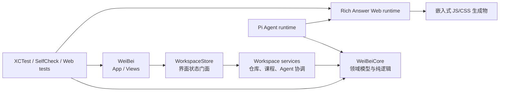

# 魏碑工程架构

本文说明仓库的稳定模块边界、状态流向、生成物约束和验证分层。新增代码应优先放入对应领域目录，避免再次把业务、持久化、视图和验证逻辑集中到单个文件。

## 目标与模块边界

- `Sources/WeiBeiCore/`：不依赖 SwiftUI 的领域模型、协议、解析、索引、Rich Answer 编排和 Agent 运行时。
- `Sources/WeiBei/Stores/`：面向界面的状态门面；持久化、课程扫描和请求生命周期分别交由 `Stores/Workspace/` 下的专用对象处理。
- `Sources/WeiBei/Views/`：按 Notes、Agent、Reader、RichAnswer 等功能域组织视图。大型容器只负责组合和路由，不承载领域算法。
- `Sources/WeiBei/App/`：应用生命周期、Scene、菜单命令和窗口入口。
- `Sources/WeiBei/Verification/`：真实窗口验证、截图协调和验证标记。验证基础设施不得混入生产视图与应用生命周期。
- `Sources/WeiBeiCore/AgentResources/`：Pi Agent 使用的提示词、TypeScript 扩展和 Python 资源。
- `Prototypes/RichAnswerWebRuntime/`：Rich Answer 网页运行时的可编辑源码与测试；名称保留是历史原因，不代表它是一次性原型。
- `Sources/WeiBei/Resources/`：随 App 打包的静态资源。由源码构建得到的文件属于生成物，不应直接手改。

## 状态与数据流

`WorkspaceStore` 是 SwiftUI 的可观察门面，而不是所有职责的实现位置：

1. View 只通过 Store 暴露的状态和意图更新界面。
2. Store 把工作区和笔记持久化交给 repository，把课程文件发现交给 course service，把 Agent 请求生命周期交给 coordinator。
3. repository 与 service 可以执行文件系统和后台工作，完成后再把结果交回主 actor。
4. `WeiBeiCore` 中的纯值类型和算法不引用 App 层类型，优先由 XCTest 直接验证。

工作区写入必须保持原子替换语义。普通输入可以去抖并异步落盘；退出、切换工作区等显式 flush 场景必须保留可确认的耐久语义。

## Rich Answer 协议

Rich Answer 外层 Envelope 只接受 schema v2。缺少 `schemaVersion`、显式 v1 和未知版本都应尽早失败，不能静默降级。内部 `weibei.openui.v1` 是另一套渲染程序协议，不属于本次删除范围。

Swift 端负责 Envelope 解码、校验、展示计划和原生回退；Agent 扩展负责生成符合 v2 约束的数据；Web runtime 负责注册并渲染网页能力。三端的协议测试必须一起通过。

## 源码真相与生成物

| 能力 | 源码真相 | 生成物 |
| --- | --- | --- |
| Markdown 编辑器 | `Sources/WeiBei/WebEditor/src/` | `Sources/WeiBei/Resources/Editor/` |
| Rich Answer 网页运行时 | `Prototypes/RichAnswerWebRuntime/src/` | `Sources/WeiBei/Resources/rich-answer-runtime.*` |
| 设计资源清单 | `DesignSystem/assets/` 与构建脚本 | DesignSystem manifest |

生成物更新只能通过相应构建脚本完成。CI 使用临时目录重建并比较，检查过程不得改写工作树。

## 验证分层

- `swift test`：领域模型、持久化兼容、关系索引、引用解析、选区与 Markdown 等可隔离行为。
- Web runtime 测试：renderer/domain 合约、类型检查和构建。
- `WeiBeiSelfCheck`：需要跨模块或历史回归覆盖、暂时不适合 XCTest 的应用级检查。
- `WeiBeiWebEditorCheck`：编辑器生成物与宿主契约。
- `WeiBeiPiCheck`：真实 Pi 运行时与 Rich Answer 协议检查。
- `script/check-generated-resources.sh`：只读生成物漂移检查。
- `script/build_and_run.sh check`：本地与 CI 共用的规范 Swift 检查入口。
- `script/build_and_run.sh --visual-verify`：真实应用窗口和截图证据；界面或发布链路变化必须运行。

新增验证应优先测试行为和公开契约，避免依赖某段实现代码必须出现在某个源文件中的字符串断言。

## 修改原则

- 新领域类型先判断是否属于 Core；不要为了缩短文件而制造没有职责边界的碎片。
- View 文件按用户功能拆分，纯布局、投影、命中测试等算法放到可独立验证的值层。
- 生产代码不得 import 或执行 `self-check` 模块。
- 更改 wire/disk 格式时必须明确迁移策略；除已决定删除的 Rich Answer Envelope v1 外，不得无意改变现有 Codable 字段。
- `script/build_and_run.sh` 与 CI 必须调用相同的规范验证入口，避免本地和远端检查清单漂移。
