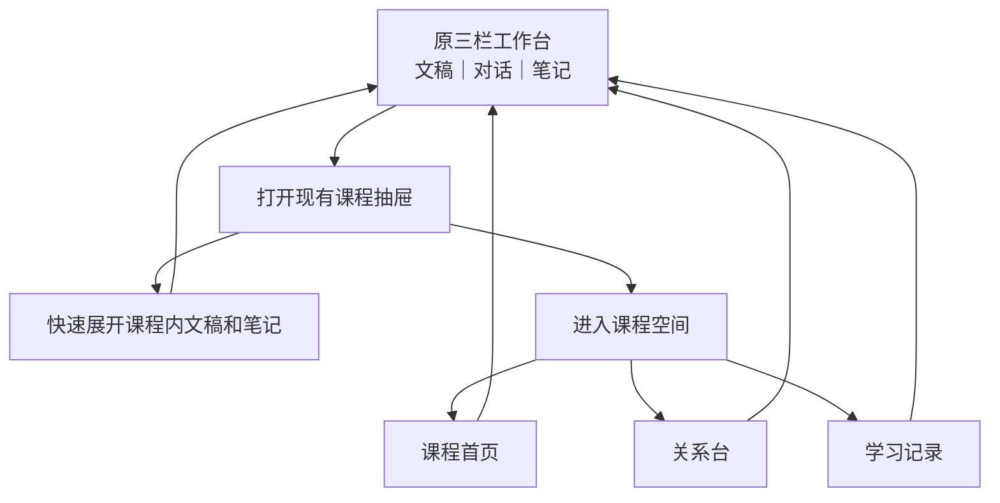

# 魏碑宣发前完整工作计划

- 日期：2026-07-28
- 状态：产品方向与 Chat 领域模型已收敛；草稿 PR 等待 Fable 复核，复核完成前不开工
- 目标：把魏碑做成一个真正围绕课程持续工作的学习 Agent，并通过真实 App 全链路验收后对外宣发
- 视觉母版：[课程首页最终母版](../VisualReferences/课程首页最终母版-2026-07-28.png)
- 母版规格：1487 × 1058，SHA-256 `c8bb324539efabce9726f0f3d1e486f076b1cfeedef052709c321f13ff433627`
- 适用范围：课程空间、Agent 会话与工具、Chat 正文与渲染、学习记忆、富回答、性能、发布物

## 0. 先说结论

这次不是“换一个课程首页”或“删一批报错代码”，而是同时完成四件事：

| 必须完成的结果 | 做完以后用户得到什么 |
|---|---|
| 课程原生 Agent | Agent 明确知道自己在哪门课、哪条 Chat、用户正在看哪里，并能按需查本课资料 |
| Answer-first Chat | 没有材料也能回答；引用、富回答、写入动作失败都不再连带吞掉正文 |
| 可用的课程空间 | 课程首页照最终母版落地，关系台和学习记录保留，退出后原三栏工作台原样恢复 |
| 可证明的发布版本 | 不以“能构建”冒充可用；用真实材料、真实问题、重开恢复、性能采样和安装包完成验收 |

不按日历机械决定是否宣发。以上能力做完并通过对应发布类型的验收，本周也可以发；没通过就不能包装成已完成。

### 这份计划描述的是目标，不是当前完成状态

| 目标模型 | 当前实现缺口 | 对应施工 |
|---|---|---|
| 一门课程是一个逻辑项目空间 | Chat 仍可能靠接触过的材料猜课程归属 | A1、A3 |
| 课程内每条 Chat 是一条独立线程 | 当前 Pi 基本每轮新建会话 | A2 |
| 同课多 Chat 共享课程记忆 | 当前学习记忆还没有可靠课程身份 | A5a、C4、A5b |
| Pi 可按需查完整课程空间 | 当前工具仍依赖预裁剪快照 | A4、A7 |
| 首页新问题开新线程、继续对话回旧线程 | 当前首页还没有稳定恢复点与线程规则 | A6、B2b |

Fable 或其他审阅者必须区分“当前代码已经做到什么”和“本计划要求改成什么”，不能把目标模型误当成现状，也不能因为现状尚未实现就认为计划自相矛盾。

---

## 1. 已经拍板的产品决定

这些不再反复讨论，后续任务必须按它们执行。

| 主题 | 最终决定 |
|---|---|
| 课程心智 | 一门课程相当于 Codex App 里的一个项目，是资料、笔记、关系、工具和学习记忆的逻辑作用域 |
| Chat 心智 | 课程内每条 Chat 相当于项目中的一条线程；一门课可以有多条线程 |
| 普通 Chat | 没打开文稿、没有笔记、没有课程，也必须能正常回答 |
| 全局 Chat | 默认可以按需查所有课程；没有明确进入课程时，不擅自把某门课当唯一范围 |
| 课程 Chat | 明确进入课程后，只能读取该课程的资料、笔记、关系和课程学习记忆 |
| 当前焦点 | 当前课程、文稿、页码或章节、选区、当前 Chat 身份由 App 自动提供 |
| 其他资料 | 不整库硬塞给 Pi；由 Pi 根据问题决定何时搜索、读取和关联 |
| Chat 连续性 | 同一个 Chat 的多轮对话对应同一条可恢复 Pi 会话 |
| 一课多 Chat | 一门课程允许多条 Chat；不同 Chat 不共享消息历史 |
| 课程共享内容 | 同课程不同 Chat 共享资料、笔记、关系和课程学习记忆 |
| 跨课程隔离 | 切换课程不能把上一门课的资料、记忆和学习判断带过来 |
| Pi 接入方式 | 不迁移 Pi SDK；保留 Swift 与 Pi 的 RPC 通道，但重做会话、上下文和工具使用方式 |
| Pi 的自主性 | 不再强制每轮先读上下文，也不再靠关键词强行进入某个学习工作流 |
| 系统提示词 | 当前版本先保留一份稳定的魏碑核心规则；每门课自定义学习方式记为后续能力 |
| 课程学习记忆 | Agent 要总结学习进度、已掌握内容、困惑和下一步；内容对用户可见、可改 |
| 数据写入 | 写笔记、建关系、更新学习记忆都需要确认，但必须是轻量卡片，不做成审批系统 |
| 关系图 | 文稿、笔记和概念进入关系图；Chat 不进入关系图 |
| 资料归属 | 同一份文稿可以属于多门课程，不复制文件 |
| 引用 | 是轻量“来源定位”，不是正文正确性的审判；不影响正文显示 |
| 引用交互 | 使用小标签；可定位到页或段落并高亮，多个来源用 `+N` 标签展开 |
| 富回答 | 先把现有全部协议类型完整支持，再谈优化；不能只挑表现好的样例宣发 |
| 课程首页 | 严格照最终母版，不再增加问候、侧栏、卡片或第二个 Chat |
| 首页提问 | “问这门课”默认新建一条当前课程 Chat；只复用用户刚明确创建且尚无消息的本课程空 Chat |
| 首页续聊 | “继续对话”只恢复恢复点绑定的旧 Chat / Pi 会话，不新建、不猜最近一条 |
| 发布路线 | 源码开源、社区安装包、普通用户正式安装包三条都做，验收门槛分别计算 |
| 宣发判断 | 构建、自检、CI 通过都不等于真实可用；必须通过真实 App 全链路验收 |

### 当前版本明确不做

| 不做什么 | 原因 |
|---|---|
| 迁移 Pi SDK 或增加 JavaScript 中间宿主 | 不能解决课程身份、会话连续性和工具作用域问题，只会扩大工程面 |
| 每门课程单独生成系统提示词 | 当前先把课程身份、焦点、工具和共享记忆做对 |
| 把 Chat 变成关系图节点 | 会把学习过程和知识关系混成一团 |
| 新增永久课程侧栏或第四栏 | 与现有文稿 / 对话 / 笔记三栏工作台冲突 |
| 为了止卡删除富回答、流式或课程能力 | 这是能力回退，不是修复 |
| 追求“必须删 1200 行” | 删除目标应由调用链和行为决定，不由预估行数决定 |
| 用静态假学习小结、假页数、假跳转填满首页 | 没有真实数据就显示诚实空态 |

---

## 2. 产品层级和入口



| 层级 | 职责 | 状态规则 |
|---|---|---|
| 课程抽屉 | 快速找课程、文稿和笔记 | 临时出现，不成为永久第四栏 |
| 三栏工作台 | 阅读、连续对话、写笔记 | 主工作界面，进入课程空间时不销毁 |
| 课程空间 | 查看一门课的整体状态、关系和记录 | 全窗口覆盖层，关闭后恢复原工作台 |
| 课程首页 | 课程空间的默认页 | 不是新的产品层级，也不是第二个工作台 |
| 关系台 | 管理文稿、笔记、概念之间的关系 | 不放 Chat 节点 |
| 学习记录 | 查看课程学习过程和记忆 | 读取课程数据，不替代 Chat 历史 |

### 进入与返回的准确行为

| 用户动作 | 必须发生的结果 |
|---|---|
| 在课程抽屉展开课程 | 只展开课程内容，不改变当前文稿、Chat、笔记和活动课程 |
| 打开某份文稿或笔记 | 关闭抽屉，回到原三栏，只替换对应栏 |
| 点击“进入课程空间” | 打开全窗口课程空间，默认显示课程首页 |
| 点击“返回工作台”或按 Esc | 关闭课程空间，原三栏、滚动位置、草稿、栏宽和 Chat 原样回来 |
| 点击“继续阅读” | 返回工作台并恢复该文稿的真实阅读位置 |
| 点击“继续对话” | 返回工作台并恢复同一条 Chat / Pi 会话，不新建重复对话 |
| 从首页提交“问这门课” | 回到工作台对话栏，默认新建当前课程 Chat 并发送；只复用用户刚明确创建且尚无消息的本课程空 Chat |

### 课程空间浏览身份与底层 Chat 身份必须分开

课程空间正在浏览哪门课，不能直接改写底层工作台 Chat 属于哪门课。

| 状态 | 含义 |
|---|---|
| `courseWorkspaceCourseID` | 当前覆盖层正在看的课程；顶栏切课只改它 |
| `chat.courseID` | 当前 Chat 的硬作用域；只有明确切换、新建或继续 Chat 才改变 |
| 当前文稿 | 工作台此刻显示的资料；可能属于多门课 |
| 当前笔记 | 工作台此刻显示的笔记；不自动改写 Chat 作用域 |

打开课程 A 首页、在顶栏切到课程 B、再按 Esc，都必须原样恢复底层工作台和原 Chat 身份。只有“问这门课”“继续对话”“打开某项内容”等明确动作，才改变对应工作栏。

如果当前文稿属于课程 A，而当前 Chat 明确属于课程 B：

1. 课程 B Chat 仍以 `courseID = B` 为硬边界；
2. 课程 A 文稿只作为界面焦点显示，不能自动进入课程 B Agent 上下文；
3. 界面提示用户切换到课程 A Chat、新建课程 A Chat，或明确把该资料加入课程 B；
4. 不允许静默跨课程读取。

---

## 3. 课程首页规格

最终母版是本计划唯一视觉真相。实现时不得“顺手优化”成另一套首页。

### 3.1 页面结构

| 区域 | 母版内容 | 数据与交互 |
|---|---|---|
| 顶栏 | 返回工作台、课程下拉、课程首页、关系台、学习记录、搜索、添加 | 复用现有课程空间顶栏 |
| 继续上次 | 一张上次学习卡片 | 只代表最近停留点，不代表课程只有一份文稿 |
| 继续阅读 | 朱砂主按钮 | 恢复真实文稿和阅读位置 |
| 继续对话 | 描边按钮 | 恢复真实课程 Chat |
| 问这门课 | 母版中的大输入框 | 提交后回到对话栏，默认创建当前课程的新 Chat 并发送 |
| 最近内容 | 一行课程活动摘要 | 点击展开当前课的文稿、笔记和对话内容 |
| 学习小结 | 一行真实课程总结 | 无真实总结时显示空态，不写静态假话 |
| 下一步 | 一行真实建议 | 只有存在可执行目标时才显示跳转；纯文字建议不放假箭头 |
| 底部入口 | “查看全部文稿、笔记与对话记录” | 复用现有列表，不新造第二套资料系统 |

“最近内容”、三条摘要行和底部入口都在课程首页原位向下展开，复用同一个文稿 / 对话 / 笔记列表表面；不跳转到第二个资料页。搜索有输入时，同一区域切换为搜索结果，清空搜索后恢复此前展开状态。

### 3.2 数据真实性

| 字段 | 当前能否真实得到 | 实现要求 |
|---|---:|---|
| 课程名 | 能 | 使用当前课程标题 |
| 上次文稿 | 能 | 在当前课程文稿中按最后学习时间选择 |
| 上次页码 / 章节 | 能 | 使用已持久化位置 |
| PDF 总页数 | 当前不能稳定持久化 | 先显示“第 18 页”，不得伪造“18 / 189” |
| 上次学习时间 | 能 | 使用真实时间 |
| 最近对话 | 能 | 只取当前课程 Chat |
| 最近笔记活动 | 当前缺少可靠更新时间 | 补数据前不声称完整覆盖 |
| 学习小结 | 条件可用 | 只读当前课程的总结或已掌握记忆 |
| 下一步 | 条件可用 | 只读当前课程的下一步记忆或会话建议 |

### 3.3 “继续上次”是同一个学习现场

不能把“最新文稿”和一条无关的“最新 Chat”拼成同一张卡。需要保存或可靠推导一个课程恢复点：

| 恢复点字段 | 用途 |
|---|---|
| 课程 ID | 确保不串课 |
| 文稿 ID 和阅读位置 | 恢复阅读 |
| 对应 Chat ID（可选） | 只有真实关联时才显示“继续对话” |
| 笔记 ID（可选） | 恢复当时使用的课程笔记 |
| 保存时间 | 显示真实上次学习时间 |

没有关联 Chat 时隐藏“继续对话”；没有真实阅读位置时显示诚实空态或“开始学习”，不得拼接两个独立的“最新”对象。

### 3.4 “问这门课”的会话选择规则

1. 从课程首页提交新问题时，默认新建一条当前课程 Chat。
2. 只有底层是用户刚刚明确创建、属于当前课程且尚无任何消息的空 Chat，才复用它，避免制造第二条空线程。
3. 已经有消息的旧 Chat 无论是不是同一课程，都不能被首页输入框静默复用。
4. “继续对话”永远恢复课程恢复点绑定的那条旧 Chat / Pi 会话，不用“最近一条”猜。
5. 首页本身不保存第二份聊天历史；提交后回到原三栏工作台的对话栏。
6. 创建或恢复 Chat 前必须明确 `courseID`，不得依靠“这条 Chat 碰过哪份文稿”猜课程。

### 3.5 搜索和添加

| 功能 | 当前版本要求 |
|---|---|
| 搜索课程内容 | 搜当前课程的文稿、笔记和对话；每条结果显示类型和来源。只有标题搜索时文案写“搜索标题”，正文索引完成后才使用“搜索课程内容” |
| 添加文稿 | 加入当前课程 |
| 导入笔记 / 新建笔记 | 加入当前课程 |
| 导入文件夹 | 如果会新建课程，文案必须明确为“导入为新课程”，不能伪装成向当前课添加 |

“最近内容”只按可靠时间排序：文稿使用学习位置时间、Chat 使用更新时间、笔记补齐更新时间后再纳入。没有可靠时间的笔记可以在“全部内容”中出现，但不能冒充最近活动。

### 3.6 首页状态矩阵

| 状态 | 页面表现 |
|---|---|
| 无上次学习 | 保留母版节奏，显示“开始学习”空态，不显示伪造页码和时间 |
| 有文稿、无关联 Chat | 显示“继续阅读”，隐藏“继续对话” |
| 无学习小结 | 行内显示“完成一次课程对话后生成”，不写静态总结 |
| 无下一步 | 行内显示“尚无学习建议”，不显示可点击箭头 |
| 搜索无结果 | 在原位结果区显示空态，可一键清空搜索 |
| 加载或保存失败 | 当前可读内容仍显示；失败动作单独提示重试 |
| 窄窗口 | 保持顶栏主动作和输入框可用；内容改为单列，不裁掉按钮 |
| 深色主题 | 继承现有墨色主题，不改变默认明亮纸色母版 |

键盘与无障碍要求：Tab 顺序符合视觉顺序；Enter 发送、Shift+Enter 换行；Esc 返回工作台；折叠行、按钮、输入框有准确的 VoiceOver 名称、值和展开状态。

---

## 4. Agent 系统边界

### 4.1 谁负责什么

| 系统 | 负责的真相 | 不负责什么 |
|---|---|---|
| 魏碑课程系统 | 课程、课程成员关系、资料、笔记、显式关系、课程学习记忆 | 不替模型判断正文“够不够好” |
| 魏碑 Chat 系统 | Chat 身份、`courseID`、消息记录、Pi 会话映射 | 不靠接触过的资料猜归属 |
| 界面焦点系统 | 当前课程、文稿、页码 / 章节、选区、当前 Chat | 不把上一门课焦点带入下一门课 |
| Pi Agent | 推理、连续对话、决定何时使用工具、生成回答和提案 | 不凭空宣布 App 中存在某份资料或笔记 |
| 魏碑工具层 | 把 App 的课程数据安全、结构化地提供给 Pi | 不强迫 Pi 每轮固定调用 |
| 渲染与动作层 | 显示正文、来源标签、富回答和写入提案 | 增强失败时不能杀正文 |

“App 保存真相”说人话就是：Pi 可以理解、建议和请求修改；某份资料、笔记或关系究竟存不存在，最终以魏碑保存的数据为准。

### 4.2 会话模型

先用用户已经确认的 Codex 心智统一术语：

| Codex App 心智 | 魏碑里的正式含义 | 是否共享 |
|---|---|---|
| 项目 | 一门课程的逻辑空间 | 课程内共享 |
| 项目中的线程 | 一条课程 Chat | 消息不与其他 Chat 共享 |
| 线程运行状态 | 该 Chat 映射的一条可恢复 Pi 会话 | 只属于该 Chat |
| 项目文件和上下文 | 课程文稿、笔记、关系和课程学习记忆 | 同课程 Chat 共享 |
| 当前打开文件和选区 | 当前焦点包 | 只随本轮请求临时提供 |
| 项目外的新任务 | 全局 Chat | 不绑定单门课程，可按需跨课程查询 |

这只是产品与作用域的对应关系，不要求一门课程真的复制成磁盘文件夹。同一份文稿可以同时属于多门课程，工具按成员关系判断能否读取。

| 对象 | 正确模型 |
|---|---|
| Chat | 明确保存可选 `courseID`、Pi 会话 ID、标题、消息和更新时间 |
| 课程 Chat | `courseID` 必填；只能使用该课工具 |
| 全局 Chat | `courseID` 为空；可按需查询所有课程，但结果必须标明来自哪门课 |
| 同一 Chat | 对应一条可恢复 Pi 会话，重开 App 后继续 |
| 同课程不同 Chat | 消息历史分开；课程资料和课程学习记忆共享 |
| 资料多课程归属 | 工具按“资料是否属于当前课程”校验，不复制文件 |

课程学习记忆也必须明确保存 `courseID`，不能继续只靠来源 `sessionID` 推导。`sessionID` 只记录“这条记忆从哪次学习产生”；课程修订号按课程维护。删除一条 Chat 不删除已经确认的课程记忆。

### 4.3 Pi 会话生命周期

一 Chat 一 Pi 会话不是只保存一个字符串，必须先用当前打包的 Pi 做恢复试验，再按真实能力实现：

| 时机 | 行为 |
|---|---|
| 新建 Chat | 在魏碑自己的会话目录创建 Pi 会话并保存映射 |
| 继续 Chat | 恢复该 Pi 会话，不再每轮执行 `new_session` |
| 正常下一轮 | 依靠 Pi 会话历史，不重复注入最近 20 条消息 |
| Pi 会话文件缺失 / 损坏 | App 消息仍保留；从可见消息一次性重建新的 Pi 会话 |
| 切换 Chat | 取消或结束当前运行，再切换到目标 Pi 会话 |
| 删除 Chat | 删除对应 Pi 运行状态；不删除已确认的课程记忆 |
| 重开 App | 按 Chat 映射恢复；恢复失败走安全重建 |

App 消息是用户能看到的长期记录，Pi 会话是可重建的运行状态。Pi 文件损坏不能导致 Chat 消失。

### 4.4 上下文策略

每次提问自动附带一个很小的“当前焦点”：

- 当前 Chat ID 和课程 ID；
- 当前正在看的文稿 ID；
- 页码、章节或段落位置；
- 用户选区；
- 当前界面动作来源。

当前文稿和选区只有在属于当前课程 Chat 的作用域时，才自动进入 Agent 上下文；全局 Chat 可以使用它；明确属于另一门课的 Chat 不得自动接收它。

其他内容不提前塞满提示词。Pi 自己判断是否需要：

- 查看课程目录；
- 搜索课程；
- 读具体文稿；
- 读笔记；
- 看课程学习记忆；
- 看文稿、笔记和概念关系。

### 4.5 工具合同

工具不是为了限制 Pi 的聪明，而是把 App 内部对象变成 Pi 能可靠操作的课程能力。

| 工具能力 | 目的 | 关键边界 |
|---|---|---|
| 读取当前焦点 | 知道用户此刻在看什么 | App 自动给，不要求先调用 |
| 查看课程内容 | 列出本课文稿、笔记、概念和关系摘要 | 必须校验课程成员关系 |
| 搜索课程 | 用 Pi 自己提出的搜索词查询当前课程完整索引 | 不再只搜原问题预裁剪出的静态快照 |
| 读取文稿 | 按资料 ID 和位置读取内容 | 返回稳定资料 ID 和位置锚点 |
| 读取笔记 | 读当前课程笔记 | 不允许跨课读取未归属内容 |
| 读取关系 | 查文稿、笔记、概念之间的显式关系 | Chat 不作为关系节点 |
| 读取课程记忆 | 读进度、已掌握、困惑和下一步 | 内容对用户可见 |
| 提议写笔记 | 生成可编辑写入卡片 | 用户确认后执行 |
| 提议建关系 | 生成两端和关系类型预览 | 用户确认后执行 |
| 提议更新记忆 | 生成本轮学习总结 | 用户确认后执行 |

全局 Chat 使用另一组全课程目录 / 搜索入口：可以查询所有课程，但每条结果必须带课程身份；“课程查询不使用全库 `allItems`”只约束课程 Chat，不能误伤全局 Chat。

关系系统对 Agent 的意义也要分清：

- 课程成员关系决定“能不能读”，是作用域边界；
- 文稿、笔记和概念关系决定“还可以沿哪里继续找”，是课程内导航和理解线索；
- 关系不是简单把所有文件装进课程，也不把 Chat 变成知识节点。

Pi 自带的通用文件工具不能直接替代这些工具，因为它不知道魏碑的课程 ID、资料多课程归属、阅读位置、笔记对象和关系数据。当前版本应保留课程专用工具；是否额外开放网页、任意文件或其他 Pi 内置工具，必须在真实工具清单审阅后由产品负责人单独确认。

工具背后必须是真实的动态读取：

1. 课程 Chat 的 scope 由宿主绑定，Pi 不能把参数改成另一门课；
2. Pi 可以用第二个、第三个自行改写的搜索词查询当前课程完整索引；
3. 搜索结果返回稳定资料 ID、课程归属和位置；
4. Pi 再按 ID / 位置读取正文；
5. 不能继续把按用户原问题裁成少量片段的 `context.json` 包装成“自主搜索”。

### 4.6 学习记忆

课程学习记忆不是隐形画像，而是一个用户能看见和改的课程层内容。

| 记忆类型 | 例子 | 更新方式 |
|---|---|---|
| 学习进度 | 已读到利率期限结构 | Agent 生成提案，用户确认 |
| 已掌握 | 能区分名义利率与实际利率 | Agent 生成提案，用户确认 |
| 困惑 | 仍不理解久期与价格波动 | Agent 生成提案，用户确认或修改 |
| 下一步 | 对比收益率曲线三种形态 | Agent 生成提案，用户确认 |
| 课程摘要 | 当前课程学习到哪里、主要线索是什么 | 在有意义的学习轮次后批量提议更新 |

学习记忆分两阶段：Agent 先生成持久化、可编辑的提案，用户确认后才写入课程记忆；取消不写。用户在学习记录中直接编辑，本身就是明确操作，不再额外弹确认。

Pi 自己的会话历史解决“一条 Chat 里记得前文”，不能天然解决“同课程多条 Chat 共享、用户能看见并修改”的课程记忆。A5 开工前可以审阅打包 Pi 是否已有可复用的记忆扩展；只有它同时支持课程身份、跨会话共享、用户可见可改和可迁移时才复用，否则直接使用魏碑现有课程数据与工具，不为“可能有用”新增插件层。

记忆更新失败说明动作层有问题，应单独报错和重试，不能被当成正常体验长期存在；已经生成的回答仍保留。

### 4.7 删除旧“学习工作流”

现有“学习工作流”说人话就是：宿主根据“整理、笔记、解释”等关键词，先替 Pi 选一个模式，再规定它必须先读什么、必须产出什么。它应被移除：

- 删除关键词路由；
- 删除“必须先读上下文”的回答门槛；
- 删除“没有笔记提案就判整轮失败”；
- 删除提示词中“无本地依据就不要正常回答”的规则；
- 保留工具说明，让 Pi 按问题自主组合读取、搜索、解释和提案。

删除范围不只在 Swift：必须同时审查并改造 Agent 核心提示词 `system.md`、工具扩展 `extension.ts`、现有五套学习 Skill、`StudyAgentRuntime`、`PiAgentRuntime` 和对应自检。首工具限制、无来源拒答、笔记模式和无提案整轮失败要从完整调用链删除。

---

## 5. Chat、渲染和失败规则

### 5.1 回复首先是一条可恢复记录

不能只把正文存进 `AgentMessage`，再把来源、动作卡片和中断状态留在当前界面内存。每一条 Agent 回复至少要持久化：

| 字段 | 用途 |
|---|---|
| 正文 | 用户实际看到的回答 |
| 完成状态 | 生成中、已完成、已中断 |
| 来源附件 | 资料 ID、课程 ID、位置锚点和短摘 |
| 待处理动作 | 笔记、关系、学习记忆提案及目标对象 |
| 动作状态 | 待确认、已执行、已取消、已失败 |
| 富回答 | 当前协议已经支持的结构化内容 |
| 运行信息 | 发起时的 Chat ID、课程 ID、运行时代次和必要诊断信息 |

每次请求在发出时就固定 `originChatID` 和 `originCourseID`。之后即使用户切换课程、Chat 或关闭课程空间，流式片段、完成事件、来源和动作卡片也只能写回原 Chat，不能写到当前界面碰巧选中的 Chat，也不能因为界面作用域变化而丢弃。

待处理动作还要保存目标对象、发起时修订号和状态。正文一旦安全生成就永久保留；只有用户确认执行动作时，才重新检查目标是否变化。

### 5.2 一个回答分四层

| 层 | 内容 | 失败时怎么办 |
|---|---|---|
| 正文 | 普通回答文本 | 只要已安全生成就显示 |
| 来源 | 来源小标签和原文定位 | 定位不了就不显示可点击标签 |
| 动作 | 写笔记、建关系、更新记忆 | 动作失败单独报错和重试 |
| 富回答 | 卡片、图表、交互块 | 坏了回到普通正文 |

### 5.3 失败分类

| 类型 | 例子 | 正确处理 | 能否吞正文 |
|---|---|---|---:|
| 内容审判 | 没引用、没命中标签、答案不像课程回答 | 删除硬门槛，用提示词、评测和体验提升质量 | 否 |
| 来源定位失败 | 找不到资料、页码或段落 | 不渲染假按钮；正文照常显示 | 否 |
| 写入动作失败 | 笔记已变化、保存失败、关系冲突 | 保留正文，动作卡片单独提示重试 | 否 |
| 富回答失败 | 协议结构坏、组件无法显示 | 回退普通正文，记录富回答错误 | 否 |
| 模型 / 网络 / 进程失败 | 限流、断网、超时、Pi 崩溃 | 显示真实人话错误，保留已流出的安全文字 | 只有没有正文时 |
| 协议 / 执行失败 | 消息损坏、工具越权、网页越界 | 阻止当前动作或产物，必要时重启当前运行 | 否 |

### 5.4 “协议数据损坏”到底是什么

只包括可客观判断的传输问题：

- 某一行不是合法 JSON；
- 已知事件缺少当前协议真实要求的必要字段；
- 命令响应 ID 对不上仍在等待的命令；
- 工具结果的 `toolCallId` 对不上原工具调用；
- 事件的上下文修订号或宿主运行时代次已经失效；
- 同一运行反复出现无法解析的事件；
- 进程退出却没有正常完成事件；
- 单条数据超过合理资源上限。

处理规则：

1. 格式正确但宿主尚不认识的可选事件可以忽略并记录。
2. 非法 JSON、ID 对不上、顺序已经不可信、数据过大或连续损坏时，安全结束当前运行并重启运行时。
3. 已经安全收到的正文片段保留并标记“回答中断”。
4. 协议规则只判断传输是否可信，不判断答案内容是否正确。

这里不凭空给 Pi 协议增加 `runID` 或 `messageID`；实现前先以当前 `extension.ts`、Swift 解码器和实际 JSONL 事件为准，逐个列出真实必填字段。

### 5.5 Markdown 和流式

| 问题 | 任务要求 |
|---|---|
| 段落挤成一坨 | 最终正文统一使用真正的块级 Markdown 解析与显示 |
| 流式丢段落 | 流式装配必须保留换行、段落、列表和代码块边界 |
| 完成时闪变 | 流式片段与最终消息由同一个装配器按原序合并 |
| 开头文字被丢 | 不再把“工具调用前的文字”当有毒输出 |
| 工作区变化吞答 | 正文继续显示；只有后续写入动作执行时重新检查目标 |
| 中途中断 | 已生成正文入列并标记中断，可一键重试 |
| 运行中再次发送 | 不做隐藏队列；发送按钮变成“停止”，先取消当前运行并把安全正文保存回原 Chat，再允许下一次发送 |
| 运行中切换 Chat | 取消当前运行，安全正文仍写回原 Chat；切换完成后目标 Chat 才能开始新请求 |
| 迟到事件 | 用宿主运行时代次和命令 / 工具身份拒绝，不得落到新 Chat |

### 5.6 需要删除、改造和保留什么

| 处理 | 范围 |
|---|---|
| 删除 | 无资料白名单、关键词式诚实性判断、必须命中来源标签、强制工作流、必须先读上下文、回答后的内容判决 |
| 改造 | 来源定位、笔记提案、学习记忆、富回答解析、工作区版本变化：从“整轮失败”改成“局部失败” |
| 保留 | 模型 / 网络 / 进程错误、凭据脱敏、运行时完整性、协议身份和资源上限、写入一致性、富回答执行隔离 |

不照抄旧“30 条”表机械删除。每个删除项必须先查全部调用者；确定只服务旧内容审判后再删除，并同步删除失效测试。

---

## 6. 来源标签和写入交互

### 6.1 来源标签

来源不是课程 Chat 的主角，只做轻量增强。

| 状态 | 视觉与交互 |
|---|---|
| 一个可靠来源 | 相关句子后显示小标签，例如“明拓本 · 第 18 页” |
| 多个来源 | 显示第一个标签和 `+2` 标签 |
| 悬停 / 点击标签 | 显示资料名、位置和短摘 |
| 打开原文 | Chat 保持可见；工作台文稿栏定位并高亮 |
| 定位失败 | 不显示可点击假标签，也不额外打扰用户 |
| 没有来源 | 正常回答，不显示任何警告 |

工具返回稳定 ID 和锚点是为了让跳转可靠，不是把 Agent 变成机械匹配器；Pi 仍然自己决定读什么和引用什么。

### 6.2 写笔记卡片

回答后需要写入时，显示一张轻量卡片：

- 标题：`建议写入内容：`
- 中间：可编辑的笔记标题和正文预览
- 底部：`写入笔记`、`取消`
- 写入后：可撤销

关系和学习记忆沿用同样模式，不再展开一大串审判依据。

### 6.3 动作权限

| 动作 | 默认处理 |
|---|---|
| 阅读、课程内搜索、跳到原文 | 直接执行，不确认 |
| 建议写笔记、建关系、更新课程记忆 | 每次显示轻量预览并确认 |
| 覆盖、删除、批量修改 | 显示对象和差异，明确确认，可撤销时提供撤销 |
| 读取课程外任意文件 | 当前课程 Agent 不开放 |
| 任意网页访问 | 不默认开放；需在工具合同审阅中单独决定 |
| Shell / 任意代码执行 | 不作为课程 Agent 通用工具开放 |
| 富回答内网页脚本 | 继续使用隔离运行时，禁止任意网络、文件和导航 |

这张表必须在真正接好工具前，拿实际工具清单与产品负责人逐项复核，不能用抽象“安全”一词带过。

---

## 7. 富回答完整能力

“完整”指对当前代码已经声明支持的全部协议类型负责，不是无限支持所有未来想象。

### 7.1 每种协议都要过的矩阵

| 维度 | 验收 |
|---|---|
| 生成 | 普通真实问题可以稳定触发，不依赖固定演示短语 |
| 解析 | 合法结构被正确识别；未知可选字段向前兼容 |
| 显示 | 首次显示、流式结束、滚动、窗口缩放正常 |
| 交互 | 按钮、拖动、切换等声明过的动作真实可用 |
| 持久化 | 保存、重开 App 和恢复 Chat 后仍能显示 |
| 失败降级 | 富回答坏了只回退正文，不吞回答 |
| 资源边界 | 大小、资源路径、网络、文件和导航保持隔离 |
| 性能 | 长对话中多个富回答不造成明显冻结 |

### 7.2 验收方法

1. 先从协议注册表生成“全部类型 × 全部状态”的唯一清单。
2. 现有 56 题可作为起点，但必须以当前代码重跑，不沿用旧通过率。
3. 每类至少覆盖首次生成、交互、重开、失败降级。
4. 可以在宣传片里少展示，但不能把未通过的能力写成已支持。

---

## 8. 性能与卡死

性能问题真实存在，但当前没有资格宣布唯一根因。先取证，再修复。

### 8.1 固定复现场景

| 场景 | 需要记录 |
|---|---|
| 长 Chat 快速流式 | 主线程、SwiftUI 更新、WebKit、高度回写、内存 |
| 快速输入 | 每次击键触发的 Store 发布和视图重算 |
| 切换文稿、课程和 Chat | 保存、编码、布局切换、Pi 会话切换 |
| 课程记录搜索 | 搜索耗时、主线程占用和数据量 |
| 打开多个富回答 | WebView 创建、进程、内存、布局循环 |
| 关闭 / 重开 App | 保存、等待 Pi 退出、管道读取和恢复 |

### 8.2 当前候选范围

| 候选 | 现在能说什么 | 取证后才决定什么 |
|---|---|---|
| 大型全局 Store 高频发布 | 风险明确 | 是否拆局部状态、缓存或迁移观察模型 |
| 多个 WebView 与高度回写 | 路径存在 | 是否减少活跃 WebView、复用容器或把静态 Markdown 原生化 |
| 课程记录全文扫描 | 同步扫描存在 | 是否索引、缓存、防抖或后台化 |
| 保存、编码和写盘 | 主线程风险存在 | 哪部分移到后台以及快照策略 |
| 等待 Pi 退出 | 存在同步等待路径 | 改成异步生命周期还是限定关闭路径 |
| Pi 管道阻塞读取 | 存在候选路径 | 实际是否占住主线程或导致反压 |

不把“共享 `WKProcessPool`”当修复答案。若采样证明 WebView 是主因，优先减少创建、避免无意义重建和高度回写循环；每项修复用同一场景前后对比。

### 8.3 性能通过标准

- 每个冻结场景都有可重复步骤和采样文件；
- 修复说明包含现场调用栈，而不是“看代码觉得”；
- 修复前后使用同一数据、窗口和操作对比；
- 没有通过关闭能力获得虚假提升；
- 用户能连续完成阅读、提问、看富回答、写笔记、切换课程和重开。

E1a 固定硬件、系统版本、数据夹和操作脚本后，至少使用下面的产品阈值：

| 指标 | 通过条件 |
|---|---|
| 冻结 | 20 分钟核心流程中零次界面无响应或输入停顿达到 1 秒 |
| 输入与本地导航 | 固定脚本的 p95 响应小于 100ms |
| 课程本地搜索 | 固定数据集的 p95 首批结果小于 300ms |
| 长 Chat / 富回答内存 | 不随重复打开、关闭持续单调增长；结束后回落到稳定区间 |
| WebView / 子进程 | 数量有明确上限，不随消息滚动无限增加 |

E1a 在 E2 开工前先冻结测量协议：

| 项目 | 固定规则 |
|---|---|
| 响应起止点 | 本地输入 / 导航从系统事件进入开始，到目标界面状态提交并可见结束；课程搜索从最后一次输入变化到首批真实结果发布结束 |
| 样本 | 每个 p95 场景先预热 10 次，再记录至少 100 次；不得删除慢样本 |
| 原始证据 | 保存每次开始、结束、耗时、主线程停顿和场景 ID 的原始日志，报告只做可重算汇总 |
| 内存 | 预热后记基线；连续 20 分钟核心流程、再空闲 2 分钟，常驻内存不高于基线 115%，且趋势不继续上升 |
| WebView / 子进程 | 重复打开与关闭富回答 20 轮后，活跃数量回到预热基线 `+1` 以内；不得随消息总数增长 |
| 冻结 | 以主线程停顿和真实输入停顿双证据判断，任何一次达到 1 秒即失败 |

如果当前硬件和数据无法达到阈值，E1a 报告必须给出实测基线、用户可感知影响和新的目标，由产品负责人确认后再开 E2；不能由实现者自行放宽。

---

## 9. 发布路线

三条路线并行准备，但产品能力验收共用一套真实 App 基线。

| 路线 | 交付物 | 额外门槛 | 对外称呼 |
|---|---|---|---|
| 源码开源 | 公开仓库、版本标签、构建说明、许可证 | 从干净 checkout 可构建 | 魏碑开源项目 |
| 社区安装包 | 明确版本的 App / DMG、校验值、安装说明 | 包内容完整；明确未公证与 Gatekeeper 操作 | 社区构建 / 未公证包 |
| 普通用户正式包 | Developer ID 签名、公证、DMG、更新通道 | 干净 Mac 双击安装、系统不报警、升级可用 | 正式安装版 |

更准确的正式包门槛是：没有“身份不明开发者”“无法检查恶意软件”或阻止运行的警告；macOS 正常的首次打开确认不算失败。

发布节奏可以分阶段：

1. F1 和产品核心验收通过后，可以公开源码；
2. F2 通过后，可以发布明确标注的社区包；
3. 面向普通用户的完整正式宣发必须等 F3 通过；
4. 因为本计划选择三条路线都做，整个宣发前计划只有 F1、F2、F3 全部完成才算最终完成。

社区包使用现有社区构建脚本，必须在隔离环境或干净 Mac 验收；安装说明不得要求用户关闭全局 Gatekeeper。正式包使用现有签名 / 公证路线，并验证真实下载后的隔离属性和“旧版本 → 候选版本”更新。

三条发布路线必须使用同一个冻结候选：

`RC_SHA` 说人话就是“这一轮准备发布的唯一代码版本身份证”。源码、社区包和正式包如果不是从同一个提交构建，就不能把三份验收拼成一次发布结论。

1. 核心体验、H1 清理、发布脚本和版本改动全部合入整合线后，由发布任务记录唯一 `RC_SHA`；
2. F1、F2、F3 都从该 `RC_SHA` 构建和验收；
3. 任意代码、资源、版本或发布脚本发生变化，旧的三条证据全部失效，必须生成新的 `RC_SHA` 并重跑；
4. 创建标签、上传安装包和建立正式 Release 只由明确标记的发布任务执行，功能任务不得代做。

| 发布任务 | 必须留下的证据 |
|---|---|
| F1 源码 | 干净克隆、锁定依赖、构建与自检、标签与 `VERSION` 一致、许可证和第三方声明 |
| F2 社区包 | 社区构建命令、App / DMG 哈希、包内提交与 `SourceDirty=false`、干净 Mac 安装和首次打开 |
| F3 正式包 | Developer ID 身份、严格签名、公证票据与装订、安全策略检查、真实下载、干净 Mac 安装和实际升级 |

### 宣发前允许说什么

| 能力状态 | 对外表达 |
|---|---|
| 已通过真实 App 全链路 | 可以作为正式卖点和演示 |
| 只通过构建、自检或固定样例 | 不能写成用户能力已完成 |
| 富回答只部分通过 | 不把“完整富回答”作为卖点 |
| 社区包未公证 | 可以发，但必须说清楚 |
| 正式包未签名 / 未公证 | 不能包装成普通用户无门槛安装版 |

---

## 10. 施工任务和依赖

不再先拍固定天数。每个任务以“退出门槛”结束，证据齐全后再进入下一依赖任务。

### 10.1 Gate 0：整合基线

2026-07-28 取证时，远端 `codex/course-workspace` 是 `main` 的祖先并落后 29 个提交，课程首页新实现只在 `main`。这个数字会变化，开工时必须重新取证，不能把“29”写成永久事实。

执行流程：

1. `git fetch origin --prune`；
2. 重新计算 `origin/codex/course-workspace` 与 `origin/main` 的祖先关系；
3. 若整合线仍是 `main` 的祖先，由明确标记的整合任务从整合线开刷新短分支，快进到 `origin/main`，建立目标为整合线的草稿 PR；
4. 若两者已经分叉，停止自动同步，由整合任务审查差异；禁止强推或整体覆盖；
5. 刷新 PR 合入并通过验证后，记录唯一的 `G0_BASE_SHA`；
6. 后续任务必须等待依赖 PR 合入，再从新的整合线 SHA 开分支，不能提前从旧基线开一排分支。

| 任务 | 产物 | 退出门槛 |
|---|---|---|
| G0.1 同步整合线 | 经草稿 PR 审阅的最新整合线 | 构建、自检通过；记录 `G0_BASE_SHA`；树内容包含当前课程空间 |
| G0.2 固化基线 | 真实 App 录屏、失败场景、性能采样、包状态 | 每份证据记录 SHA、App 哈希、数据集、窗口、provider / model、步骤和结果 |
| G0.3 建任务账本 | Issue / 草稿 PR、共享文件占用、依赖 | 每个任务一分支、一工作目录、一草稿 PR |
| G0.4 发布外部条件预检 | 只读核对 Developer ID 身份、公证凭据是否已配置、Pi / Bun 再分发条件、干净 Mac、可升级旧版本和更新通道 | 不读取或记录凭据值；缺项立即标为 F3 外部阻塞并指定负责人，不能拖到最终波次才发现 |

### 10.2 关键路径：课程原生 Agent

| ID | 任务 | 主要结果 | 依赖 | 共享面 |
|---|---|---|---|---|
| A1 | Chat 显式课程身份 | `StudySession` 保存 `courseID`，版本化迁移旧数据；同步领域词汇中“课程＝逻辑项目、Chat＝线程”的定义 | G0 | `WorkspaceStore`、自检、`CONTEXT.md` |
| A2 | 一 Chat 一 Pi 会话 | 先用打包内 Pi 完成恢复试验，再保存会话映射；打开同一 Chat 可恢复，损坏可重建 | A1 | `PiAgentRuntime`、`WorkspaceStore` |
| A3 | 浏览身份、当前焦点和课程隔离 | 课程空间浏览 ID 与底层 Chat ID 分离；当前焦点自动输入；课程 Chat 不再查询全库 `allItems` | A2 | `WorkspaceStore` |
| A4 | 课程读取工具 | 动态目录、搜索、读文稿、读笔记、读关系、读记忆；另设全局目录 / 搜索 | A3、P1 | `PiAgentRuntime`、`WorkspaceStore`、`extension.ts` |
| A5a | 课程记忆数据模型 | 显式 `courseID`、课程修订号、版本迁移、可见与可编辑 | A3、P2 | `WorkspaceStore` |
| A5b | Agent 更新课程记忆 | Pi 基于真实学习过程提议进度 / 掌握 / 困惑 / 下一步，并复用确认卡片 | A4、C4 | `PiAgentRuntime`、`WorkspaceStore` |
| A6 | 课程恢复点 | 保存同一次学习的文稿位置、可选 Chat / 笔记和时间 | A2、A3 | `WorkspaceStore` |
| A7 | 删除旧工作流和快照审判 | 同步移除提示词、扩展、五套 Skill 和运行时中的关键词路由、强制读上下文及内容判决 | A4、C0 | `StudyAgentRuntime`、`PiAgentRuntime`、Agent 配置 |

这些任务因共享核心面不能同时改同一文件；主路径为 A1 → A2 → A3，随后按共享文件占用串行推进 A4 / A5a / A6；A4 + C0 后可做 A7，A4 + C4 后可做 A5b。依赖成立不代表可以并改同一核心文件，仍要等待上一任务释放占用。

旧 Chat 迁移规则：

- 只接触一门课程且归属唯一时，可以写入该 `courseID`；
- 同时接触多门课程或无法可靠判断时，保持为全局 Chat；
- 无法归类的旧 Chat 进入用户可见的“待归类”状态，不用当前活动课程猜；
- 迁移保留原 Chat ID、消息顺序、标题和时间；
- 迁移版本可重复识别，失败时不破坏原数据。

### 10.3 可并行工作流

| ID | 任务 | 主要结果 | 可以何时并行 |
|---|---|---|---|
| B1 | 课程首页视觉原型 | 严格照母版重排现有 Hub，用于视觉对照；不得合入可分发构建 | G0 后 |
| B2a | 首页阅读与内容 | 增加可断言的 `hub` 验证路由；接好继续阅读、最近内容、全部内容和可靠搜索 | A3、A6 完成后 |
| B2b | 首页课程对话 | “问这门课”默认新建课程线程；“继续对话”恢复恢复点绑定的旧 Chat / Pi 会话 | B2a、A1、A2、A3、A4、A6 完成后 |
| B2c | 首页总结与下一步 | 只显示真实课程记忆，完整覆盖空态并完成最终母版对照 | B2b、A5b 完成后 |
| C0 | 回复附件持久化 | 正文、完成状态、来源、待处理动作、富回答和原始 Chat 身份一起保存 | A1 完成后 |
| C1 | Markdown 块级渲染 | 段落、标题、列表、代码块正常 | G0 后 |
| C2 | 单一流式装配器 | 原序写回发起 Chat、完成无闪变、取消 / 中断保留、迟到事件隔离 | A2、C0 完成后 |
| C3 | 来源小标签 | 页 / 段定位、高亮和 `+N`，重开仍在 | A4、C0 完成后 |
| C4 | 轻量写入卡片 | 笔记、关系、记忆提案可编辑、确认、取消、失败和撤销 | A5a、C0、P2 完成后 |
| D1 | 富回答协议清单 | 从注册表产出全部类型和状态矩阵 | G0 后 |
| D2 | 富回答全量修复 | 全协议生成、显示、交互、重开、降级 | D1、P3、C0、C1、C2、A2；涉及来源的类型再依赖 C3 |
| E1a | 性能只读取证 | 固定场景、采样、根因排序 | G0 后立即并行 |
| E1b | 性能埋点 | 为已确认缺口增加最小测量点 | E1a 后，先声明共享文件占用 |
| E2 | 定向性能修复 | 只修采样证明的路径，并按相同场景量化 | E1a / E1b 后 |
| R0 | 发布候选冻结 | 发布脚本和版本改动先合入；记录唯一 `RC_SHA` | H1、完整真实 App 回归和 G0.4 完成后 |
| F1 | 源码发布准备 | 干净克隆、依赖、构建、自检、许可证、标签一致 | R0 |
| F2 | 社区包准备 | 复用社区构建脚本，完成隔离环境安装和首次打开 | R0 |
| F3 | 正式包准备 | Developer ID、公证、装订、干净 Mac 安装和真实升级 | R0；G0.4 无外部阻塞 |

#### 实际开工波次

| 波次 | 可以推进的工作 | 进入下一波的条件 |
|---|---|---|
| 0 | G0 刷新整合线、固化真实基线、建任务账本并提前做发布外部条件预检 | 唯一 `G0_BASE_SHA`、证据元数据和外部条件状态齐全 |
| 1 | A1；同时只读取证的 E1a、D1、C1、B1 | Chat 迁移安全；性能现场和协议清单可复核 |
| 2 | A2、C0；并完成 P1、P2、P3 | Pi 恢复试验、回复持久化模型和三个产品合同通过 |
| 3 | A3、C2；随后按占用串行做 A4、A5a、A6 | 课程隔离、动态工具、记忆模型和恢复点分别通过 |
| 4 | A7、C3、C4；随后 A5b | Answer-first、来源、确认动作和 Agent 记忆闭环通过 |
| 5 | B2a → B2b → B2c；同时按占用推进 D2、E1b / E2 | 首页三个 PR 依次合入；全富回答和性能指标通过 |
| 6 | H1 与完整真实 App 回归 | 旧架构清理后没有能力回退 |
| 7 | R0 冻结 `RC_SHA`；F1、F2、F3 从同一提交验收，最后 P4 | 三类发布物分别达到自己的门槛 |

同一波次只是依赖允许并行，不代表允许抢同一个共享文件；共享核心面仍按占用矩阵串行。

`B2a → B2b → B2c` 不是三个首页，而是同一个首页依次接通三层真实能力：先接阅读 / 内容 / 搜索，再接新建与恢复 Chat，最后接学习小结 / 下一步。三个任务全部完成前，不得把首页称为正式可用。

课程首页的视觉原型只用于对照，不得把可见但不能工作的输入框合入整合线。B2a、B2b、B2c 必须依次合入，后一个任务只能从含前一个结果的最新整合线开分支；三个任务全部通过后，课程首页才可标记为可用。

### 10.4 共享核心文件占用矩阵

下面是开工前已知占用。每项仍需在自己的 Issue 或草稿 PR 中写明负责人任务和释放条件；同一文件同一时间只允许一个活跃任务占用。

| 任务 | 预计占用的共享核心文件 | 释放条件 |
|---|---|---|
| A1 | `WorkspaceStore.swift`、`WeiBeiSelfCheck/main.swift`；同步 `CONTEXT.md` 但不把它当实现规格 | 旧 Chat 版本化迁移、待归类状态、数据保全自检和领域词汇一致性通过 |
| A2 | `WorkspaceStore.swift`、`WeiBeiSelfCheck/main.swift` | 打包内 Pi 恢复试验通过；同一 Chat 恢复同一 Pi 会话，损坏可重建 |
| A3 | `WorkspaceStore.swift`、`WeiBeiSelfCheck/main.swift` | 浏览课程不改底层 Chat；A/B 课程隔离通过 |
| A4 | `WorkspaceStore.swift`、`WeiBeiSelfCheck/main.swift` | 课程工具与全局工具作用域测试通过；扩展侧占用在任务 PR 单列 |
| A5a / A5b | `WorkspaceStore.swift`、`WeiBeiSelfCheck/main.swift` | 课程记忆可见、可改、确认写入和跨 Chat 共享通过 |
| A6 | `WorkspaceStore.swift`、`WeiBeiSelfCheck/main.swift` | 恢复点关联文稿、位置、Chat 和时间正确 |
| A7 | `WorkspaceStore.swift`、`WeiBeiSelfCheck/main.swift`；Agent 核心提示词 `system.md`、工具扩展 `extension.ts`、五套学习 Skill、两个运行时按实际路径在 PR 单列 | 内容审判删除、真实故障边界保留、Answer-first 回归通过 |
| B2a / B2b / B2c | `WeiBeiSelfCheck/main.swift`；B2b 如入口动作尚未在 A 线提供，再占 `WorkspaceStore.swift` | 首页所有可见控件真实接线且母版对照通过 |
| C1 | `WeiBeiSelfCheck/main.swift` | 块级 Markdown 真实窗口通过 |
| C0 | `WorkspaceStore.swift`、`WeiBeiSelfCheck/main.swift` | 来源、动作、富回答和中断状态随消息持久化，重开通过 |
| C2 | `WorkspaceStore.swift`、`WeiBeiSelfCheck/main.swift` | 写回原 Chat、单一装配、中断保留、完成无闪变和迟到事件隔离通过 |
| C3 / C4 | `WorkspaceStore.swift`、`WeiBeiSelfCheck/main.swift` | 来源定位与确认动作全链路通过 |
| D2 | `WeiBeiSelfCheck/main.swift`；若批量证据脚本需改动，再占 `script/` | 全协议矩阵通过 |
| E1b / E2 | 由 E1a 的调用栈决定；涉及 Store 时占 `WorkspaceStore.swift`，涉及验收时占自检 | 相同场景量化达标并释放 |
| F1 | `Package.swift`、`.github/`、`VERSION`、必要的 `script/` | 源码发布门槛全部通过 |
| F2 / F3 | `VERSION`、`script/`、必要的 `.github/` | 对应安装包验收完成 |

`WeiBeiApp.swift`、`ContentView.swift`、`StableDocumentWorkspace.swift` 当前不属于课程首页计划的预计改动面；如果实际调用链证明必须修改，任务先停止并更新占用声明，不能直接顺手改。

### 10.5 清理任务

清理任务编号为 **H1**，依赖 A7、B2a / B2b / B2c、C0 / C2 / C4 和 D2 的调用链稳定后执行，负责人为“旧架构清理任务”。清理不以行数为目标：

1. 对旧内容审判、旧快照字段、旧工作流和未使用课程页面运行全调用者检索。
2. 没有调用、没有迁移价值、测试也不依赖的代码直接删除。
3. `CourseOverviewView` 不得复活；确认零引用后删除。
4. 协议身份、资源上限、写入一致性、凭据脱敏和网页隔离不得混进“旧代码”一并删。

H1 预计占用 `WeiBeiSelfCheck/main.swift`；如果清理调用链触及 `WorkspaceStore.swift`，必须等待前一占用任务释放并单独声明。退出条件是全调用者检索、构建、自检、真实 Chat 和课程首页回归全部通过。

---

## 11. 每个任务的完成定义

每个任务必须同时满足：

1. 从最新整合线开独立短分支，当天推送并建立目标为整合线的草稿 PR。
2. PR 写清占用的共享文件、释放条件、实际改动和未做内容。
3. 代码构建、对应自检和回归通过。
4. 涉及 UI 的任务有与视觉母版同窗口、同状态的对照截图。
5. 涉及体验的任务有真实窗口操作录像，不以静态字符串自检代替。
6. 涉及 Agent 的任务使用真实 provider、真实课程和至少三种不同问题。
7. 涉及性能的任务有修复前后同场景采样。
8. 涉及发布的任务检查包身份、签名、公证、安装和更新。
9. 分支已推送，工作树干净，草稿 PR 已更新；功能任务不自行合并。

每份真实窗口证据必须记录：

- 代码提交 SHA、包内提交、`SourceDirty=false` 和 App 哈希；
- 发布验收额外记录同一 `RC_SHA`；任何候选变化都使旧发布证据失效；
- 数据夹或固定测试数据集；
- 窗口尺寸、显示比例、明亮 / 深色状态；
- provider、model 和是否为 live；
- 操作步骤、预期、实际结果；
- 截图、录像、日志和采样文件路径。

### 通用验证命令

```bash
swift build
swift run WeiBeiSelfCheck
WEIBEI_PI_TERMINAL_SELF_CHECK_ONLY=1 swift run WeiBeiSelfCheck
swift run WeiBeiWebEditorCheck
./script/build_and_run.sh check
```

具体任务还必须补真实窗口和 live Pi 验收，不能用以上命令替代。

课程首页默认母版验收固定为 1487×1058；同时补一个紧凑窗口状态：

```bash
WEIBEI_VERIFY_SCENARIO=course-workspace-overview-flow \
WEIBEI_VERIFY_COURSE_PAGE=hub \
WEIBEI_VERIFY_WINDOW_SIZE=1487x1058 \
./script/build_and_run.sh --visual-verify
```

当前脚本尚不认识 `WEIBEI_VERIFY_COURSE_PAGE=hub`，直接运行会落到错误页面，因此这条命令在 B2a 完成前不构成证据。B2a 必须增加真实 `hub` 路由，并让状态报告机器可读地断言当前页就是课程首页；未知页面值必须明确失败，不能静默回退到关系台。

课程首页场景必须产出 before / after 状态报告，依次验证继续阅读、继续对话、首页提问、顶栏切课和返回恢复。默认态需要把母版和真实截图放在同一张对照图中审阅；空态、展开态、窄窗口和深色主题各自单独截图。

---

## 12. 最终全链路验收矩阵

| 场景 | 必须证明的结果 |
|---|---|
| 无课程、无资料提问 | 正常回答，不拒绝 |
| Pi 本轮不调用任何工具 | 仍能正常回答普通知识问题，不被宿主判失败 |
| 全局 Chat 问跨课程问题 | 可按需查多门课，并清楚区分来源课程 |
| 旧 Chat 只接触一门课 | 迁移到唯一课程，原 ID、消息顺序和时间不变 |
| 旧 Chat 接触多门课或无法判断 | 保持全局并显示“待归类”，不拿当前活动课程猜 |
| 课程 A 首页提问 | 默认新建课程 A Chat；只可复用用户刚创建且无消息的 A 空 Chat；不得污染已有旧线程 |
| 课程 A 首页“继续对话” | 恢复恢复点绑定的旧 Chat 和同一 Pi 会话，不新建、不猜最近一条 |
| 切换到课程 B | 不带入课程 A 的资料、记忆和判断 |
| 底层课程 B Chat 上打开课程 A 首页后按 Esc | 底层 Chat、作用域和三栏状态仍属于 B |
| 课程 B Chat 同时显示课程 A 文稿 | A 文稿不自动进入 B 的 Agent 上下文；必须显式切换 / 新建 Chat 或加入课程 |
| 同一 Chat 连续多轮 | Pi 会话连续，能记住本 Chat 对话 |
| 同课程两条 Chat | 消息历史独立，课程学习记忆共享 |
| 删除其中一条课程 Chat | 该 Chat 运行状态删除，已经确认的课程学习记忆仍保留 |
| Pi 会话文件缺失或损坏 | 可见 Chat 不丢；从 App 消息安全重建后继续 |
| 当前文稿第 18 页选区提问 | Agent 自动知道课程、文稿、页码和选区 |
| 问整门课问题 | Pi 自主搜索本课程内多个材料，不需要用户重新喂资料 |
| 第一组搜索词没找到 | Pi 可自行改写第二组搜索词查询完整课程索引，不受旧预裁剪快照限制 |
| 退出并重开 App | 课程、Chat、阅读位置、笔记草稿、学习记忆和 Pi 会话恢复 |
| 写入笔记 | 显示“建议写入内容”卡片；确认后写入，取消不改数据 |
| 建关系 / 更新记忆 | 每次轻确认；失败只影响动作 |
| 提案被取消、过期或执行失败 | 原回答仍在；卡片状态可见，可重新生成或重试 |
| 来源标签 | 可到页 / 段并高亮；失败不出现假按钮 |
| 普通 Markdown | 多段落、标题、列表、代码块完整 |
| 流式中断 | 已生成文字保留，显示中断，可重试 |
| A Chat 生成中切到 B Chat | 安全正文、来源和动作只写回 A；B 不出现 A 的任何片段 |
| 取消 A 后立即在 B 提问 | A 的迟到事件被拒绝；B 正常生成，不出现内部 busy 错误 |
| 协议损坏 | 不显示内部乱码；安全结束当前轮，不丢已有正文 |
| 重开含增强内容的 Chat | 来源、待确认动作、富回答和中断状态与关闭前一致 |
| 富回答 | 全协议矩阵通过；坏结构回退正文 |
| 性能 | 固定冻结场景无复现，采样证明瓶颈已消除或达标 |
| 课程首页 | 与最终母版通过设计对照；所有主要控件真能用 |
| 课程首页空态 | 无上次学习、无 Chat、无小结、无下一步和搜索无结果都不出现假数据 / 假按钮 |
| 返回工作台 | 原三栏、滚动位置、草稿、栏宽和 Chat 状态恢复 |
| 社区包 | 干净机器按文档可安装，未公证状态说明准确 |
| 正式包 | Developer ID、严格签名、公证、DMG 安装和升级全部通过 |

---

## 13. 产品负责人还需要参与的四个检查点

大方向已定，后面只在这些具体产物上请产品负责人判断，不再把开放题反复抛回来。

| 检查点 | 提交给产品负责人的东西 | 需要判断什么 |
|---|---|---|
| P1 工具合同 | G0 后导出的当前真实工具清单和读 / 写 / 外部能力表 | 哪些工具开放，哪些动作必须确认；通过后 A4 才开工 |
| P2 学习记忆原型 | 用真实课程内容制作的一组进度、掌握、困惑、下一步与确认卡片 | 内容是否有用、确认是否过重；通过后 A5a 和 C4 才开工 |
| P3 富回答支持矩阵 | D1 产出的当前全部协议类型和真实窗口状态 | 正式支持边界；通过后 D2 才开工 |
| P4 宣发承诺 | F1 / F2 / F3 证据、能力清单、真实录屏和对外文案 | 对外称呼与承诺是否和已完成能力一致；通过后才正式宣发 |

课程首页视觉不再属于待判断项，直接以最终母版为准。

---

## 14. 恢复宣发的最终门槛

只有下面四项同时成立，才宣布“这一版可以对外宣发”：

| 门槛 | 通过条件 |
|---|---|
| 产品闭环 | 导入真实材料 → 阅读 → 提问 → 定位来源 → 确认写入 → 重开后仍在 |
| Agent 闭环 | Chat 连续、课程隔离、按需查资料、共享课程记忆、无资料正常回答 |
| 体验闭环 | Markdown、流式、富回答、课程首页和性能全部通过真实窗口验收 |
| 发布闭环 | R0 冻结唯一 `RC_SHA`，F1 源码、F2 社区包、F3 正式包都从该提交验收并满足门槛；分阶段发布时名称和承诺准确 |

完成以后可以发；没完成的能力不靠降级文案、挑样例或漂亮截图冒充完成。

---

## 15. 给 Fable 的复核入口

复核目标不是重新讨论已经拍板的产品方向，而是验证这份计划有没有误读当前代码、漏掉调用链、制造循环依赖或留下无法执行的验收。

| 必查问题 | 通过标准 |
|---|---|
| 课程＝逻辑项目、Chat＝线程是否真正落到数据模型 | `StudySession` 有明确 `courseID` 和 Pi 会话映射；不再靠碰过的资料或当前活动课程猜 |
| 一 Chat 一 Pi 会话是否能用当前打包 Pi 实现 | 有真实恢复试验；正常续聊不再每轮 `new_session`，也不重复注入整段历史 |
| 课程共享记忆是否独立于单 Chat 的 Pi 历史 | 学习记忆有课程身份、跨同课 Chat 共享、用户可见可改，删除 Chat 不删除已确认记忆 |
| 课程 Chat 与全局 Chat 工具是否同时成立 | 课程工具不能越课；全局工具仍能按需跨课查询并返回课程身份 |
| 首页新线程与旧线程规则是否唯一 | “问这门课”默认新建；只有明确空 Chat 可复用；“继续对话”只恢复绑定旧 Chat |
| 当前焦点是否可能串课 | 课程 Chat 只自动接收属于本课程的文稿 / 选区；全局 Chat 保持全局身份 |
| 失败分层是否仍有正文陪葬 | 来源、动作、记忆和富回答失败不能吞正文；只保留真实模型、网络、进程和协议错误 |
| Pi 协议判断是否使用真实字段 | 必须对照打包 Pi、`extension.ts` 和 Swift 解码器，不允许发明不存在的运行或消息字段 |
| 任务依赖与共享文件占用是否可施工 | 无循环依赖；同一共享核心文件不会被多个活跃任务同时修改 |
| 性能和发布证据是否可复跑 | 性能样本、阈值、原始日志明确；F1 / F2 / F3 使用同一 `RC_SHA` |

Fable 输出时应把结论分成四类，并给出文件、调用者或真实运行证据：

1. 已由当前代码证实；
2. 当前代码与计划描述冲突；
3. 方向正确但仍需要运行试验；
4. 纯推测，暂时不能作为改动依据。

不要只给“有风险”“可能有问题”这种结论；能沿调用链确认就继续确认，必须运行才能确定的内容要写出最小复现和判定标准。
