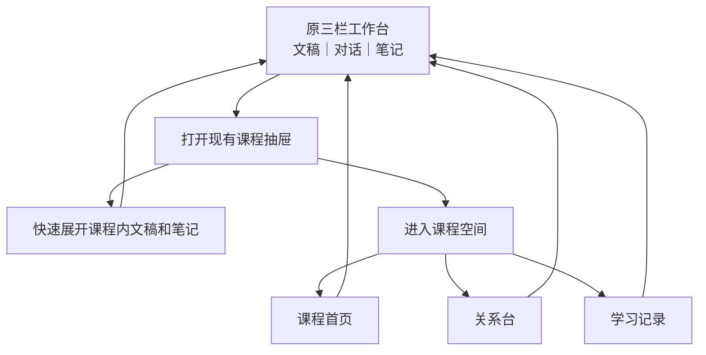

# 魏碑宣发前完整工作计划

- 日期：2026-07-28
- 状态：Fable 审阅、产品逐项确认和 Codex 代码事实终审均已完成；G0.0 规则已由 PR #61 合入 `main`，其余任务按本计划施工
- 入库方式：原草稿 PR #58 已关闭且不重开；本计划不单开文档 PR，最终版本随首个相关实现 PR 进入 `main`
- 目标：把魏碑做成一个真正围绕课程持续工作的学习 Agent，并通过真实 App 全链路验收后对外宣发
- 视觉母版：[课程首页最终母版](../VisualReferences/课程首页最终母版-2026-07-28.png)
- 母版规格：1487 × 1058，SHA-256 `c8bb324539efabce9726f0f3d1e486f076b1cfeedef052709c321f13ff433627`
- 适用范围：课程空间、Agent 会话与工具、Chat 正文与渲染、学习记忆、富回答、性能、发布物

## 0. 先说结论

这次不是“换一个课程首页”或“删一批报错代码”，而是同时完成四件事：

| 必须完成的结果 | 做完以后用户得到什么 |
|---|---|
| 课程原生 Agent | Agent 明确知道自己在哪门课、哪条 Chat、用户正在看哪里，并能按需查本课资料 |
| Answer-first Chat | 没有材料也能回答；引用、富回答、写入动作失败都不再连带吞掉正文 |
| 可用的课程空间 | 课程首页照最终母版落地，关系台和学习记录保留，退出后原三栏工作台原样恢复 |
| 可证明的发布版本 | 不以“能构建”冒充可用；用真实材料、真实问题、重开恢复、性能采样和安装包完成验收 |

不按日历机械决定是否宣发。以上能力做完并通过对应发布类型的验收，本周也可以发；没通过就不能包装成已完成。

### 这份计划描述的是目标，不是当前完成状态

| 目标模型 | 当前实现缺口 | 对应施工 |
|---|---|---|
| 一门课程有一个真实工程目录 | 当前课程主要是 App 内成员关系，Pi 没有进入稳定的课程项目根目录 | A0a、A1、A3；可携带状态见 A0b |
| 课程内每条 Chat 是一条独立线程 | 当前 Pi 基本每轮新建会话 | A2 |
| 同课多 Chat 共享课程记忆 | 当前学习记忆实际是全工作区共享，没有课程身份，存在串课 | A5a、A5b、C4b |
| 所有全局 Chat 共享独立全局记忆 | 当前只有一份无作用域记忆，无法同时保证全局连续性和课程隔离 | A5a、A5b、C4b |
| Pi 可按需查完整课程空间 | 当前工具仍依赖预裁剪快照 | A4、A7b |
| 首页新问题开新线程、继续对话回旧线程 | 当前首页还没有稳定恢复点与线程规则 | A6、B2b |

Fable 或其他审阅者必须区分“当前代码已经做到什么”和“本计划要求改成什么”，不能把目标模型误当成现状，也不能因为现状尚未实现就认为计划自相矛盾。

---

## 1. 已经拍板的产品决定

这些不再反复讨论，后续任务必须按它们执行。

| 主题 | 最终决定 |
|---|---|
| 课程心智 | 一门课程相当于 Codex App 里的一个项目，背后有魏碑管理的真实课程工程目录 |
| 资料库位置 | 首次使用由用户选择“魏碑资料库”总目录；新课程默认建在其中，现有文件夹也可以原地成为课程根目录 |
| 课程可携带性 | 普通课程目录保留单一共享原件；需要独立带走一门课程时，用“导出可携带课程副本”把本课使用的共享文稿实体化并连同可见学习状态一起导出 |
| 导出课程身份 | 可携带导出是同一门课程的迁移 / 备份，保留课程 ID；同机已有该 ID 时不重复登记。真正复制为独立课程以后另做并生成新 ID |
| 资料接入 | 新文稿真实进入课程的“文稿”目录；不提供普通“保留原位置并引用”的新增方式，也不在后台偷偷移动 |
| 多课程共享 | 一份文稿加入第二门课程时，经用户确认移到“共享文稿”目录，各课程用符号链接访问同一原件 |
| 移除课程 | 默认只从魏碑取消登记，真实课程文件夹及其中全部内容保持原样，以后可重新打开 |
| 删除课程文件 | 另设“将课程文件夹移到废纸篓”；显示真实路径并明确确认后才移动整个文件夹，共享文稿原件不跟随删除 |
| 同名文件冲突 | 永不静默覆盖；默认取消，可改名保留两份；明确替换时先把旧文件移到废纸篓。课程导出不合并现有目录，只能选择新空目录或取消 |
| 课程内打开资料 | 课程空间中的文稿条目直接打开现有工作台文稿栏并恢复阅读位置，不新造第二套阅读器 |
| Chat 心智 | 课程内每条 Chat 相当于项目中的一条线程；一门课可以有多条线程 |
| Chat 归属 | 新 Chat 创建时确定为全局或某一课程，之后不可普通改归其他课程；旧 Chat 的一次性归类只属于迁移 |
| 回答归属 | 一次回答始终写回发起它的 Chat；切换查看其他 Chat 不改变归属，也不自动中断 |
| 普通 Chat | 没打开文稿、没有笔记、没有课程，也必须能正常回答 |
| 全局 Chat | 默认可以按需查所有课程；没有明确进入课程时，不擅自把某门课当唯一范围；所有全局 Chat 共享独立的全局记忆 |
| 课程 Chat | 明确进入课程后，只能读取该课程的资料、笔记、关系和课程学习记忆 |
| 当前焦点 | 当前课程、文稿、页码或章节、选区、当前 Chat 身份由 App 自动提供 |
| 其他资料 | 不整库硬塞给 Pi；由 Pi 根据问题决定何时搜索、读取和关联 |
| Chat 连续性 | 同一个 Chat 的多轮对话对应同一条可恢复 Pi 会话 |
| 一课多 Chat | 一门课程允许多条 Chat；不同 Chat 不共享消息历史 |
| 课程共享内容 | 同课程不同 Chat 共享资料、笔记、关系和课程学习记忆 |
| 跨课程隔离 | 切换课程不能把上一门课的资料、记忆和学习判断带过来 |
| Pi 接入方式 | 不迁移 Pi SDK；保留 Swift 与 Pi 的 RPC 通道，但重做会话、上下文和工具使用方式 |
| Pi 的自主性 | 不再强制每轮先读上下文，也不再靠关键词强行进入某个学习工作流 |
| Pi 原生项目工具 | 开放当前课程内的列目录、找文件、搜索正文和读取文件；不开放终端、直接编辑或覆盖 |
| 网页能力 | 本次宣发版本不新增网页搜索或浏览；必须联网核实的问题明确说明尚未联网验证，网页研究留作后续独立能力 |
| 系统提示词 | 当前版本先保留一份稳定的魏碑核心规则；每门课自定义学习方式记为后续能力 |
| 作用域学习记忆 | 课程 Chat 自动写入该课程记忆；全局 Chat 自动写入独立的全局记忆。两者都对用户可见、可改，不逐次确认，也不互相自动注入 |
| 记忆查看入口 | 课程记忆仍进课程空间“学习记录”；全局记忆复用 Chat 顶部现有“对话目录”中的“全局记忆”，打开临时面板，关闭后原 Chat 与三栏状态不变 |
| 记忆生命周期 | 新信息新增；同义信息更新原记录；目标完成或困惑解决后保留历史并标记完成；用户明确纠正优先，直到后续学习产生新证据 |
| 记忆更新提示 | 回答末尾最多显示一枚可展开的朱砂记忆签；它告知已经发生的更新，不是确认入口 |
| 数据写入 | 学习记忆直接写入；正式笔记和关系仍用轻量卡片确认，不做成审批系统 |
| 关系图 | 宣发版只显示文稿与笔记之间的简单长期关联；不新增概念或 Chat 节点，也不增加总结、对比、质疑等关系类型 |
| 资料归属 | 普通文稿由一门课程目录持有；多课程共用时转为共享文稿，不复制文件 |
| 引用 | 是轻量“来源定位”，不是正文正确性的审判；不影响正文显示 |
| 引用交互 | 使用小标签；可定位到页或段落并高亮，多个来源用 `+N` 标签展开 |
| 富回答 | 保留已经合入的协议合同、失败隔离、正文共存、持久化和现有渲染；本轮暂停新增类型、固定题库和全矩阵，不把“完整富回答”作为核心卖点 |
| 课程首页 | 严格照最终母版，不再增加问候、侧栏、卡片或第二个 Chat |
| 首页提问 | “问这门课”默认新建一条当前课程 Chat；只复用用户刚明确创建且尚无消息的本课程空 Chat |
| 首页续聊 | “继续对话”只恢复恢复点绑定的旧 Chat / Pi 会话，不新建、不猜最近一条 |
| 发布路线 | 源码开源、社区安装包、普通用户正式安装包三条都做，验收门槛分别计算 |
| 宣发判断 | 构建、自检、CI 通过都不等于真实可用；必须通过真实 App 全链路验收 |

### 当前版本明确不做

| 不做什么 | 原因 |
|---|---|
| 迁移 Pi SDK 或增加 JavaScript 中间宿主 | 不能解决课程身份、会话连续性和工具作用域问题，只会扩大工程面 |
| 新增网页搜索或浏览 | 会引入另一套来源、权限和失败链路，不是本轮课程 Agent 核心；以后作为独立能力设计 |
| 每门课程单独生成系统提示词 | 当前先把课程身份、焦点、工具和共享记忆做对 |
| 给关系图新增概念节点或复杂关系类型 | 现有文稿—笔记关联已能承担导航；本轮先把课程隔离、Agent 读取和轻量确认做通 |
| 把 Chat 变成关系图节点 | 会把学习过程和知识关系混成一团 |
| 新增永久课程侧栏或第四栏 | 与现有文稿 / 对话 / 笔记三栏工作台冲突 |
| 为了止卡删除富回答、流式或课程能力 | 这是能力回退，不是修复 |
| 追求“必须删 1200 行” | 删除目标应由调用链和行为决定，不由预估行数决定 |
| 用静态假学习小结、假页数、假跳转填满首页 | 没有真实数据就显示诚实空态 |

---

## 2. 产品层级和入口



| 层级 | 职责 | 状态规则 |
|---|---|---|
| 课程抽屉 | 快速找课程、文稿和笔记 | 临时出现，不成为永久第四栏 |
| 三栏工作台 | 阅读、连续对话、写笔记 | 主工作界面，进入课程空间时不销毁 |
| 课程空间 | 查看一门课的整体状态、关系和记录 | 全窗口覆盖层，关闭后恢复原工作台 |
| 课程首页 | 课程空间的默认页 | 不是新的产品层级，也不是第二个工作台 |
| 关系台 | 查看和管理文稿与笔记之间的简单关联 | 不放概念或 Chat 节点，不新增关系类型 |
| 学习记录 | 查看课程学习过程和记忆 | 读取课程数据，不替代 Chat 历史 |

### 进入与返回的准确行为

| 用户动作 | 必须发生的结果 |
|---|---|
| 在课程抽屉展开课程 | 只展开课程内容，不改变当前文稿、Chat、笔记和活动课程 |
| 打开某份文稿或笔记 | 关闭抽屉，回到原三栏，只替换对应栏 |
| 点击“进入课程空间” | 打开全窗口课程空间，默认显示课程首页 |
| 点击“返回工作台”或按 Esc | 关闭课程空间，原三栏、滚动位置、草稿、栏宽和 Chat 原样回来 |
| 点击“继续阅读” | 返回工作台并恢复该文稿的真实阅读位置 |
| 点击“继续对话” | 返回工作台并恢复同一条 Chat / Pi 会话，不新建重复对话 |
| 从首页提交“问这门课” | 回到工作台对话栏，默认新建当前课程 Chat 并发送；只复用用户刚明确创建且尚无消息的本课程空 Chat |
| 点击课程内容中的文稿 | 返回工作台，在现有文稿栏打开课程中的真实文稿并恢复已保存位置；资料不可用时原位提示重新定位 |

### 课程空间浏览身份与底层 Chat 身份必须分开

课程空间正在浏览哪门课，不能直接改写底层工作台 Chat 属于哪门课。

| 状态 | 含义 |
|---|---|
| `courseWorkspaceCourseID` | 当前覆盖层正在看的课程；顶栏切课只改它 |
| `chat.courseID` | 当前 Chat 的硬作用域；只有明确切换、新建或继续 Chat 才改变 |
| 当前文稿 | 工作台此刻显示的资料；可能属于多门课 |
| 当前笔记 | 工作台此刻显示的笔记；不自动改写 Chat 作用域 |

打开课程 A 首页、在顶栏切到课程 B、再按 Esc，都必须原样恢复底层工作台和原 Chat 身份。只有“问这门课”“继续对话”“打开某项内容”等明确动作，才改变对应工作栏。

其中“打开某项内容”只能改变文稿或笔记栏，不能顺带切换、重标或重新推导 Chat。现有 `activateLatestStudySession` 这类“根据所选文稿自动找一条 Chat”的路径必须移除：一份文稿可能属于多门课，普通选文稿永远只更新阅读焦点；只有新建 Chat、继续对话或用户显式选择 Chat 才能改变 Chat 身份。所有 Chat 激活入口最终统一经过同一个带 `expectedCourseID` / 全局作用域校验的方法，`alignActiveCourse` 只负责浏览显示，不能决定 Chat 属于哪门课。

如果当前文稿属于课程 A，而当前 Chat 明确属于课程 B：

1. 课程 B Chat 仍以 `courseID = B` 为硬边界；
2. 课程 A 文稿只作为界面焦点显示，不能自动进入课程 B Agent 上下文；
3. 界面提示用户切换到课程 A Chat、新建课程 A Chat，或明确把该资料加入课程 B；
4. 不允许静默跨课程读取。

---

## 3. 课程首页规格

最终母版是本计划唯一视觉真相。实现时不得“顺手优化”成另一套首页。

### 3.1 页面结构

| 区域 | 母版内容 | 数据与交互 |
|---|---|---|
| 顶栏 | 返回工作台、课程下拉、课程首页、关系台、学习记录、搜索、添加 | 复用现有课程空间顶栏 |
| 继续上次 | 一张上次学习卡片 | 只代表最近停留点，不代表课程只有一份文稿 |
| 继续阅读 | 朱砂主按钮 | 恢复真实文稿和阅读位置 |
| 继续对话 | 描边按钮 | 恢复真实课程 Chat |
| 问这门课 | 母版中的大输入框 | 提交后回到对话栏，默认创建当前课程的新 Chat 并发送 |
| 最近内容 | 一行课程活动摘要 | 点击展开当前课的文稿、笔记和对话内容 |
| 学习小结 | 一行真实课程总结 | 无真实总结时显示空态，不写静态假话 |
| 下一步 | 一行真实建议 | 只有存在可执行目标时才显示跳转；纯文字建议不放假箭头 |
| 底部入口 | “查看全部文稿、笔记与对话记录” | 复用现有列表，不新造第二套资料系统 |

“最近内容”、三条摘要行和底部入口都在课程首页原位向下展开，复用同一个文稿 / 对话 / 笔记列表表面；不跳转到第二个资料页。搜索有输入时，同一区域切换为搜索结果，清空搜索后恢复此前展开状态。

### 3.2 数据真实性

| 字段 | 当前能否真实得到 | 实现要求 |
|---|---:|---|
| 课程名 | 能 | 使用当前课程标题 |
| 上次文稿 | 能 | 在当前课程文稿中按最后学习时间选择 |
| 上次页码 / 章节 | 能 | 使用已持久化位置 |
| PDF 总页数 | 当前不能稳定持久化 | 先显示“第 18 页”，不得伪造“18 / 189” |
| 上次学习时间 | 能 | 使用真实时间 |
| 最近对话 | 能 | 只取当前课程 Chat |
| 最近笔记活动 | 当前缺少可靠更新时间 | 补数据前不声称完整覆盖 |
| 学习小结 | 条件可用 | 只读当前课程的总结或已掌握记忆 |
| 下一步 | 条件可用 | 只读当前课程的下一步记忆或会话建议 |

### 3.3 “继续上次”是同一个学习现场

不能把“最新文稿”和一条无关的“最新 Chat”拼成同一张卡。需要保存或可靠推导一个课程恢复点：

| 恢复点字段 | 用途 |
|---|---|
| 课程 ID | 确保不串课 |
| 文稿 ID 和阅读位置（可选） | 有真实阅读现场时恢复阅读 |
| 对应 Chat ID（可选） | 有真实对话现场时恢复该 Chat |
| 笔记 ID（可选） | 恢复当时使用的课程笔记 |
| 保存时间 | 显示真实上次学习时间 |

没有关联 Chat 时隐藏“继续对话”；没有真实阅读位置但有课程 Chat 时，上次学习卡显示真实 Chat 标题和时间，只提供“继续对话”；文稿和 Chat 都没有时显示诚实的“开始学习”空态。不得拼接两个独立的“最新”对象。

### 3.4 “问这门课”的会话选择规则

1. 从课程首页提交新问题时，默认新建一条当前课程 Chat。
2. 只有底层是用户刚刚明确创建、属于当前课程且尚无任何消息的空 Chat，才复用它，避免制造第二条空线程。
3. 已经有消息的旧 Chat 无论是不是同一课程，都不能被首页输入框静默复用。
4. “继续对话”永远恢复课程恢复点绑定的那条旧 Chat / Pi 会话，不用“最近一条”猜。
5. 首页本身不保存第二份聊天历史；提交后回到原三栏工作台的对话栏。
6. 创建或恢复 Chat 前必须明确 `courseID`，不得依靠“这条 Chat 碰过哪份文稿”猜课程。

### 3.5 搜索和添加

| 功能 | 当前版本要求 |
|---|---|
| 搜索课程内容 | 搜当前课程的文稿、笔记和对话；每条结果显示类型和来源。只有标题搜索时文案写“搜索标题”，正文索引完成后才使用“搜索课程内容” |
| 添加文稿 | 加入当前课程 |
| 导入笔记 / 新建笔记 | 加入当前课程 |
| 导入文件夹 | 如果会新建课程，文案必须明确为“导入为新课程”，不能伪装成向当前课添加 |

“最近内容”只按可靠时间排序：文稿使用学习位置时间、Chat 使用更新时间、笔记补齐更新时间后再纳入。没有可靠时间的笔记可以在“全部内容”中出现，但不能冒充最近活动。

### 3.6 首页状态矩阵

| 状态 | 页面表现 |
|---|---|
| 无上次学习 | 保留母版节奏，显示“开始学习”空态，不显示伪造页码和时间 |
| 有文稿、无关联 Chat | 显示“继续阅读”，隐藏“继续对话” |
| 有 Chat、无文稿 | 上次学习卡显示真实 Chat 标题和时间，只显示“继续对话”；文稿列表为空不影响课程提问 |
| 无学习小结 | 行内显示“产生实质学习变化后生成”，不把随便聊过一次冒充学习进展 |
| 无下一步 | 行内显示“尚无学习建议”，不显示可点击箭头 |
| 搜索无结果 | 在原位结果区显示空态，可一键清空搜索 |
| 加载或保存失败 | 当前可读内容仍显示；失败动作单独提示重试 |
| 窄窗口 | 保持顶栏主动作和输入框可用；内容改为单列，不裁掉按钮 |
| 深色主题 | 继承现有墨色主题，不改变默认明亮纸色母版 |

键盘与无障碍要求：Tab 顺序符合视觉顺序；Enter 发送、Shift+Enter 换行；Esc 返回工作台；折叠行、按钮、输入框有准确的 VoiceOver 名称、值和展开状态。

---

## 4. Agent 系统边界

### 4.1 谁负责什么

| 系统 | 负责的真相 | 不负责什么 |
|---|---|---|
| 魏碑作用域数据系统 | 全局记忆；各课程、课程成员关系、资料、笔记、显式关系和课程记忆 | 不替模型判断正文“够不够好” |
| 魏碑 Chat 系统 | Chat 身份、`courseID`、消息记录、Pi 会话映射 | 不靠接触过的资料猜归属 |
| 界面焦点系统 | 当前课程、文稿、页码 / 章节、选区、当前 Chat | 不把上一门课焦点带入下一门课 |
| Pi Agent | 推理、连续对话、决定何时使用工具、生成回答和提案 | 不凭空宣布 App 中存在某份资料或笔记 |
| 魏碑工具层 | 把 App 的课程数据安全、结构化地提供给 Pi | 不强迫 Pi 每轮固定调用 |
| 渲染与动作层 | 显示正文、来源标签、富回答和写入提案 | 增强失败时不能杀正文 |

“App 保存真相”说人话就是：Pi 可以理解、建议和请求修改；某份资料、笔记或关系究竟存不存在，最终以魏碑保存的数据为准。

### 4.2 真实课程工程目录与会话模型

一门课程不是纯虚拟筛选条件。魏碑为每门课程维护一个真实工程目录，Pi 以它作为项目根目录；新文稿真实放入该课程的“文稿”目录，笔记真实放入“笔记”目录。

| Codex App 心智 | 魏碑里的正式含义 | 是否共享 |
|---|---|---|
| 项目 | 一门课程及其真实课程工程目录 | 课程内共享 |
| 项目中的线程 | 一条课程 Chat | 消息不与其他 Chat 共享 |
| 线程运行状态 | 该 Chat 映射的一条可恢复 Pi 会话 | 只属于该 Chat |
| 项目文件和上下文 | 工程目录中的真实文稿、笔记、关系和课程学习记忆 | 同课程 Chat 共享 |
| 当前打开文件和选区 | 当前焦点包 | 只随本轮请求临时提供 |
| 项目外的新任务 | 全局 Chat | 不绑定单门课程，可按需跨课程查询 |

课程工程目录必须满足：

- 目录身份使用稳定 `courseID`，课程改名不能产生第二个项目或丢失 Chat；
- 首次使用由用户选择“魏碑资料库”总目录，魏碑用 macOS 可持续访问授权保存该总目录权限；每个原地接管的课程根也分别保存权限。授权失效时原位提示用户重新选择同一目录，不把课程误判为被删除；新建课程默认在资料库中创建包含“文稿”“笔记”和内部状态的真实工程目录；
- 注册课程前解析真实路径：课程根不能是磁盘根、用户主目录、`Documents`、魏碑资料库根或共享文稿目录，也不能包含这些目录；不同已登记课程根不能相同或互为父子。课程可以正常位于魏碑资料库之下，只要不落入共享文稿目录且不与另一课程重叠；
- 用户可以把一个已经整理好的文件夹原地打开为课程根目录；魏碑不得为了套用默认结构擅自搬动、重命名或重新分组其中的文件；
- 用户可以在 Finder 中把文稿移入课程目录，魏碑自动识别；也可以从 App 添加，但移动前必须明确告知目标位置；
- 魏碑持续协调课程目录变化，而不是只在首次导入时扫描：Finder 中的新增、删除、改名、移动和云文件占位状态都要增量对账；同一文件在课程内改名或移动后仍保持同一资料 ID，不能按路径新建重复资料；
- 不提供普通“文件留在外面、课程只存引用”的新增方式；旧版本留下的外部资料进入待整理迁移状态；
- Pi 会话在课程工程目录下启动和恢复，使用项目内真实路径工作；
- 课程空间中的内容列表与 Pi 的项目文件树读取同一批真实课程文件；用户点击文稿时在现有三栏工作台的文稿栏打开并恢复阅读位置；
- 一份文稿加入第二门课程时，先明确询问用户；确认后将唯一原件移入顶层“共享文稿”目录。原持有课程用链接替换原文件并保留原相对路径，新加入课程的链接默认放入“文稿”目录，不能因为共享而打乱原课程结构；
- “从魏碑移除”先停止该课程正在生成的回答并把最新可保存状态写入 `.weibei`，再清理本机登记、书签和可重建缓存；不删除或重排真实课程文件夹及其中内容，重新打开同一文件夹仍恢复同一课程；
- “将课程文件夹移到废纸篓”是分开的危险动作：确认界面显示真实课程根路径，执行前再次核验它不是宽目录、共享目录或其他课程祖先；先停止该课程运行，再把整个根目录移入 macOS 废纸篓，成功后才取消登记。移动失败时课程仍保持登记且文件不作已删除处理；共享文稿唯一原件位于课程目录之外，始终保留；
- 普通课程目录中的共享文稿链接不冒充可携带原件；用户要单独带走课程时，使用“导出可携带课程副本”；
- 导出不会改动原课程或共享原件；它复制本课自有文件和 `.weibei` 可携带状态，把本课实际使用的共享文稿复制进导出目录，并将导出清单改为指向这些本地副本；
- 导出清单保留原课程 ID，含义是迁移 / 备份同一门课程，不是克隆。同一真实根再次打开时只激活已有课程；同 ID 的另一根在原根可用时拒绝重复登记；原根离线或丢失时，用户可明确确认“用此备份重新定位”，把已有课程绑定到核验通过的新根，不生成第二条课程记录；
- 本次不提供“复制为新课程”；以后如需克隆，必须由独立动作生成新课程 ID，并重新建立 Chat、记忆和关系归属，不能借导出偷偷改身份；
- 添加、旧资料迁移、转为共享文稿或其他跨目录移动遇到同名目标时，先显示来源与目标路径。默认“取消”；“两个都保留”建议 `文件名 2.扩展名` 并允许修改；普通目标才可选择“替换”。已登记且正被其他课程使用的共享原件禁止在冲突面板中替换，只能取消或改名保留两份；
- 普通文件“替换”沿用目标资料 ID 和显式关系，但生成新的内容修订号；旧回答的来源附件继续绑定旧内容修订，不能跳到新内容冒充原文。事务顺序固定为：新文件先写入同卷临时目标并校验 → 记录来源 / 目标 ID、内容哈希、事务阶段和废纸篓返回位置 → 旧目标移入废纸篓 → 新文件原子落位 → 提交清单；索引、缩略图和无效阅读锚点随后重建。任一步失败都恢复为可重试的一致状态；
- 可携带课程导出只写入新建的空目标目录；目标目录不能位于源课程或共享文稿目录内部。目标已存在时允许重新命名或取消，不把两套课程文件和 `.weibei` 状态合并，也不静默替换整目录；
- PDF 页码、HTML 章节、App 当前选区、关系和学习记忆仍由魏碑的课程读取能力提供，不能假装普通文件读取已经覆盖；
- 用户可以从课程界面“在 Finder 中显示”工程目录，但不要求用户手工维护内部状态文件。

课程目录内的隐藏 `.weibei` 只保存可以随项目带走的小型长期状态：

- 课程稳定身份和版本；
- 用户可见的 Chat 消息及其必要附件；
- 课程学习记忆、关系和阅读位置；
- 恢复这些数据所需的最小迁移信息。

搜索索引、PDF / OCR 缓存、缩略图、临时 Pi 会话、运行日志、性能采样、API 密钥和账号配置只保存在本机系统目录，不进入课程文件夹。课程在另一台 Mac 打开后，以 `.weibei` 中的可见数据恢复学习现场，并重新生成索引和 Pi 运行状态；不能把缓存文件冒充可携带的长期数据。没有共享文稿的普通课程目录可以直接复制；包含共享文稿时，只有“导出可携带课程副本”承诺带齐全部文稿，普通复制只带走链接和共享身份信息。

课程文件不能在用户不知情时移动。App 内“添加文稿”在执行前显示原位置和目标课程目录；现有外部资料迁移、课程转共享和跨目录移动都写入可恢复事务记录，先复制到临时目标、核对文件身份和内容，再原子完成清单切换，最后才移除旧入口；崩溃、Finder 并发改名 / 编辑或权限中断后重复执行不会复制第二份，也不会删除尚未验证的原件。共享文稿的符号链接只是各课程中的工作入口，唯一原件、稳定资料 ID、文件身份和共享课程清单仍由魏碑记录，不能用同名文件冒充原件。外置磁盘离线、云文件未下载或原文件删除时，课程内保留条目并明确显示“资料不可用 / 重新定位”；Agent 可以使用最后一次成功提取的索引继续回答，但必须标注“基于上次索引，原文件当前不可用”，不能声称内容为最新，也不能显示可点击的原文定位。

| 对象 | 正确模型 |
|---|---|
| Chat | 明确保存可选 `courseID`、Pi 会话 ID、标题、消息和更新时间；新建后作用域不可变 |
| 课程 Chat | `courseID` 创建时必填并固定；只能使用该课工具 |
| 全局 Chat | `courseID` 创建时为空并保持全局；可按需查询所有课程，但结果必须标明来自哪门课；所有全局 Chat 共享独立的全局记忆 |
| 同一 Chat | 对应一条可恢复 Pi 会话，重开 App 后继续 |
| 同课程不同 Chat | 消息历史分开；课程资料和课程学习记忆共享 |
| 资料多课程归属 | 唯一原件位于“共享文稿”，各课程目录使用符号链接，不复制文件 |

Chat 顶部“对话目录”不能再用一个无作用域的“新对话”按钮：

- 当前是全局 Chat 时，主动作显示“新建全局对话”；
- 当前是课程 Chat 时，主动作显示“新建本课对话”，另提供“新建全局对话”；
- 历史按“全局”和课程名分组，每条 Chat 显示其固定作用域；切换只由用户明确点击触发；
- 不增加永久侧栏或第四栏，仍复用现有 Chat 顶部菜单。

学习记忆的存储作用域由发起回答的 Chat 决定，不能由当前浏览课程决定：

| Chat 作用域 | 自动读取和写入的记忆 | 保存位置 |
|---|---|---|
| 课程 Chat | 该课程的课程记忆 | 课程 `.weibei` 可携带状态 |
| 全局 Chat | 所有全局 Chat 共享的一份全局记忆 | 魏碑 App 数据，不进入任何课程目录或课程导出 |

课程记忆明确保存 `courseID`；全局记忆明确保存全局作用域且没有 `courseID`。两者使用分开的 ID 空间和修订号，不自动互相复制或注入。全局 Chat 仍可按需查询带课程身份的课程记忆来回答跨课程问题，但其自动更新只写全局记忆；课程 Chat 不读取全局记忆。来源 Chat 和来源消息只记录“这条记忆从哪里产生”。删除一条 Chat 不删除已经写入其作用域的记忆。

### 4.3 Pi 会话生命周期

一 Chat 一 Pi 会话不是只保存一个字符串，必须先用当前打包的 Pi 做恢复试验，再按真实能力实现：

当前实现只有一个长驻 Pi 进程、一个全局正在生成的回答，进程工作目录固定在魏碑运行目录，并且每轮使用 `--no-session` 后执行 `new_session`。改造后的运行绑定必须由三件事共同决定：Chat 作用域（课程 / 全局）、真实项目根目录、Chat 会话身份。切换课程、全局作用域或项目根时，必须在没有进行中回答后安全重启并用新工作目录启动 Pi；切换回同一 Chat 时恢复它自己的会话。课程 Chat 的进程工作目录是课程真实根目录；全局 Chat 使用魏碑中立运行目录，且不开放 Pi 原生项目文件工具，只能走带课程身份的全局查询能力。第一版继续保持全 App 同时只生成一个回答，不为多进程并发另造调度层。

| 时机 | 行为 |
|---|---|
| 新建 Chat | 在魏碑自己的会话目录创建 Pi 会话并保存映射 |
| 继续 Chat | 恢复该 Pi 会话，不再每轮执行 `new_session` |
| 正常下一轮 | 依靠 Pi 会话历史，不重复注入最近 20 条消息 |
| Pi 会话文件缺失 / 损坏 | App 消息仍保留；从可见消息一次性重建新的 Pi 会话 |
| 回答中切换 Chat | 只切换可见 Chat；原回答后台继续并只写回原 Chat |
| 在另一 Chat 再发送 | 第一版同一时间只生成一个回答；先轻量确认是否停止原回答，再开始目标 Chat |
| 删除 Chat | 删除对应 Pi 运行状态；不删除已经写入该 Chat 作用域的全局或课程记忆 |
| 重开 App | 按 Chat 映射恢复；恢复失败走安全重建 |

App 消息是用户能看到的长期记录，Pi 会话是可重建的运行状态。Pi 文件损坏不能导致 Chat 消失。

A2 开工前的最小恢复试验：

1. 使用 App 当前打包的 Pi，以 RPC 模式启动，去掉 `--no-session`，会话目录指向一次性临时目录；
2. 执行 `new_session`，让它记住一个本次随机生成的暗号；
3. 结束进程，确认临时目录中产生可识别的会话文件；
4. 先从打包 Pi 的真实 RPC 命令清单和会话文件中确认它实际支持的恢复命令与参数，再重启同一个 Pi、恢复该会话并询问暗号；不得在试验前把 `switch_session(sessionPath)` 当成已经存在的接口。

能在不重放历史的情况下答出暗号，A2 使用原生会话恢复；不能，则保留可见 Chat 记录，并从 App 消息一次性重建新的 Pi 会话。试验只决定实现路径，不改变“一条 Chat 对应一条可恢复运行状态”的产品模型。

### 4.4 上下文策略

每次提问自动附带一个很小的“当前焦点”：

- 当前 Chat ID 和课程 ID；
- 当前正在看的文稿 ID；
- 页码、章节或段落位置；
- 用户选区；
- 当前界面动作来源。

当前文稿和选区只有在属于当前课程 Chat 的作用域时，才自动进入 Agent 上下文；全局 Chat 可以使用它；明确属于另一门课的 Chat 不得自动接收它。

其他内容不提前塞满提示词。Pi 自己判断是否需要：

- 查看课程目录；
- 搜索课程；
- 读具体文稿；
- 读笔记；
- 看当前 Chat 作用域的学习记忆；
- 看文稿与笔记之间已经建立的关联。

### 4.5 工具合同

工具不是为了限制 Pi 的聪明，而是把 App 内部对象变成 Pi 能可靠操作的课程能力。

Pi 原生项目工具先恢复到真正的只读项目模式：

| 原生能力 | 开放范围 | 处理 |
|---|---|---|
| 列目录 `ls` | 当前课程工程目录 | 直接执行 |
| 找文件 `find` | 当前课程工程目录 | 直接执行 |
| 搜索正文 `grep` | 当前课程文稿和笔记 | 直接执行 |
| 读取文件 `read` | 当前课程文件、已确认共享文稿和随 App 打包的必要 Skill | 直接执行 |
| 终端 `bash` | 不开放 | 课程学习不需要任意命令执行 |
| 编辑 `edit`、覆盖 `write` | 不开放 | 正式笔记和关系仍走用户确认的写入卡片 |

每次运行由 App 注入不可由 Pi 改写的作用域清单：当前课程 `courseID`、课程根目录真实路径，以及已核验属于本课的共享文稿真实路径。扩展统一接管 `ls / find / grep / read`，在执行前规范化路径并核对清单，在打开文件后再次核对实际文件身份；拒绝 `../`、任意绝对路径、借符号链接越界和检查后换文件的路径竞争。课程根内的 `.weibei`、事务日志、清单、书签和其他内部状态必须从列目录、找文件、搜索和读取结果中硬排除；当前 Chat、课程记忆和关系只通过对应结构化工具提供，不能让同课另一 Chat 的原始消息变成项目文件。目录、搜索和读取结果都设条数 / 字节上限，避免一次工具调用拖垮 App。全局 Chat 不开放这些原生项目文件工具。不能因为恢复 Pi 原生只读工具，就放开整机文件系统。

| 工具能力 | 目的 | 关键边界 |
|---|---|---|
| 读取当前焦点 | 知道用户此刻在看什么 | App 自动给，不要求先调用 |
| 查看课程内容 | 列出本课文稿、笔记和关联摘要 | 必须校验课程成员关系 |
| 搜索课程 | 用 Pi 自己提出的搜索词查询当前课程完整索引 | 不再只搜原问题预裁剪出的静态快照 |
| 读取文稿 | 按资料 ID 和位置读取内容 | 返回稳定资料 ID 和位置锚点 |
| 读取笔记 | 读当前课程笔记 | 不允许跨课读取未归属内容 |
| 读取关系 | 查看当前课程已经建立的关系并沿线索继续查找 | 关系不是语义结论；是否搜索或读取正文由 Pi 根据问题判断，不设强制调用顺序 |
| 读取当前作用域记忆 | 课程 Chat 读本课记忆；全局 Chat 读独立全局记忆 | 作用域由宿主绑定，内容对用户可见 |
| 提议写笔记 | 生成可编辑写入卡片 | 用户确认后执行 |
| 提议建关系 | 生成一份笔记与一份文稿的关联预览 | 用户确认后执行；不让 Agent 自造关系类型 |
| 更新当前作用域记忆 | 写入本轮有意义的学习进度、掌握、困惑、下一步或摘要 | 只能写入发起 Chat 的记忆作用域；直接执行并在回答末尾告知 |

全局 Chat 使用另一组全课程目录 / 搜索入口：可以查询所有课程及其课程记忆，但每条结果必须带课程身份；这些查询结果不会变成全局记忆，也不会授权全局 Chat 自动改写课程记忆。“课程查询不使用全库 `allItems`”只约束课程 Chat，不能误伤全局 Chat。

关系系统对 Agent 的意义也要分清：

- 课程成员关系决定“能不能读”，是作用域边界；
- 宣发版只有“笔记与文稿已关联”这一种长期关系，不新增概念节点或带类型的关系边；
- 已建立的关系只告诉 Agent“还可以沿哪里继续找”，是课程内导航线索，不自动证明两项之间是总结、质疑、补充还是对比；
- 只展示“已关联”时不需要为了走流程强制读取；用户追问“为什么相关”或 Agent 准备作出具体语义判断时，由 Pi 自己决定搜索、读取哪些相关段落；
- 宿主不得规定“看见关系后必须调用读取工具”，也不得因为 Pi 没有按固定顺序调用工具而拒绝或吞掉回答；
- 关系不是简单把所有文件装进课程，也不把 Chat 变成知识节点。

Pi 自带的通用文件工具不能直接替代这些工具，因为它不知道魏碑的课程 ID、资料多课程归属、阅读位置、笔记对象和关系数据。当前版本保留课程专用工具，并只恢复上表四个原生只读项目工具；不开放任意文件、网页搜索、网页浏览或其他 Pi 内置工具。回答需要核实最新事实时，Agent 必须明确说明当前没有联网核实，不能假装查过网页。

工具背后必须是真实的动态读取：

1. 课程 Chat 的 scope 由宿主绑定，Pi 不能把参数改成另一门课；交给它的关系必须两端都属于该课程；
2. Pi 可以用第二个、第三个自行改写的搜索词查询当前课程完整索引；
3. 搜索结果返回稳定资料 ID、课程归属和位置；
4. Pi 再按 ID / 位置读取正文；
5. 不能继续把按用户原问题裁成少量片段的 `context.json` 包装成“自主搜索”。

### 4.6 学习记忆

学习记忆不是隐形画像，而是用户能看见和改的作用域内容。课程 Chat 使用本课记忆；全局 Chat 使用所有全局 Chat 共享的一份全局记忆。查看入口不增加永久侧栏、第四栏或顶栏标签：

| 当前 Chat | 查看全部记忆 | 返回行为 |
|---|---|---|
| 课程 Chat | 课程空间的“学习记录” | 关闭课程空间后恢复原三栏工作台和原 Chat |
| 全局 Chat | Chat 顶部现有“对话目录”菜单中的“全局记忆”，打开可搜索、查看和修改的临时面板 | 关闭面板后恢复原全局 Chat 和三栏状态 |

| 记忆类型 | 例子 | 更新方式 |
|---|---|---|
| 学习进度 | 已读到利率期限结构 | Agent 根据本轮学习过程自动写入；App 的阅读位置另行记录，不冒充语义记忆 |
| 已掌握 | 能区分名义利率与实际利率 | Agent 根据真实学习过程自动写入 |
| 困惑 | 仍不理解久期与价格波动 | 用户明确表达或 Agent 从本轮学习中识别后自动写入 |
| 下一步 | 对比收益率曲线三种形态 | Agent 自动写入 |
| 作用域摘要 | 当前课程，或跨课程学习整体进行到哪里 | 在有意义的学习轮次后自动更新 |

记忆更新遵守同一套生命周期：

| 本轮情况 | 保存结果 |
|---|---|
| 出现真正的新进展、掌握、困惑或下一步 | 新建稳定记忆 ID，并记录来源 Chat、来源消息、依据和时间 |
| 与现有记忆语义相同 | 更新原记忆 ID 和修订记录，不新增第二条活动记忆 |
| 目标完成或困惑解决 | 原记忆改为“已完成 / 已解决”，保留全部历史，不删除 |
| 用户明确纠正 Agent | 用户修订成为当前值；只有后续学习产生新证据时，Pi 才可再次更新 |
| 没有实质变化 | 不写入，也不显示记忆签 |

“有没有实质变化”和“是否与现有记忆同义”由 Pi 结合当前 Chat 作用域的记忆与本轮对话判断，不使用关键词路由或宿主内容审判。Pi 通过稳定记忆 ID 指明新增、更新或解决；App 只校验作用域、目标 ID 和结构，保存每次修订及来源，不用一套模糊关键词规则替 Pi 判断内容。

学习记忆生成后直接写入发起 Chat 对应的课程或全局记忆，不弹确认卡片，也不参考界面当前碰巧打开的课程。写入成功后，回答末尾最多显示一枚朱砂记忆签：

- 收起时显示 `已更新学习记忆 · N 项`，不把多条记忆堆成一排标签；
- 回答完成时只播放一次克制的浮现动效，不循环、不抢正文注意力；
- 点击后在回答原位展开本轮记忆，逐项显示类型和简短内容；
- 课程记忆的“查看全部”进入该课“学习记录”；全局记忆的“查看全部”进入同一个全局记忆临时面板；
- 本轮没有更新时完全不显示；
- 记忆签随回答持久化；重开 Chat 默认收起且不重新播放动效。

正式笔记仍是用户创作内容，必须另走“建议写入内容”卡片并确认，不能拿学习记忆的自动写入规则代替。

Pi 自己的会话历史解决“一条 Chat 里记得前文”，不能天然解决“同作用域多条 Chat 共享、用户能看见并修改”的学习记忆。A5a 开工前可以审阅打包 Pi 是否已有可复用的记忆扩展；只有它同时支持全局 / 课程作用域、跨会话共享、用户可见可改和可迁移时才复用，否则直接使用魏碑现有数据与工具，不为“可能有用”新增插件层。

记忆更新失败说明动作层有问题，应单独报错和重试，不能被当成正常体验长期存在；已经生成的回答仍保留。

### 4.7 分两段删除旧“学习工作流”

现有“学习工作流”说人话就是：宿主根据“整理、笔记、解释”等关键词，先替 Pi 选一个模式，再规定它必须先读什么、必须产出什么。拆除分成两段，不能再归到 C0：

| 阶段 | 现在做什么 | 明确不做什么 |
|---|---|---|
| A7a，随 A2 / PR #68 收口 | 删除会吞正文的来源硬门槛、关键词式内容 / 诚实性判断、回答前必须已读上下文的宿主判决，以及“没有笔记提案就判整轮失败”；来源、笔记提案、学习记忆和富回答动作校验失败只丢弃相应附件或动作，不吞普通正文 | 不在本 PR 全面拆 Skill、关键词路由和资源清单 |
| A7b，A4 与 C0 后立即施工 | 删除关键词路由、强制先读上下文、旧学习工作流；把当前材料、笔记和选区作为隐藏的本轮焦点自然交给 Pi，其他课程资料再由 Pi 按需搜索；同步处理核心提示词、旧学习 Skill、两个运行时、资源清单、启动校验和自检 | 不把功能性拆除拖到 H1 |

A7b 的删除范围不只在两个运行时：必须同时审查并改造 Agent 核心提示词 `system.md`、工具扩展 `extension.ts`、当前五个旧学习 Skill、`StudyAgentRuntime`、`PiAgentRuntime` 和对应自检。`weibei-interactive-study` 只曾残留在旧自检的假命令里，不得为了迁就旧清单把它复活。首工具限制、无来源拒答和笔记模式要从完整调用链删除。

当前焦点正文通过 Pi 0.82.1 的 `before_agent_start` 隐藏消息注入，只作为本轮用户资料，不抬高为系统指令；回答实际引用其中标签时，宿主才附上可打开的来源对象。无当前资料的普通问题允许零工具直接回答；跨文稿问题由 Pi 自主使用课程项目搜索与读取。损坏的上下文快照、越权路径、真实网络 / 进程 / 协议错误仍保留为真实故障，不能伪装成“无资料”继续运行。

A7a 先移除 `PiAgentRejectedReplyError` 等把安全正文判掉的宿主路径。A7b 再把这些调用者一起纳入：`NotesAgentView` 的“整理本页”、`WorkspaceStore` 对工作流的直接调用、`WeiBeiPiCheck`、`PiTerminalRuntimeSelfChecks`、`WeiBeiSelfCheck/main.swift` 的源码字符串断言。删除或调整任何 Skill 时，必须同步更新 `PiAgentResources`、启动参数、`verifyRequiredSkills` 和 `piPrompt`；不能删了资源却让启动自检继续把它当必需项。

---

## 5. Chat、渲染和失败规则

### 5.1 回复首先是一条可恢复记录

当前 `AgentMessage.richAnswer` 已经随消息进行 `Codable` 持久化，C0 不重做这一能力；需要保留现有兼容解码和重开恢复，并给静默解码降级留下可诊断证据。真正缺的是结构化多来源、持久动作卡片与状态、完成 / 中断状态，以及回答发起时的运行身份。每一条 Agent 回复至少要形成下面这份可恢复记录：

| 字段 | 用途 |
|---|---|
| 正文 | 用户实际看到的回答 |
| 完成状态 | 生成中、已完成、已中断 |
| 来源附件 | 资料 ID、课程 ID、位置锚点和短摘 |
| 学习记忆更新 | 本轮写入的记忆 ID、简短说明和来源 Chat / 消息 |
| 待处理动作 | 笔记、关系提案及目标对象 |
| 动作状态 | 待确认、已执行、已取消、已失败 |
| 富回答 | 已有持久化能力，保持回归保护；不重复造一套存储 |
| 运行信息 | 发起时的 Chat ID、课程 ID、运行时代次和必要诊断信息 |

每次请求在发出时就固定 `originChatID` 和 `originCourseID`。之后即使用户切换课程、Chat 或关闭课程空间，流式片段、完成事件、来源和动作卡片也只能写回原 Chat，不能写到当前界面碰巧选中的 Chat，也不能因为界面作用域变化而丢弃。

待处理动作还要保存目标对象、发起时修订号和状态。正文一旦安全生成就永久保留；只有用户确认执行动作时，才重新检查目标是否变化。

正文、富回答和动作卡片必须能够同时存在。现有笔记提案路径会用提案文字替换正文并清空富回答，C0 / C4a 必须改为在同一条消息上追加动作附件，不能让“建议写笔记”变成另一种正文陪葬。

### 5.2 一个回答分五层

| 层 | 内容 | 失败时怎么办 |
|---|---|---|
| 正文 | 普通回答文本 | 只要已安全生成就显示 |
| 来源 | 来源小标签和原文定位 | 定位不了就不显示可点击标签 |
| 记忆提示 | 回答末尾的一枚可展开朱砂记忆签 | 写入失败单独提示，不吞正文 |
| 动作 | 写笔记、建关系 | 动作失败单独报错和重试 |
| 富回答 | 卡片、图表、交互块 | 坏了回到普通正文 |

### 5.3 失败分类

| 类型 | 例子 | 正确处理 | 能否吞正文 |
|---|---|---|---:|
| 内容审判 | 没引用、没命中标签、答案不像课程回答 | 删除硬门槛，用提示词、评测和体验提升质量 | 否 |
| 来源定位失败 | 找不到资料、页码或段落 | 不渲染假按钮；正文照常显示 | 否 |
| 写入动作失败 | 笔记已变化、保存失败、关系冲突 | 保留正文，动作卡片单独提示重试 | 否 |
| 富回答失败 | 协议结构坏、组件无法显示 | 回退普通正文，记录富回答错误 | 否 |
| 模型 / 网络 / 进程失败 | 限流、断网、超时、Pi 崩溃 | 显示真实人话错误，保留已流出的安全文字 | 只有没有正文时 |
| 协议 / 执行失败 | 消息损坏、工具越权、网页越界 | 阻止当前动作或产物，必要时重启当前运行 | 否 |

### 5.4 “协议数据损坏”到底是什么

只包括可客观判断的传输和身份问题，而且先区分当前已经有的能力与需要新增的能力：

| 状态 | 判定能力 | 计划动作 |
|---|---|---|
| 已有，保留 | 上下文 / 记忆修订号校验、等待中命令的响应 ID 配对、进程退出未完成、现有数据大小与超时上限 | 回归验证，不重复实现 |
| 需要补强 | 未知命令响应 ID 目前可能被静默丢弃 | 只有能证明是已取消旧命令时才忽略，否则结束当前运行并留下诊断 |
| 需要补强 | `toolCallId` 已在协议和扩展侧存在，但 Swift 侧没有完整匹配当前工具调用 | 在 Swift 侧配对，拒绝错位结果 |
| 需要新增 | 宿主运行时代次 | 每次启动 / 重启运行时生成身份，用于隔离取消后或旧进程的迟到事件 |

在此基础上，非法 JSON、已知事件缺少真实必要字段、连续无法解析、顺序已经不可信或单条数据超过既有资源上限，才属于当前运行必须中断的协议损坏。上下文或运行时代次已经失效的合法事件属于“迟到事件”，应拒绝落库，但不应显示成回答内容错误。

处理规则：

1. 格式正确但宿主尚不认识的可选事件可以忽略并记录。
2. 非法 JSON、ID 对不上、顺序已经不可信、数据过大或连续损坏时，安全结束当前运行并重启运行时。
3. 已经安全收到的正文片段保留并标记“回答中断”。
4. 协议规则只判断传输是否可信，不判断答案内容是否正确。

这里不凭空给 Pi 协议增加 `runID` 或 `messageID`；实现前先以当前 `extension.ts`、Swift 解码器和实际 JSONL 事件为准，逐个列出真实必填字段。

### 5.5 Markdown 和流式

| 问题 | 任务要求 |
|---|---|
| 段落挤成一坨 | 最终正文统一使用真正的块级 Markdown 解析与显示 |
| 流式丢段落 | 流式装配必须保留换行、段落、列表和代码块边界 |
| 完成时闪变 | 流式片段与最终消息由同一个装配器按原序合并 |
| 开头文字被丢 | 不再把“工具调用前的文字”当有毒输出 |
| 工作区变化吞答 | 正文继续显示；只有后续写入动作执行时重新检查目标 |
| 中途中断 | 已生成正文入列并标记中断，可一键重试 |
| 原 Chat 运行中再次发送 | 不做隐藏队列；发送按钮变成“停止”，先取消当前运行并把安全正文保存回原 Chat，再允许下一次发送 |
| 运行中切换 Chat | 只切换视图，不取消；原回答继续生成并只写回原 Chat，目标 Chat 可正常浏览和编辑草稿 |
| 运行中在另一 Chat 发送 | 第一版不并行、不隐藏排队；询问是否停止原回答并在当前 Chat 提问，只有用户确认后才切换 |
| 迟到事件 | 用宿主运行时代次和命令 / 工具身份拒绝，不得落到新 Chat |

### 5.6 需要删除、改造和保留什么

| 处理 | 范围 |
|---|---|
| 删除 | 无资料白名单、关键词式诚实性判断、必须命中来源标签、强制工作流、必须先读上下文、回答后的内容判决 |
| 改造 | 来源定位、笔记提案、学习记忆、富回答解析、工作区版本变化：从“整轮失败”改成“局部失败” |
| 保留 | 模型 / 网络 / 进程错误、凭据脱敏、运行时完整性、协议身份和资源上限、写入一致性、富回答执行隔离 |

不照抄旧“30 条”表机械删除。每个删除项必须先查全部调用者；确定只服务旧内容审判后再删除，并同步删除失效测试。

---

## 6. 来源标签和写入交互

### 6.1 来源标签

来源不是课程 Chat 的主角，只做轻量增强。

| 状态 | 视觉与交互 |
|---|---|
| 一个可靠来源 | 相关句子后显示小标签，例如“明拓本 · 第 18 页” |
| 多个来源 | 显示第一个标签和 `+2` 标签 |
| 悬停 / 点击标签 | 显示资料名、位置和短摘 |
| 打开原文 | Chat 保持可见；工作台文稿栏定位并高亮 |
| 定位失败 | 不显示可点击假标签，也不额外打扰用户 |
| 没有来源 | 正常回答，不显示任何警告 |

工具返回稳定 ID 和锚点是为了让跳转可靠，不是把 Agent 变成机械匹配器；Pi 仍然自己决定读什么和引用什么。

### 6.2 写笔记卡片

回答后需要写入时，显示一张轻量卡片：

- 标题：`建议写入内容：`
- 中间：可编辑的笔记标题和正文预览
- 底部：`写入笔记`、`取消`
- 写入后：可撤销

关系提案沿用同样的轻量确认模式，只预览要关联的一份笔记和一份文稿，不要求用户选择关系类型。学习记忆不使用写入卡片，自动写入后只显示轻量更新提示。

### 6.3 动作权限

| 动作 | 默认处理 |
|---|---|
| 项目内列目录、找文件、搜索、读取和跳到原文 | 直接执行，不确认 |
| 更新学习记忆 | 直接写入发起 Chat 对应的课程或全局记忆，并在回答末尾显示更新提示 |
| 建议写笔记、建关系 | 每次显示轻量预览并确认 |
| 覆盖、删除、批量修改 | 显示对象和差异，明确确认，可撤销时提供撤销 |
| 导入 / 迁移同名文件 | 默认取消；可改名保留两份；明确替换时旧目标先移到废纸篓 |
| 读取课程外任意文件 | 当前课程 Agent 不开放 |
| 网页搜索与浏览 | 本次宣发版本不开放；需要最新事实时明确说明未联网核实，后续作为独立能力设计 |
| Shell / 任意代码执行 | 不作为课程 Agent 通用工具开放 |
| 直接编辑、创建或覆盖文件 | 不开放；正式笔记与关系使用确认卡片 |
| 富回答内网页脚本 | 继续使用隔离运行时，禁止任意网络、文件和导航 |

这张表必须在真正接好工具前，拿实际工具清单与产品负责人逐项复核，不能用抽象“安全”一词带过。

---

## 7. 富回答本轮边界

本轮停止继续扩建富回答，不删除、不禁用、不回退已经合入的能力。

| 保留 | 本轮暂停 |
|---|---|
| D2a 协议合同、逐项失败隔离、正文共存、持久化、现有渲染和网页安全边界 | 新增富回答类型、56 题 / 八家族矩阵、固定生成素材、重型自动批改和反复抽卡 |
| 普通用户路径自然触发时，检查显示、真实交互、保存重开、失败降级、安全隔离、性能和学习有效性 | 为了验收而强迫 Pi 生成固定内容，或用逐字 / 逐形态一致冒充真实可用 |

D2b 仍保留为以后恢复的“真实魏碑 App 非确定性验收阶段”，不是一个实现 PR，也不能由固定题库宣布完成。恢复时，Codex 在真实 App 中提出覆盖不同知识形态的问题；发现具体产品故障后再开最小修复 PR。

本轮唯一门槛是：普通使用中若自然出现富回答，它不能崩溃、吞正文、丢数据、越过网页安全边界或造成协议错位。最终候选只做一次轻量自然冒烟；没有自然触发时不专门强迫触发。对外文案不承诺“全部富回答类型完整支持”。

---

## 8. 性能与卡死

性能问题真实存在，但当前没有资格宣布唯一根因。先取证，再修复。

### 8.1 固定复现场景

| 场景 | 需要记录 |
|---|---|
| 长 Chat 快速流式 | 主线程、SwiftUI 更新、WebKit、高度回写、内存 |
| 快速输入 | 每次击键触发的 Store 发布和视图重算 |
| 切换文稿、课程和 Chat | 保存、编码、布局切换、Pi 会话切换 |
| 课程记录搜索 | 搜索耗时、主线程占用和数据量 |
| 打开多个富回答 | WebView 创建、进程、内存、布局循环 |
| 退出 App | 保存、终止阶段最多 1 秒的关闭信号量、管道清理 |
| 重开 App | 工作区解码、Chat / Pi 会话映射和阅读状态恢复 |

### 8.2 当前候选范围

| 候选 | 现在能说什么 | 取证后才决定什么 |
|---|---|---|
| 大型全局 Store 高频发布 | 风险明确 | 是否拆局部状态、缓存或迁移观察模型 |
| 多个 WebView 与高度回写 | 路径存在 | 是否减少活跃 WebView、复用容器或把静态 Markdown 原生化 |
| 课程记录全文扫描 | 同步扫描存在 | 是否索引、缓存、防抖或后台化 |
| 保存、编码和写盘 | 主线程风险存在 | 哪部分移到后台以及快照策略 |
| App 关闭与 OAuth 探测等待 | 已确认同步等待位于 App 关闭信号量和 OAuth 的 Node 探测；主 Chat 的 Pi 终止本身是异步终止并在 1 秒后兜底强杀 | 先只采样这两个确定路径；除非现场栈证明，否则不把主 Chat 生成路径列为“同步等待 Pi 退出” |
| Pi 管道阻塞读取 | 存在候选路径 | 实际是否占住主线程或导致反压 |

不把“共享 `WKProcessPool`”当修复答案。若采样证明 WebView 是主因，优先减少创建、避免无意义重建和高度回写循环；每项修复用同一场景前后对比。

### 8.3 性能通过标准

- 每个冻结场景都有可重复步骤和采样文件；
- 修复说明包含现场调用栈，而不是“看代码觉得”；
- 修复前后使用同一数据、窗口和操作对比；
- 没有通过关闭能力获得虚假提升；
- 用户能连续完成阅读、提问、看富回答、写笔记、切换课程和重开。

E1a 固定硬件、系统版本、数据夹和操作脚本后，至少使用下面的产品阈值：

| 指标 | 通过条件 |
|---|---|
| 冻结 | 20 分钟核心流程中零次界面无响应或输入停顿达到 1 秒 |
| 输入与本地导航 | 固定脚本的 p95 响应小于 100ms |
| 课程本地搜索 | 固定数据集的 p95 首批结果小于 300ms |
| 长 Chat / 富回答内存 | 不随重复打开、关闭持续单调增长；结束后回落到稳定区间 |
| WebView / 子进程 | 数量有明确上限，不随消息滚动无限增加 |

E1a 在 E2 开工前先冻结测量协议：

| 项目 | 固定规则 |
|---|---|
| 响应起止点 | 本地输入 / 导航从系统事件进入开始，到目标界面状态提交并可见结束；课程搜索从最后一次输入变化到首批真实结果发布结束 |
| 样本 | 每个 p95 场景先预热 10 次，再记录至少 100 次；不得删除慢样本 |
| 原始证据 | 保存每次开始、结束、耗时、主线程停顿和场景 ID 的原始日志，报告只做可重算汇总 |
| 内存 | 预热后记基线；连续 20 分钟核心流程、再空闲 2 分钟，常驻内存不高于基线 115%，且趋势不继续上升 |
| WebView / 子进程 | 重复打开与关闭富回答 20 轮后，活跃数量回到预热基线 `+1` 以内；不得随消息总数增长 |
| 冻结 | 以主线程停顿和真实输入停顿双证据判断，任何一次达到 1 秒即失败 |

如果当前硬件和数据无法达到阈值，E1a 报告必须给出实测基线、用户可感知影响和新的目标，由产品负责人确认后再开 E2；不能由实现者自行放宽。

### 8.4 当前实测结论

E1b 已在隔离真实 App 中完成最小测量：课程搜索去掉 10 次预热后有 101 个完成样本，主队列回合代理 p95 为 `24.046ms`，因此课程搜索不进入 E2。输入、导航和启动样本仍不足，`AttributeGraph cycle` 只能作为线索；没有新的可复现用户卡顿和现场采样前，不据此启动大重构。最终候选仍由普通用户路径检查是否存在明显卡死、白屏或状态跳变。

---

## 9. 发布路线

三条路线并行准备，但产品能力验收共用一套真实 App 基线。

| 路线 | 交付物 | 额外门槛 | 对外称呼 |
|---|---|---|---|
| 源码开源 | 公开仓库、版本标签、构建说明、许可证 | 从干净 checkout 可构建 | 魏碑开源项目 |
| 社区安装包 | 明确版本的 App / DMG、校验值、安装说明 | 包内容完整；明确未公证与 Gatekeeper 操作 | 社区构建 / 未公证包 |
| 普通用户正式包 | Developer ID 签名、公证、DMG、更新检查通道 | 干净 Mac 双击安装、系统不报警；旧版能提示新版，用户手动下载 DMG 覆盖安装后身份和数据保留 | 正式安装版 |

更准确的正式包门槛是：没有“身份不明开发者”“无法检查恶意软件”或阻止运行的警告；macOS 正常的首次打开确认不算失败。

发布节奏可以分阶段：

1. F1 通过，表示源码路线达到公开门槛；
2. F2 通过，表示社区包路线达到发布门槛；
3. F3 通过，表示普通用户正式包达到发布门槛；
4. 本计划选择三条路线都做，并要求三者来自同一冻结候选；但三条路线分别判断、分别开放。F1 通过即可发布源码，F2 通过才发布社区包，F3 通过才把安装包称为普通用户正式版。未通过的路线不得被另一条路线的结果代替。

社区包使用现有社区构建脚本，必须在隔离环境或干净 Mac 验收；安装说明不得要求用户关闭全局 Gatekeeper。正式包使用现有签名 / 公证路线，并验证真实下载后的隔离属性。当前没有自动更新器，因此“实际升级”专指：旧版本检查到候选版本 → 用户手动下载 DMG → 覆盖安装 → App 身份、课程数据和 Chat 数据仍正确；不得把它写成自动下载安装。

三条发布路线必须使用同一个冻结候选：

`RC_SHA` 说人话就是“这一轮准备发布的唯一代码版本身份证”。源码、社区包和正式包如果不是从同一个提交构建，就不能把三份验收拼成一次发布结论。

1. 核心体验、H1 清理、发布脚本和版本改动全部合入 `main` 后，由发布任务记录唯一 `RC_SHA`；
2. F1 验收该 `RC_SHA` 的源码；授权发布任务从该 `RC_SHA` 构建并私有暂存候选安装包，F2、F3 只验收这些精确字节，不在验收时重建另一份；
3. 任意 App 代码、打包资源、版本或发布脚本发生变化，旧的三条证据全部失效，必须生成新的 `RC_SHA` 并重跑；
4. 创建标签、上传安装包和建立正式 Release 只由明确标记的发布任务执行，功能任务不得代做。
5. F1、F2、F3 只做冻结候选的验收，不在验收任务里顺手改仓库。问题若导致 App 代码、资源、版本、脚本、源码归档或候选字节变化，三条旧证据全部失效，必须另开修复 PR、全量重跑 Q0 并重新冻结 `RC_SHA`；只有某条路线的外部验收失败、`RC_SHA` 和候选字节都未变化时，才只重跑该路线。不同提交的 Q0 行不能拼成一份“全绿”证据。
6. 候选安装包由授权发布任务上传到未公开的草稿 Release 或等价私有暂存区，记录精确 HTTPS 下载地址、哈希和包内 `RC_SHA`；F3 用该地址完成真实下载与隔离属性验收。失败候选由同一任务清理，不能进入公共标签、Release 或 `latest.json`。

`RC_SHA` 是发布流程里的名称，不是仓库里已有的字段。发布任务必须把它写在发布 Issue / PR 正文，并附上 `verify_release_metadata.sh --require-clean` 的原始输出。安装包内实际核对的键名是 `WeiBeiGitCommit` 和 `WeiBeiSourceDirty`；前者必须等于 `RC_SHA`，后者必须为 `false`。

发布身份必须同时满足：

- 构建前的干净 checkout `HEAD == RC_SHA`；
- `CFBundleShortVersionString == VERSION`；
- `CFBundleVersion == git rev-list --count RC_SHA`；
- 隔离验收使用的候选更新清单，以及最终公开的 `Docs/releases/latest.json`，其 `commit`、`version`、`build` 都与安装包一致，`url` 指向该候选的精确 Release 或 DMG，不能只是泛化 releases 列表；
- 正式标签指向 `RC_SHA`。

`latest.json` 不能在 `RC_SHA` 自己的提交中写入自己的哈希。正确顺序是：先冻结 `RC_SHA` → F1 源码验收与 S0 候选构建 / 私有暂存可以并行 → F1 和对应 P4 判断通过后可以先发布源码 → F2 / F3 等 S0 完成后验收同一精确候选字节，再分别增加已经通过的社区包或正式包。只有正式包通过 F3 后，才以一个只修改公开更新清单的发布通道 PR 写入 `main`。这个清单提交不改变已构建候选；除此之外的任何 App 或发布脚本变化都必须重冻候选。

| 发布任务 | 必须留下的证据 |
|---|---|
| F1 源码 | 干净克隆、锁定依赖、构建与自检、标签与 `VERSION` 一致、许可证和第三方声明 |
| S0 候选私有暂存 | 干净 checkout 构建命令、社区 / 正式 App 与 DMG 哈希、包内 `WeiBeiGitCommit = RC_SHA`、`WeiBeiSourceDirty = false`、未公开草稿或私有暂存位置、精确下载地址和清理记录 |
| F2 社区包 | 下载 S0 的社区候选，核对哈希和包身份，完成隔离环境 / 干净 Mac 安装和首次打开 |
| F3 正式包 | 下载 S0 的正式候选，核对 Developer ID 身份、严格签名、公证票据与装订、安全策略和隔离属性，完成干净 Mac 安装，以及“旧版提示新版 → 手动下载 DMG → 覆盖安装后身份与数据保留” |

F3 的升级样本必须从最后一个真实可下载的旧正式包开始：记录旧版版本、构建号和下载地址；先创建课程、Chat、笔记和阅读位置，再让旧版通过隔离的候选更新清单检查到 S0 的精确候选地址、打开候选下载，覆盖安装并重开，验证数据迁移、课程 / Chat 状态、阅读位置和“关于”页身份。若当前正式 App 还不能在验收环境安全指定候选清单，F0 必须先补最小验证入口；不能等冻结后再改，也不能提前污染公共 `latest.json`。若没有可用旧正式包，这一项明确记为 F3 外部阻塞，不能用两次干净安装冒充升级。

### 9.1 Pi 运行时再分发与 MIT 目标

魏碑**自有源码坚持 MIT**。这与“安装包里是否内置第三方 Agent 运行时”是两层问题：

| 说法 | 是否成立 |
|---|---|
| 魏碑源码 MIT 开源 | 成立，且是本计划默认 |
| Pi 上游源码 MIT | 成立 |
| 当前安装包内置的 Bun 单文件 `pi` 可以当成“只有 MIT、无额外义务” | **不成立**；G0.4 已取证阻塞 |
| 为了 MIT 目标必须立刻换掉 Pi | **不成立**；可先源码路线，或诚实声明第三方 |

关闭社区 / 正式包上的 Pi 再分发缺口，只允许下面三条路径之一（最终只选一条默认）：

| 路径 | 含义 | 对 MIT 目标 | 对体验 | 状态 |
|---|---|---|---|---|
| **材料补齐 + Bun 单文件（已选型默认）** | 内置上游 Bun compile 的 standalone `pi`；随包 Pi MIT + 完整 `BUN_LICENSE.md` + 正面再分发说明（含 LGPL 组件与公开重建/relink 路径）；发布负责人确认后设 `WEIBEI_PI_REDISTRIBUTION_REVIEWED=1` | 源码仍 MIT；安装包写清第三方 | 开箱即用；运行时约 72MB 级 | **2026-07-31 产品选型：默认安装包走此路径**；见 `Docs/audit/2026-07-31-Pi-Bun再分发结论修订.md` |
| **Node 形态（G0.5，备选）** | Node + `@earendil-works/pi-coding-agent`；曾合入 #126，体积更大 | 源码仍 MIT | 开箱；App 约 330MB 级 | 保留 git 历史，非默认 |
| **不内置运行时** | 安装包不含 Pi | 最干净 | 开箱即聊变差 | 未选 |

约束：

1. **F0 已收口**；再分发工程门禁保留。
2. **Q0 / F1** 继续；不因再分发叙事阻塞源码与体验验收。
3. **S0 社区 / 正式候选**：声明 `disclosure-ready` 且发布负责人确认后，可设 `WEIBEI_PI_REDISTRIBUTION_REVIEWED=1` 构建候选；**不等于**法律认证。
4. 对外话术固定为：**“魏碑源码 MIT；安装包含第三方运行时（Pi / Bun 构建链等）见第三方声明”**，禁止说“整包纯 MIT 无第三方义务”。

### 宣发前允许说什么

| 能力状态 | 对外表达 |
|---|---|
| 已通过真实 App 全链路 | 可以作为正式卖点和演示 |
| 只通过构建、自检或固定样例 | 不能写成用户能力已完成 |
| 富回答只部分通过 | 不把“完整富回答”作为卖点 |
| 社区包未公证 | 可以发，但必须说清楚 |
| 正式包未签名 / 未公证 | 不能包装成普通用户无门槛安装版 |

---

## 10. 施工任务和依赖

不再先拍固定天数。每个施工任务以“退出门槛”结束，证据齐全后再进入下一依赖任务。

### 10.1 Gate 0：`main` 基线与规则落库

`main` 是唯一开发整合线和发布主线。`codex/course-workspace`、已关闭 PR #58 对应的 `codex/prelaunch-complete-work-plan` 以及其他旧功能分支都只用于取证；不得把它们快进、变基、整体合并或重新作为 PR 目标。提交差距是会变化的临时数字，不再写进计划。

Fable 在 2026-07-29 的审阅基线中确认：当时 `origin/main` 仍保存旧分支规则，而用户确认的新规则只在本地未提交工作树中。功能施工前先检查该规则是否已经落库；若尚未完成，则执行一次最小规则落库：

1. 从最新 `origin/main` 创建规则任务短分支，目标 PR 为 `main`；
2. 只带入已经确认的 `AGENTS.md` 规则差异，以及在 PR 检查工作流中删除旧 `codex/course-workspace` 目标这一行；
3. PR 模板直接保留 `origin/main` 中 PR #60 已完善的版本；不带入本地过时模板，也不夹带 `CLA.md` 删除、其他文档、编辑器改动或任何未审明的本地脏改动；
4. 由整合任务审阅并合入后，重新 `git fetch origin --prune`，记录 `G0_BASE_SHA = origin/main` 的完整提交；
5. 后续功能任务等待依赖 PR 合入，再从当时最新的 `origin/main` 开分支，目标始终为 `main`。

纯研究、只读审计和本计划本身不因此单开 PR；最终计划随首个相关实现 PR 入库。G0.0 之所以需要 PR，是因为它修改仓库长期规则和自动检查，属于仓库状态变更，不是“为计划建 PR”。

| 任务 | 产物 | 退出门槛 |
|---|---|---|
| G0.0 规则落库（尚未完成时） | 只含 `AGENTS.md` 和 PR 检查工作流的已确认差异、目标为 `main` 的 PR | PR 模板与 `origin/main` 保持一致；新克隆只读取仓库规则也会从 `origin/main` 开分支并把 PR 指向 `main`；无无关脏改动 |
| G0.1 固化 `main` 基线 | 唯一 `G0_BASE_SHA` 和旧分支取证记录 | `G0_BASE_SHA` 等于规则落库后的 `origin/main`；当前课程空间构建和自检通过 |
| G0.2 固化体验基线 | 已知失败场景、必要性能采样和包状态 | 留下足以复现与比较的基线；不在每个功能任务前后重复制作完整录屏和证据矩阵 |
| G0.3 建任务账本 | 任务 Issue、依赖、共享文件占用和释放条件 | 这里只登记任务，不提前创建所有分支 / 工作目录 / 草稿 PR；每个实现任务真正开工时，才从当时最新 `origin/main` 建一条分支、一个工作目录和一个目标为 `main` 的草稿 PR |
| G0.4 发布外部条件预检 | 只读核对 Developer ID 身份、公证凭据是否已配置、Pi / Bun 再分发条件、干净 Mac、可升级旧版本和更新通道 | 不读取或记录凭据值；Pi / Bun 再分发缺口阻塞社区与正式候选，Developer ID、公证、干净 Mac 和升级样本缺口只额外阻塞正式包；这些缺口都不阻塞 F1 源码路线 |
| G0.5 Node 形态 Pi 运行时路径 | 曾评估并实现 Node 布局（#126）；**产品改回 Bun 单文件为默认**；Node 保留历史备选 | 选型已定（Bun）；不阻塞 Q0 / F1 |

G0.4 的技术复核结论（2026-07-31）：Pi 源码与 npm 锁大多可对齐，但当前安装包再分发的是上游 `bun build --compile` 生成的单文件 `pi`，其中静态链接了 Bun 的 LGPL 等组件，魏碑包内尚缺对应许可证 / 对象材料，因此**不得**设置 `WEIBEI_PI_REDISTRIBUTION_REVIEWED=1`，也不得把社区 / 正式包装成已可发布。这不否定“Pi 源码是 MIT”，也不要求魏碑放弃 MIT；卡的是**内置二进制形态**。

G0.5 已完成的可行性取证（2026-07-31，只读 / 本机命令，未改产品代码）：

| 验证项 | 结果 |
|---|---|
| 官方 npm 包 `@earendil-works/pi-coding-agent@0.82.1` | 可安装；入口 `dist/cli.js`，`#!/usr/bin/env node` |
| Node 版本要求 | `engines.node >= 22.19.0` |
| `node …/cli.js --version` | 输出 `0.82.1` |
| 魏碑同款 RPC 启动参数（`--mode rpc --offline --session-id …` 等） | 进程可常驻 |
| RPC `get_state` / `get_commands` / `abort` | 成功，响应形态与当前 Bun 单文件对照一致 |
| 体积粗估 | Node 依赖树约 172MB；当前 Bun 单文件约 72MB |

G0.5 **尚未**证实：完整 `prompt` 对话、魏碑 extension / skills / 课程工具、App 内嵌 Node 打包签名、冷启动与稳定性、以及“切到 Node 后第三方声明是否足以关闭社区 / 正式包门禁”。这些属于后续原型与决策，不能把本表可行性当成已可替换生产底座。

G0.5 退出门槛（按阶段）：

1. **G0.5a 证据入库**：把上述可行性结论与复现命令写入计划或 `Docs/audit/`，标明“未接魏碑宿主”；
2. **G0.5b 宿主原型（可选）**：调试构建用 `node + cli.js` 拉起真实 `PiAgentRuntime` 参数（含 extension / skills），至少完成离线启动 + 一轮安全 RPC；失败则记录阻塞，不强行迁移；
3. **G0.5c 产品选型**：在“继续 Bun 单文件并补齐材料 / 切 Node 形态 / 安装包不内置 Pi”三者中明确选一；选型前不得改默认发布路径；
4. **G0.5d 迁移实现（仅当选型 Node）**：改 `prepare_pi_runtime`、可执行定位、打包、哈希 / 签名与自检；重做 Agent 相关回归；重新做再分发声明；**不得**在 F2 / F3 验收期临时换底座。

### 10.2 关键路径：课程原生 Agent

| ID | 任务 | 主要结果 | 依赖 | 共享面 |
|---|---|---|---|---|
| A0a | 真实课程工程目录与共享文稿 | 首次选择资料库总目录并保存可恢复权限；课程根拓扑不重叠危险目录；新课程建立“文稿 / 笔记 / .weibei”目录并作为 Pi 项目根；现有文件夹可原地接管且不重排；持续识别 Finder 内增删、改名、移动和云占位变化；资料保持稳定身份；新资料明确移入课程；旧外部资料和一文多课迁移使用可重试事务，复制校验完成前不删除原件；共享链接保留原课程相对路径；同名冲突不静默覆盖 | G0 | `WorkspaceStore`、课程 / 文件身份模型、目录权限、文件协调与自检 |
| A1 | Chat 显式课程身份 | `StudySession` 保存 `courseID`，版本化迁移旧数据；同步领域词汇中“课程＝真实项目、Chat＝线程”的定义 | A0a | `WorkspaceStore`、自检、`CONTEXT.md` |
| A2 | Pi 按项目与 Chat 正确运行 | 先用打包内 Pi 完成真实会话恢复试验；运行绑定固定为“课程 / 全局作用域 + 项目根 + Chat”；课程 Chat 在课程根启动并恢复自己的会话，全局 Chat 使用中立目录且不开放原生项目文件工具；损坏时从可见消息重建；同一 PR 完成 A7a 的正文保留宿主收口 | A1 | `PiAgentRuntime`、`PiRPCProtocol`、`WorkspaceStore` |
| A3 | 浏览身份、Chat 入口、当前焦点和课程隔离 | 课程空间浏览 ID 与底层 Chat ID 分离；“对话目录”明确区分新建全局 / 本课 Chat 并按作用域分组；选文稿只改阅读焦点，不再通过 `activateLatestStudySession` 自动切换或重标 Chat；所有显式 Chat 激活统一校验预期课程；课程 Chat 不再查询全库 `allItems` | A2 | `NotesAgentView`、`WorkspaceStore` |
| CI1 | CI 分层 | 所有代码 PR 保留快速编译、核心自检和风险专项；普通 `main` push 只做快速组合验证；完整构建、打包、签名检查和短期产物只在发布相关改动、明确阶段整合、最终候选或手动触发时运行 | A3 | `.github/workflows/`、必要的 CI 范围判断脚本 |
| A4 | 课程项目读取工具 | 恢复并严格限定 Pi 原生 `ls / find / grep / read`；课程根内 `.weibei`、事务清单和内部状态硬排除；补充当前焦点、PDF / 选区、关系和记忆等课程能力；另设全局目录 / 搜索 | A3、P1 | `PiAgentRuntime`、`WorkspaceStore`、`extension.ts` |
| A5a | 全局 / 课程记忆数据模型 | 显式记忆作用域、课程记忆的 `courseID`、全局与各课程独立修订号、稳定记忆 ID、修订历史、活动 / 已解决状态、来源 Chat / 消息、版本迁移、可见与可编辑 | A3、P2 | `WorkspaceModels`、`WorkspaceStore` |
| A5b | Agent 更新当前作用域记忆 | Pi 基于真实学习过程决定新增、更新或解决，避免同义重复并尊重用户纠正；课程 Chat 只写本课，全局 Chat 只写全局；有实质变化才写入，并把真实写入结果附到原回答 | A4、A5a、C0 | `PiAgentRuntime`、`PiRPCProtocol`、`WorkspaceStore` |
| A6 | 课程恢复点 | 保存同一次学习的文稿位置、可选 Chat / 笔记和时间 | A2、A3 | `WorkspaceStore` |
| A7a | 正文不再陪葬 | 随 A2 删除来源 / 内容硬门槛和无笔记提案整轮失败；动作或附件校验失败只丢弃对应结果，普通正文照常返回 | A1，与 A2 同 PR | `PiAgentRuntime`、`WeiBeiPiCheck`、两套自检 |
| A7b | 删除旧工作流和快照审判 | 按 §4.7 的完整调用链移除关键词路由、强制先读上下文和旧学习工作流；当前焦点自动可见、其他课程资料按需读取；同步修正 UI 入口、旧学习 Skill、资源清单、启动校验和源码断言 | A4、C0 | `NotesAgentView`、`WorkspaceStore`、两个运行时、Agent 资源、`WeiBeiPiCheck`、两套自检 |
| A0b | 可携带课程状态与导出 | A0b-1 保存并恢复课程可见长期状态；A0b-2 安全导出并把共享文稿实体化；A0b-3 处理同根幂等、异根拒绝和失联后的明确重绑；A0b-4 将课程状态的整理、编码、摘要、比较交换写入和读回，以及总工作区的编码、原子写入和读回移出主线程，并保证保存期间的新修改最终继续落盘。四段全部完成后才关闭 A0b | A0a、A1、A5a、A5b、A6、C0、C4a、C4b | `WorkspaceStore`、可携带状态模型、导出与自检 |
| A0c | 课程移除与废纸篓 | 在 Chat / 可携带状态稳定后接入两层动作；默认移除先保存最新可携带状态，再停运行并清本机登记 / 缓存，不删除或重排课程文件；危险动作再次核验根目录，成功移到废纸篓后才取消登记，失败保持原状态 | A0b、C2 | `WorkspaceStore`、侧边栏、课程空间菜单、课程设置与课程根自检 |

这些任务因共享核心面不能同时改同一文件；当前主路径为 A0a → A1 → A2（含 A7a）→ C0 → A3 → CI1 → C2，随后按共享文件占用串行推进 A4 / A5a / A6；A4 + C0 后立即做 A7b，A4 + A5a + C0 后可做 A5b；可携带状态必须等待其承载的数据模型定型后再做 A0b，课程移除必须等 A0b + C2 后再做 A0c。依赖成立不代表可以并改同一核心文件，仍要等待上一任务释放占用。

旧 Chat 迁移规则：

- 只接触一门课程且归属唯一时，可以写入该 `courseID`；
- 同时接触多门课程或无法可靠判断时，保持为全局 Chat；
- 无法归类的旧 Chat 进入用户可见的“待归类”状态，不用当前活动课程猜；
- 迁移保留原 Chat ID、消息顺序、标题和时间；
- 迁移版本可重复识别，失败时不破坏原数据。

旧学习记忆迁移规则：

- 现状中的学习记忆是全工作区共享，迁移开始前先完整保全，不能继续整批注入任意课程；
- 记忆的来源 `sessionID` 如果能映射到唯一课程 Chat，就原子移动到该课程并保留“旧记忆”来源标记；同一个 ID 不得在全局和课程各复制一份；
- 来源 Chat 接触多门课程、没有可靠课程，或来源 Chat 已删除形成孤儿时，保留为全局记忆；不要求用户先整理才能继续使用；
- 只有已可靠归入唯一课程的旧记忆才进入课程 Agent 上下文；全局记忆只自动进入全局 Chat；
- 迁移保留原记忆 ID、正文、类型、时间和来源；全局 / 课程使用分开的修订号；版本可重复执行且结果不重复，失败时回到迁移前保全状态；
- 删除 Chat 只删除该 Chat 的 Pi 运行状态，不删除已经写入全局或课程作用域的学习记忆。

### 10.3 可并行工作流

| ID | 任务 | 主要结果 | 可以何时并行 |
|---|---|---|---|
| B2a | 首页阅读与内容 | 增加可断言的 `hub` 验证路由；接好继续阅读、最近内容、全部内容和可靠搜索 | A3、A6 完成后 |
| B2b | 首页课程对话 | “问这门课”默认新建课程线程；“继续对话”恢复恢复点绑定的旧 Chat / Pi 会话 | B2a、A1、A2、A3、A4、A6 完成后 |
| B2c | 首页总结与下一步 | 只显示真实课程记忆，完整覆盖空态并完成最终母版对照 | B2b、A5b 完成后 |
| C0 | 回复附件持久化 | 补结构化来源、待处理动作与状态、完成 / 中断状态和原始 Chat 身份；复用并回归保护已有富回答持久化 | A1 完成后 |
| C1 | Markdown 块级渲染 | 段落、标题、列表、代码块正常 | G0 后 |
| C2 | 单一流式装配器 | 原序写回发起 Chat、完成无闪变、取消 / 中断保留、迟到事件隔离；回归覆盖原 `activateLatestStudySession` 旁路造成的修订变化与静默丢答 | A2、A3、C0 完成后 |
| C3 | 来源小标签 | 页 / 段定位、高亮和 `+N`，重开仍在 | A4、C0 完成后 |
| C4a | 写入动作卡片 | 笔记、关系提案可编辑、确认、取消、失败和撤销；正文、富回答和动作卡不互相替换 | C0 完成后 |
| C4b | 学习记忆提示与查看入口 | 读取 A5b 的真实写入结果，在原回答末尾显示一枚可展开的朱砂记忆签；课程签进入本课可搜索、查看和修改的学习记录，全局签进入“对话目录”共用的临时全局记忆面板；无写入不显示，重开后状态仍在 | A5b、C0、P2 完成后 |
| D1 | 富回答协议清单 | 从注册表产出全部类型和状态矩阵 | G0 后 |
| D2a | 富回答协议合同与失败隔离 | 对齐 Agent、Swift 宿主和 Web 运行时的正式协议身份与组级资源上限；单项失败只显示该项安全叙述兜底，保留正文和同组其他项目；明确不冒充全协议矩阵 | G0 后，可独立并行 |
| D2b | 富回答非确定性真实验收 | 本轮暂停；以后恢复时只在真实魏碑 App 验收非确定性生成、显示、交互、重开、降级、安全、性能和学习有效性，不以单个 PR 或固定题库宣布完成 | 恢复时再确认依赖；本轮不阻塞 H1、F0 或 Q0 |
| E1a | 性能只读取证 | 固定场景、采样、根因排序 | G0 后立即并行 |
| E1b | 性能埋点 | 只在 E1a 未达标且现有证据不足以定位时增加最小测量点 | E1a 明确判定“缺测量”后，先声明共享文件占用 |
| E2 | 定向性能修复 | 只修采样证明的路径并按同场景量化；E1a 已达标则 E1b / E2 都记为“不需要”，未达标且证据充分则跳过 E1b 直接修 | E1a 已证明路径，或 E1b 补足证据后 |
| F0 | 冻结前发布文件准备 | 在冻结前完成版本、许可证 / 第三方声明、源码与社区构建脚本、签名 / 公证脚本、候选更新清单入口和必要 CI 改动；G0.4 已完成技术复核但仍是外部阻塞，F0 可以准备源码路线和发布脚本，不得把社区 / 正式包标成可发布 | H1 完成后；**状态：已合入 `main`（#124）** |
| G0.5 | Node 形态 Pi 运行时路径 | 评估并可选落地“Node 跑官方 Pi JS 包”以缓解 Bun 单文件再分发缺口；见 §9.1 与 G0 表 | G0.4 取证完成后可并行；**不阻塞 Q0 / F1**；迁移实现若开工，须在 R0 前完成 |
| Q0 | 发布门槛总验收 | 在同一提交上用内部清单逐行执行完整真实 App 回归；任意代码、资源、版本或脚本变化后全量重跑。性能只按已取得的证据进入定向修复；富回答只做普通路径自然冒烟 | A0a、A1、A2 / A7a、A3、A4、A5a、A5b、A6、A7b、A0b、A0c、B2a、B2b、B2c、C0、C1、C2、C3、C4a、C4b、H1、F0、E1a / E1b |
| R0 | 发布候选冻结 | Q0 全部通过后，把同一提交记为唯一 `RC_SHA`；冻结后不再改代码、资源、版本或发布脚本 | Q0；若 G0.5 已选型要迁移，迁移须已合入，否则不得冻结“将用旧 Bun 底座发安装包”的候选 |
| F1 | 源码发布验收 | 对 `RC_SHA` 做干净克隆、依赖、构建、自检、许可证和版本 / 标签预检查；只产证据，不改仓库 | R0 |
| S0 | 候选安装包私有暂存 | 授权发布任务从干净 `RC_SHA` 按路线构建候选，核对身份和哈希，上传未公开草稿或等价私有位置，生成隔离候选清单和精确下载地址；社区候选不等待签名公证条件，正式候选单独等待 | R0；社区 / 正式候选都先关闭 Pi 再分发缺口（材料补齐路径 **或** G0.5 Node 路径已选型落地并重评），正式候选再关闭 Developer ID 与公证条件 |
| F2 | 社区包验收 | 下载并核对 S0 的社区候选，完成包身份、哈希、隔离环境安装和首次打开；只产证据，不重建 | S0 的社区候选 |
| F3 | 正式包验收 | 下载并核对 S0 的正式候选，完成 Developer ID、公证、装订、隔离属性、干净 Mac 安装和真实升级；只产证据，不重建 | S0 的正式候选；Developer ID、公证、干净 Mac 和升级样本齐全 |
| R1 | 分路线发布 | 发布任务只开放已经通过对应验收和 P4 判断的路线：F1 后可发布源码；F2 后可增加社区包；F3 后才可增加正式包并用只改 `latest.json` 的发布通道 PR 开放公共更新检查；失败候选先清理 | 对应路线的 F1 / F2 / F3 与 P4 |

最终母版已经由产品负责人拍板，不再另写一版“只能看不能用”的 B1 原型；B2a 直接在真实首页结构上接阅读、内容和搜索。D1、E1a 和 G0 的只读取证若不修改仓库，不单开 PR；一旦需要埋点或代码变更，分别进入 E1b 或对应实现任务。

性能分支必须唯一：

1. E1a 已达到门槛：E1b、E2 都记为“不需要”；
2. E1a 未达标且已有采样足以定位：直接进入 E2；
3. E1a 未达标且缺少关键测量：先做 E1b，再进入 E2。

#### 实际开工波次

| 波次 | 可以推进的工作 | 进入下一波的条件 |
|---|---|---|
| 0 | G0.0 先把新规则落入 `main`，再固化真实基线、建任务账本并提前做发布外部条件预检 | 唯一 `G0_BASE_SHA`、可复现基线和外部条件状态齐全 |
| 1 | C1 已先完成并合入；共享核心主线按 A0a → A1 串行，只读取证的 E1a、D1 和独立的 D2a 可并行 | 课程工程目录、资料迁移、共享文稿和 Chat 迁移分别通过；Markdown 已落库；性能现场和协议清单可复核 |
| 2 | 共享 Store / 自检按 A2（含 A7a）→ C0 → A3 → CI1 → C2 串行；P1、P2、P3 可并行 | Pi 会话、正文不陪葬、回复持久化、课程隔离、CI 分层和单一流式装配分别通过 |
| 3 | 按共享文件占用串行做 A4、A5a、A6 | 动态工具、记忆模型和恢复点分别通过 |
| 4 | 按 `NotesAgentView` 和 Store 占用顺序做 A7b → C3 → C4a → A5b → C4b；数据模型稳定后做 A0b → A0c | 旧工作流完整拆除、来源、确认动作、Agent 记忆、可携带导出和课程移除分别通过 |
| 5 | B2a → B2b → B2c 已依次合入；D2b 本轮暂停；E1b 只补真实测量，不把证据不足的线索直接变成 E2 | 首页真实能力完成；课程搜索已排除为本轮慢因，其他性能只在出现可复现现场后定向修 |
| 6 | H1 清理；随后完成 F0，再按 Q0 清单执行完整真实 App 回归 | 旧架构清理后没有能力回退；所有发布前改动已经合入且 Q0 全绿 |
| 6.5 | G0.5 与 G0.4 材料路径可并行：可行性已取证；宿主原型与产品选型不阻塞 Q0，但若决定迁移 Node 底座必须在进入 R0 前完成 | 再分发路径明确：材料补齐 / Node 形态 / 不内置，三选一写入发布 Issue |
| 7 | R0 冻结 `RC_SHA`；F1 可开始源码验收，S0 私有暂存精确候选后再做 F2 / F3；完成 P4 后由 R1 发布已验收资产并开放公共更新通道 | 三类发布物分别达到门槛，公开产物、标签和更新清单都指向同一候选；社区 / 正式包仅在 Pi 再分发缺口已关闭后开放 |

同一波次只是依赖允许并行，不代表允许抢同一个共享文件；共享核心面仍按占用矩阵串行。

`B2a → B2b → B2c` 不是三个首页，而是同一个首页依次接通三层真实能力：先接阅读 / 内容 / 搜索，再接新建与恢复 Chat，最后接学习小结 / 下一步。三个任务全部完成前，不得把首页称为正式可用。

课程首页的视觉原型只用于对照，不得把可见但不能工作的输入框合入 `main`。B2a、B2b、B2c 必须依次合入，后一个任务只能从含前一个结果的最新 `origin/main` 开分支；三个任务全部通过后，课程首页才可标记为可用。

### 10.4 共享核心文件占用矩阵

下面是开工前已知占用。每项仍需在自己的 Issue 或草稿 PR 中写明负责人任务和释放条件；同一文件同一时间只允许一个活跃任务占用。

| 任务 | 预计占用的共享核心文件 | 释放条件 |
|---|---|---|
| A0a | `WorkspaceStore.swift`、`WeiBeiSelfCheck/main.swift`、课程与文件身份模型 | 目录权限可重开恢复；危险宽目录、共享目录以及课程根重叠 / 嵌套均被拒绝；真实课程目录可创建或原地接管；Finder 变化持续同步；移动 / 共享事务中断可重试且不丢原件；同名冲突取消、保留两份、替换三条路径通过，其中替换保持目标资料 ID、生成新内容修订并可从事务任一点恢复 |
| A1 | `WorkspaceStore.swift`、`WeiBeiSelfCheck/main.swift`；同步 `CONTEXT.md` 但不把它当实现规格 | 旧 Chat 版本化迁移、待归类状态、数据保全自检和领域词汇一致性通过 |
| A2 / A7a | `PiAgentRuntime.swift`、`PiRPCProtocol.swift`、`WorkspaceStore.swift`、`WeiBeiPiCheck`、两套自检 | 打包内 Pi 恢复试验通过；课程 / 全局工作目录和工具范围正确；同一 Chat 恢复同一 Pi 会话，损坏可重建；来源、动作、富回答或无笔记提案都不再吞普通正文 |
| A3 | `NotesAgentView.swift`、`WorkspaceStore.swift`、`WeiBeiSelfCheck/main.swift` | “对话目录”按当前作用域给出明确的新建动作并分组显示历史；浏览课程和选择文稿都不改底层 Chat；所有 Chat 激活校验预期课程；A/B 课程隔离通过 |
| CI1 | `.github/workflows/`、必要的 CI 范围判断脚本 | PR 快速门槛稳定；Pi、编辑器、课程目录 / 数据安全按风险触发；普通 `main` push 不打包；发布相关改动和手动完整候选会运行安装包追溯 |
| A4 | `PiAgentRuntime.swift`、`PiRPCProtocol.swift`、`AgentResources/extension.ts`、`WorkspaceStore.swift`、`WeiBeiSelfCheck/main.swift` | 课程 / 全局工具作用域、真实路径、符号链接、路径竞争和输出上限测试通过；`.weibei`、事务清单及其他内部状态不能被 Pi 列出、搜索或读取 |
| A5a | `WorkspaceModels.swift`、`WorkspaceStore.swift`、`WeiBeiSelfCheck/main.swift` | 全局 / 课程记忆分域、可见可改、稳定 ID、独立修订号、历史、解决状态、来源和同域跨 Chat 共享通过 |
| A5b | `PiAgentRuntime.swift`、`PiRPCProtocol.swift`、`WorkspaceStore.swift`、`WeiBeiSelfCheck/main.swift` | 发起 Chat 决定写入域、全局 / 课程不串写、同义去重、用户纠正优先、无变化不写和真实结果附件通过 |
| A6 | `WorkspaceStore.swift`、`WeiBeiSelfCheck/main.swift` | 恢复点关联文稿、位置、Chat 和时间正确 |
| A0b | `WorkspaceStore.swift`、可携带状态模型与独立自检；仅在未被占用时才修改 `WeiBeiSelfCheck/main.swift` | A0b-1～3 的恢复、导出与重绑安全合同通过；A0b-4 另证课程状态和总工作区文件 I/O 不在主线程，保存中发生的新修改不会被旧结果覆盖，并在退出、失焦等持久化边界前完成最后一代落盘 |
| A0c | `WorkspaceStore.swift`、`CourseProjectRootSupport.swift`、`SidebarView.swift`、`CourseWorkspaceView.swift`、`CourseWorkspaceComponents.swift`、课程根与导入身份自检 | “从魏碑移除”先把最新可保存状态写入课程，再取消本机登记，不删除或重排真实课程内容；“移到废纸篓”执行前再次核验课程根并停止该课运行，先无覆盖隔离并复核真实身份，只有移动整个根目录成功且工作区登记落盘后才完成；移动后若写盘或进程中断，由课程根之外的单事务恢复记录在重开时幂等收口，未完成恢复会阻止下一次移除；宽目录和共享目录永远不会被移动 |
| A7b | `WorkspaceStore.swift`、`WeiBeiSelfCheck/main.swift`；`NotesAgentView`、Agent 核心提示词 `system.md`、工具扩展 `extension.ts`、旧学习 Skill、`PiAgentResources` / 启动校验、两个运行时、`WeiBeiPiCheck` 与终端自检按实际路径在 PR 单列 | 所有旧硬工作流调用者同步更新；无资料普通问题零工具回答、当前焦点隐藏注入、实际引用来源可打开、跨文稿按需搜索、关键词路由与强制读上下文删除、真实故障边界保留 |
| B2a / B2b / B2c | `WeiBeiSelfCheck/main.swift`；B2b 如入口动作尚未在 A 线提供，再占 `WorkspaceStore.swift` | 首页所有可见控件真实接线且母版对照通过 |
| C1 | `NotesAgentView.swift`、`WeiBeiSelfCheck/main.swift` | 块级 Markdown 真实窗口通过 |
| C0 | `WorkspaceModels.swift` 中的 `AgentMessage`、`WorkspaceStore.swift`、`WeiBeiSelfCheck/main.swift` | 来源、动作和中断状态随消息持久化；已有富回答持久化不退化，重开通过 |
| C2 | `PiAgentRuntime.swift`、`StudyAgentRuntime.swift`、必要时的 `PiRPCProtocol.swift`、`WorkspaceStore.swift`、`NotesAgentView.swift`、`WeiBeiSelfCheck/main.swift` | 写回原 Chat、单一装配、中断保留、完成无闪变和迟到事件隔离通过 |
| C3 | `NotesAgentView.swift`、`WorkspaceStore.swift`、`WeiBeiSelfCheck/main.swift` | 来源标签、定位和重开全链路通过 |
| C4a | `NotesAgentView.swift`、`WorkspaceModels.swift`、`WorkspaceStore.swift`、`WeiBeiSelfCheck/main.swift` | 确认动作通过，正文与动作附件不互相替换，然后释放占用 |
| C4b | `NotesAgentView.swift`、`CourseRecordsView.swift`、`CourseWorkspaceView.swift`、`WorkspaceModels.swift`、`WorkspaceStore.swift`、`WeiBeiSelfCheck/main.swift` | A5b 释放占用后，复用现有学习记录结构接入课程记忆，并接入全局临时记忆面板、真实写入提示和按作用域返回行为；查看、搜索、修改、关闭恢复和重开均通过后释放占用 |
| D2a | 富回答注册表、Agent 工具扩展、Swift 宿主、Web 运行时和 `WeiBeiPiCheck` | 三层正式合同一致；组级资源上限和逐项失败隔离通过；只按 D2a 收口 |
| D2b | 本轮不占用源码文件；以后恢复真实 App 非确定性验收时，运行现有检查本身不建 PR，只有具体缺陷修复才占对应文件 | 真实证据来自 App 使用，不来自固定生成内容 |
| E1b / E2 | 由 E1a 的调用栈决定；涉及 Store 时占 `WorkspaceStore.swift`，涉及验收时占自检 | 相同场景量化达标并释放 |
| F0 | `Package.swift`、`.github/`、`VERSION`、必要的 `script/` 和发布声明 | 所有发布所需改动在冻结前完成并回归通过；**已完成** |
| G0.5 | 默认只读，不占共享核心；若做宿主原型或迁移：`script/prepare_pi_runtime.sh`、`Sources/WeiBeiCore/PiAgentRuntime.swift`、`Vendor/PiRuntime/`、`WeiBeiSelfCheck` / `WeiBeiPiCheck`、必要时 `script/build_and_run.sh` 与 `script/build_release_dmg.sh` | 可行性证据已记录；选型明确；若迁移则 RPC 回归、打包哈希、第三方声明与再分发门禁重评通过后释放 |
| Q0 | 原则上只写外部证据清单；发现实现问题转交独立修复任务，不在验收任务内顺手改 | 每一门槛都有任务 ID、场景、证据路径、SHA 和明确结果 |
| F1 | 不占用源码文件；只对冻结的 `RC_SHA` 做源码与可构建性验收 | 源码门槛完成；若发现必须改代码或脚本，停止验收，另开修复 PR，重新 Q0、R0，并重跑发布链路 |
| S0 | 不占用源码文件；只由授权发布任务从冻结的 `RC_SHA` 构建、核验并私有暂存候选资产 | 社区 / 正式候选的哈希、包内提交、下载地址、隔离候选清单和失败清理记录完整；不创建公共标签、Release 或更新清单 |
| F2 / F3 | 不占用源码文件；只下载、安装并检查 S0 的精确候选字节，不在验收时重新构建 | 对应发布门槛完成；若候选或源码必须变化，停止验收并回到修复 PR → Q0 → R0 → S0 |

`WeiBeiApp.swift`、`ContentView.swift`、`StableDocumentWorkspace.swift` 当前不属于课程首页计划的预计改动面；如果实际调用链证明必须修改，任务先停止并更新占用声明，不能直接顺手改。

### 10.5 清理任务

清理任务编号为 **H1**，依赖 A7b、A0b、A0c、B2a / B2b / B2c、C0 / C2 / C4a / C4b 的调用链稳定后执行；D2b 本轮暂停，不阻塞 H1。H1 只清理由前序功能任务已经失效的死代码、旧字段和失效测试，不承担功能性拆除；清理不以行数为目标：

1. 对 A7a / A7b 已经失效的旧字段、旧测试和未使用课程页面运行全调用者检索。
2. 没有调用、没有迁移价值、测试也不依赖的代码直接删除。
3. `CourseOverviewView` 不得复活；确认零引用后删除。
4. 协议身份、资源上限、写入一致性、凭据脱敏和网页隔离不得混进“旧代码”一并删。

当前调用者检索只证实 `CourseOverviewView` 整文件零引用，因此 H1 只删除这个旧页面并同步计划，不占用 `WeiBeiSelfCheck/main.swift` 或 `WorkspaceStore.swift`。退出条件是再次完成全调用者检索、构建、自检、真实 Chat 和课程首页轻量回归。

---

## 11. 单个施工任务的退出与滚动合并

每个施工任务必须同时满足：

1. 从当时最新的 `origin/main` 开独立短分支，当天推送并建立目标为 `main` 的草稿 PR。
2. PR 写清占用的共享文件、释放条件、实际改动和未做内容。
3. 编译与 CI 通过，并完成与本改动风险相称的定向自动检查。
4. 用户可见改动完成一次轻量真实 App 冒烟，证明真实入口能打开、核心动作能走通、没有明显回退。
5. 自动检查已经覆盖的交互，不再逐项重复截图、录屏、上传附件，也不再给每个 Agent 小任务固定跑三道 live 问题。
6. 数据迁移、文件移动 / 删除 / 覆盖、权限与目录越界、课程 / Chat / 记忆隔离、性能根因以及发布包 / 签名 / 公证，继续保留专项自动验证；这些安全底线不能推迟给最终人肉验收。
7. 分支已推送、工作树干净，PR 写明提交 SHA、自动检查结果、轻量冒烟入口与结果，以及确实留到最终整合阶段的内容。
8. 达到门槛后立即把草稿 PR 转为正式，由整合任务滚动合并；不等待其他并行任务，也不让已完成 PR 长期挂起。
9. 功能任务不创建标签、不上传正式安装包；最终发布仍由发布任务负责。

单任务证据保持够用即可：记录 PR 头提交、实际运行的命令与结果，以及轻量冒烟的入口、动作和结论。只有上述专项安全任务补充其风险所需的数据集、采样、失败注入或包身份信息。完整截图、录像、状态矩阵和统一候选版元数据集中到第 12 节。

### CI 分层合同

| 场景 | 必须运行 | 不运行 |
|---|---|---|
| 所有代码 PR | 快速编译、核心自检、空白与生成文件检查 | 不默认打包或上传 App |
| Agent / Pi 改动 | 快速门槛 + Pi 专项 | 不机械跑无关专项 |
| 编辑器 / Markdown 改动 | 快速门槛 + 编辑器专项 | 不机械跑无关专项 |
| 课程根目录、文件事务、数据迁移和隔离改动 | 快速门槛 + 课程目录与数据安全专项 | 不把专项推迟给最终人肉验收 |
| 普通 PR 合入 `main` | 只做快速编译与核心自检，验证组合后的主线 | 不做 Release 构建、App 打包、签名、压缩和上传 |
| 版本、依赖、打包、签名、发布脚本改动 | PR 内运行完整构建、App 打包、元数据、签名和短期产物 | 不在验收任务里改候选 |
| 明确阶段整合、最终候选或手动完整检查 | 运行全部专项与安装包追溯 | 正式公证、干净机器安装和升级仍只在最终候选执行 |

无法可靠分类的共享核心改动保守运行相关专项，但不得把“无法分类”解释成每次 `main` push 都跑全套。分支保护只把“快速编译与核心自检”设为固定必需检查；被路径命中的专项在同一门槛内失败时，PR 同样不能合并。

### 通用验证命令

```bash
swift build
swift run WeiBeiSelfCheck
WEIBEI_PI_TERMINAL_SELF_CHECK_ONLY=1 swift run WeiBeiSelfCheck
swift run WeiBeiWebEditorCheck
./script/build_and_run.sh check
```

这些命令按改动风险选用，不要求每个任务机械地全部重跑。用户可见改动仍需一次轻量真实 App 冒烟；只有 Agent 真实运行本身是改动对象时，才补与该改动直接相关的 live Pi 冒烟。

课程首页默认母版验收固定为 1487×1058；同时补一个紧凑窗口状态：

```bash
WEIBEI_VERIFY_SCENARIO=course-workspace-overview-flow \
WEIBEI_VERIFY_COURSE_PAGE=hub \
WEIBEI_VERIFY_WINDOW_SIZE=1487x1058 \
./script/build_and_run.sh --visual-verify
```

当前问题在 App 侧消费变量的分支，不在脚本参数解析：脚本只透传 `WEIBEI_VERIFY_COURSE_PAGE`，App 对未知页面值会静默回退到关系台。这条命令在 B2a 完成前不构成证据。B2a 必须修正 App 侧消费者，增加真实 `hub` 路由，让状态报告机器可读地断言当前页就是课程首页；未知页面值必须明确失败。

课程首页实现任务用自动检查覆盖路由、状态恢复和关键分支，再做一次默认入口轻量冒烟即可退出。继续阅读、继续对话、首页提问、顶栏切课、返回恢复、空态、展开态、窄窗口和深色主题的完整对照统一进入第 12 节最终候选版，不在 B2a / B2b / B2c 三个 PR 中重复制作。

---

## 12. 最终整合验收

全部功能滚动合入 `main` 后，整合任务从干净 `main` 构建唯一候选版并记录 `RC_SHA`。整合任务先自行完成初步全链路冒烟、清除基础阻塞，确认候选版可以交给普通用户使用；不能让用户替开发团队发现启动失败、入口打不开或基础数据损坏。

完整截图、录像、候选版元数据和内部状态矩阵只在这一阶段由 Agent 集中制作；候选提交变化后由 Agent 统一重跑，不复用旧 PR 的局部证据冒充最终通过，也不把这些工程负担转交给用户。

### 12.1 Agent 内部最终矩阵

Q0 负责执行下表中冻结前的产品、数据、Agent、体验、性能和 H1 清理场景；这张长表是 Agent 的内部工程验收，不会原样交给用户。R0、F1、S0、F2、F3、P4 与 R1 是 Q0 之后的发布门槛，继续记录在同一张内部矩阵中，但不能倒灌进 Q0 形成循环。

| 场景 | 必须证明的结果 |
|---|---|
| 无课程、无资料提问 | 正常回答，不拒绝 |
| Pi 本轮不调用任何工具 | 仍能正常回答普通知识问题，不被宿主判失败 |
| 全局 Chat 问跨课程问题 | 可按需查多门课，并清楚区分来源课程 |
| 全局 Chat A 产生新的学习变化 | 自动写入独立全局记忆；不因界面当前显示课程 A 而写入课程 A |
| 打开另一条全局 Chat B | 能读取 A 写入的全局记忆，但不读取任意课程记忆作为默认记忆 |
| 从全局 Chat 切到课程 A Chat | 课程 A 只读取和更新课程 A 记忆；全局记忆不自动注入，课程 B 记忆也不可见 |
| 旧 Chat 只接触一门课 | 迁移到唯一课程，原 ID、消息顺序和时间不变 |
| 旧 Chat 接触多门课或无法判断 | 保持全局并显示“待归类”，不拿当前活动课程猜 |
| 新建课程 | 创建稳定真实工程目录，Pi 的课程 Chat 从该项目根启动 |
| 尝试把磁盘根、用户主目录、`Documents`、魏碑资料库根、“共享文稿”目录或其他已登记课程的祖先 / 后代设为课程根 | 明确拒绝且不写入任何课程状态；原课程和目录不受影响 |
| 首次选择资料库目录后重开 App | 仍能恢复总目录权限和所有课程，不要求重新选择 |
| 资料库或原地接管课程的目录授权失效 | 原位要求重新选择同一目录；恢复授权后仍是原课程，不生成重复课程或丢状态 |
| 打开现有文件夹为课程 | 该文件夹原地成为项目根，现有层级和文件不被搬动或重命名 |
| 重复打开同一课程根 | 幂等恢复现有课程，不新增第二条课程、不复制文件、不重置阅读和学习状态 |
| 复制不含共享文稿的普通课程目录到另一台 Mac | 恢复课程身份、文稿、笔记、可见课程 Chat、课程记忆、关系和阅读位置；全局记忆不随课程复制，索引与 Pi 运行状态重新生成 |
| 直接复制含共享文稿链接的普通课程目录 | 自有文件和可携带状态仍可恢复；缺少共享原件时明确显示不可用和重新定位，不把链接冒充完整导出 |
| 导出并在另一台 Mac 打开可携带课程副本 | 本课使用的共享文稿已经成为导出目录内的真实副本；全部文稿、笔记、可见课程 Chat、课程记忆、关系和阅读位置恢复，不依赖原资料库，也不包含全局记忆 |
| 原课程根仍可用时，打开任意另一目录中的同课程 ID 副本 | 明确提示“这门课程已存在”，不登记第二条、不自动改成新课程，也不因它是否来自正式导出而放宽 |
| 原课程根已失效时，打开同课程 ID 的已验证副本 | 明确展示原路径和新路径；只有用户主动确认后才把现有课程重新绑定到新根，课程 ID 与可见状态保持不变 |
| 可携带导出在复制文件、写清单或提交完成标记时被强制中断 | 原课程和共享原件完全不变；半成品不能被魏碑识别为完整课程；清理或原位重试后只产生一份完整副本且无重复资料 |
| 检查课程目录 | 不包含 API 密钥、账号信息、运行日志、性能采样或可重建的大型缓存 |
| 让课程 Agent 列出、查找、搜索或读取 `.weibei`、事务清单和其他内部状态 | 工具结果中不可见且不能通过精确路径绕过；正常课程文稿读取不受影响 |
| 用户在课程目录内改名或移动文稿 | 魏碑更新同一资料记录，不产生重复资料 |
| 添加 / 迁移 / 转共享时目标已有同名文件并选择取消 | 源文件、目标文件和课程记录都不改变 |
| 同名冲突选择“两个都保留” | 新文件使用用户确认的建议名称，两个真实文件和资料身份均可区分 |
| 同名目标是仍被其他课程使用的共享原件 | 冲突面板只提供取消和改名保留两份，不提供替换，不影响其他课程 |
| 同名冲突选择“替换” | 新文件先在同卷临时位置写完并校验，再把旧目标移入 macOS 废纸篓并原子落位；目标资料 ID 和显式关系保持不变、内容修订号更新，旧回答的来源附件仍指向旧修订而不会跳到新内容 |
| 替换在准备、校验、移入废纸篓、原子落位或提交清单任一点失败，或同时遭遇权限变化 / Finder 改动 | 恢复成可重试的一致状态，不静默丢任一份；事务记录足以判断当前阶段和废纸篓中的旧目标 |
| 可携带导出的目标目录已经存在 | 不合并、不覆盖；用户改用新空目录或取消 |
| 外置磁盘离线、云文件未下载或原文件删除 | 保留课程条目并显示“资料不可用 / 重新定位”，不静默删除或替换 |
| 原资料离线但存在上次索引 | 可以继续回答，但明确标注“基于上次索引”，不提供假原文跳转 |
| 同一资料加入课程 A 与 B | 明确确认后把唯一原件移入“共享文稿”；A 原文件位置由链接原位替换，B 默认在“文稿”目录建立链接 |
| 从魏碑移除课程 A | A 从课程列表消失；移除前最新学习状态已写入 `.weibei`，真实课程文件夹和共享链接不被删除或重排；重新打开同一文件夹恢复同一课程 |
| 课程 A 正在生成回答时执行“从魏碑移除” | A 的运行先停止，迟到片段不再写入任何 Chat；本机登记和可重建缓存清理，真实课程文件夹完全不变；重新打开同一文件夹仍恢复同一课程与已安全保存的历史 |
| 将课程 A 文件夹移到废纸篓 | 确认界面显示真实根路径；确认后整个课程根进入 macOS 废纸篓并从魏碑移除，课程 B 和“共享文稿”的唯一原件仍在 |
| 移到废纸篓前课程根已变化、核验为危险宽目录，或移动操作失败 | 立即停止；课程仍登记、原路径可见，不把失败显示成已删除，也不移动宽目录、共享原件或其他课程 |
| 从课程空间点击可用文稿 | 退出课程空间并在现有文稿栏打开原文件，恢复该课程记录的阅读位置 |
| 从课程空间点击不可用文稿 | 不进入空白阅读器；原位显示不可用状态并提供重新定位 |
| 旧学习记忆可唯一映射课程 | 归入该课程并保留“旧记忆”来源标记，可以查看和修改 |
| 旧学习记忆多课、孤儿或无法判断 | 保留为全局记忆，不静默进入任意课程，也不丢原内容 |
| 对同一批旧记忆重复执行迁移 | 每条记忆最终只存在于一个作用域，ID 和内容不重复、不丢失 |
| 课程 A 首页提问 | 默认新建课程 A Chat；只可复用用户刚创建且无消息的 A 空 Chat；不得污染已有旧线程 |
| 课程 A 首页“继续对话” | 恢复恢复点绑定的旧 Chat 和同一 Pi 会话，不新建、不猜最近一条 |
| 课程有 Chat、没有文稿 | 首页上次学习卡显示真实 Chat 标题和时间，只提供“继续对话”；仍能直接“问这门课” |
| 切换到课程 B | 不带入课程 A 的资料、记忆和判断 |
| 底层课程 B Chat 上打开课程 A 首页后按 Esc | 底层 Chat、作用域和三栏状态仍属于 B |
| 课程 B Chat 同时显示课程 A 文稿 | A 文稿不自动进入 B 的 Agent 上下文；必须显式切换 / 新建 Chat 或加入课程 |
| 选择一份同时属于课程 A / B 的文稿 | 只改变阅读焦点，不自动切换、重标或猜测 Chat 归属 |
| 同一 Chat 连续多轮 | Pi 会话连续，能记住本 Chat 对话 |
| 同课程两条 Chat | 消息历史独立，课程学习记忆共享 |
| 在全局 Chat 打开“对话目录” | 明确提供“新建全局对话”，历史按全局 / 各课程分组；不会因为当前正在浏览课程而把新 Chat 建到课程里 |
| 在课程 A Chat 打开“对话目录” | 明确提供“新建本课对话”和“新建全局对话”；两者创建后作用域固定，历史分组不混淆 |
| 从课程 A Chat 切到课程 B Chat 后提问 | Pi 在 B 的真实项目根运行，只恢复 B Chat 会话；A 的目录和会话不进入本轮 |
| 在全局 Chat 提问 | Pi 使用中立运行目录，原生 `ls / find / grep / read` 项目工具不可用；跨课读取只能走带课程身份的全局查询 |
| Chat A 回答时切到 Chat B | A 在后台继续并只写回 A；B 可浏览和编辑草稿 |
| Chat A 回答时在 Chat B 发送 | 明确询问是否停止 A；未确认不停止、不发送、不排队 |
| 删除其中一条课程 Chat | 该 Chat 运行状态删除，已经归入课程的学习记忆仍保留 |
| 删除其中一条全局 Chat | 该 Chat 运行状态删除，已经写入全局作用域的记忆仍供其他全局 Chat 使用 |
| Pi 会话文件缺失或损坏 | 可见 Chat 不丢；从 App 消息安全重建后继续 |
| 当前文稿第 18 页选区提问 | Agent 自动知道课程、文稿、页码和选区 |
| 让 Agent 自主了解课程项目 | 可以自行列目录、找文件、搜索正文和读取项目文件，不要求先调用固定上下文工具 |
| 课程 A Chat 查看关系 | 只返回两端都属于课程 A 的关系；课程 B 的节点和关系不会进入候选结果 |
| Agent 看到一条已建立关系 | 可以直接把它作为导航线索；只有需要解释具体关系时才自行搜索或读取相关段落，不存在“必须先读”的宿主拦截 |
| 尝试读取另一课程、任意绝对路径或借链接越界 | 请求被拒绝，但本轮已生成正文和当前课程读取不受影响 |
| 在路径核验后替换符号链接或文件目标 | 打开后的实际文件身份再次核验，不能利用检查与读取之间的时间差越界 |
| 要求一次列出或读取超大目录 / 文件 | 工具按条数和字节上限返回可继续查询的截断结果，不拖死 App |
| 尝试执行终端或直接改写文件 | 工具不可用；需要写正式笔记时返回确认卡片 |
| 要求核实刚发生的网页信息 | 不假装已经联网搜索；清楚说明本次回答未做网页核实 |
| 问整门课问题 | Pi 自主搜索本课程内多个材料，不需要用户重新喂资料 |
| 第一组搜索词没找到 | Pi 可自行改写第二组搜索词查询完整课程索引，不受旧预裁剪快照限制 |
| 退出并重开 App | 课程、Chat、阅读位置、笔记草稿、全局 / 课程记忆和 Pi 会话按原作用域恢复 |
| 写入笔记 | 显示“建议写入内容”卡片；确认后写入，取消不改数据 |
| 同一回答含富回答和写入提案 | 正文、富回答、动作卡同时显示并持久化，任何一项都不覆盖另一项 |
| 课程 Chat 更新学习记忆 | 自动写入发起 Chat 所属课程，回答末尾显示记忆签；失败不吞正文 |
| 全局 Chat 更新学习记忆 | 自动写入独立全局记忆，回答末尾使用同一记忆签；不写入当前浏览课程 |
| 从全局 Chat 的“对话目录”打开“全局记忆” | 临时面板可搜索、查看和修改全局记忆；关闭后仍是原全局 Chat，文稿 / 对话 / 笔记三栏状态不变 |
| 点击课程记忆签“查看全部” | 进入该课程的“学习记录”，不显示全局或其他课程记忆 |
| 点击全局记忆签“查看全部” | 进入同一个全局记忆临时面板，不创建课程空间或新的永久导航 |
| 在课程空间“学习记录”查看课程记忆 | 可搜索、查看和修改本课记忆及历史；课程 Chat 记录仍按原有结构展示，任何全局或其他课程记忆都不可见 |
| 连续两轮表达同一掌握或困惑 | 更新同一个稳定记忆 ID，保留修订来源；活动列表不出现重复项 |
| 困惑已解决或目标已完成 | 原记忆保留并进入已解决状态，历史仍可查看 |
| 用户纠正一条 Agent 记忆 | 用户版本成为当前值；没有后续学习新证据时，Agent 不立即改回 |
| 本轮学习状态没有实质变化 | 不写记忆，也不显示记忆签 |
| 同一回答更新多条记忆 | 只显示一枚 `已更新学习记忆 · N 项`；点击原地展开类型与内容 |
| 重开含记忆更新的 Chat | 记忆签仍在并默认收起，不重复播放首次浮现动效 |
| 建关系 | 使用轻量卡片确认一份笔记与一份文稿的简单关联；没有概念节点或关系类型；失败只影响动作 |
| 提案被取消、过期或执行失败 | 原回答仍在；卡片状态可见，可重新生成或重试 |
| 来源标签 | 可到页 / 段并高亮；失败不出现假按钮 |
| 普通 Markdown | 多段落、标题、列表、代码块完整 |
| 流式中断 | 已生成文字保留，显示中断，可重试 |
| A Chat 生成中切到 B Chat | 安全正文、来源和动作只写回 A；B 不出现 A 的任何片段 |
| A Chat 生成中切换文稿（覆盖旧 `activateLatestStudySession` 路径） | 文稿焦点可以变化，但 Chat 不被自动切换；回答仍写回发起它的 A Chat，不因修订变化静默丢失 |
| 取消 A 后立即在 B 提问 | A 的迟到事件被拒绝；B 正常生成，不出现内部 busy 错误 |
| 协议损坏 | 不显示内部乱码；安全结束当前轮，不丢已有正文 |
| 重开含增强内容的 Chat | 来源、待确认动作、富回答和中断状态与关闭前一致 |
| 富回答 | 普通使用中若自然触发，能够显示和重开；失败不吞正文、不崩溃、不越过网页安全边界；本轮不跑全协议矩阵 |
| 性能首次只读测量 | 达标则明确关闭 E1b / E2；未达标且证据足够则直接进入 E2；只有缺关键测量时才开最小 E1b，三条分支留有采样和判定记录 |
| 性能修复后 | 固定冻结场景无复现，采样证明瓶颈已消除或达到已确认阈值 |
| 课程首页 | 与最终母版通过设计对照；所有主要控件真能用 |
| 课程首页空态 | 无上次学习、无 Chat、无小结、无下一步和搜索无结果都不出现假数据 / 假按钮 |
| 返回工作台 | 原三栏、滚动位置、草稿、栏宽和 Chat 状态恢复 |
| H1 旧架构清理 | 只对前序功能任务已经失效的死代码、旧字段、失效测试和未使用课程页面完成全调用者检索；`CourseOverviewView` 零引用后删除；构建、自检、真实 Chat 和课程首页均不退化 |
| R0 冻结发布候选 | Q0 每条冻结前证据都来自同一提交，整合工作树干净；记录唯一 `RC_SHA` 后没有任何源码、资源、版本或发布脚本变化 |
| F1 源码发布验收 | 从 `RC_SHA` 干净克隆，锁定依赖后构建与自检通过；许可证、第三方声明、`VERSION`、拟定标签和源码身份一致，全程不修改仓库 |
| S0 私有候选暂存 | 从干净 `RC_SHA` 只构建一次社区 / 正式候选；私有下载地址、文件哈希、包内提交和隔离候选清单一致，失败候选已清理且没有公共标签、Release 或 `latest.json` |
| 社区包 | 从 S0 精确地址下载的字节与记录哈希一致；干净机器按文档可安装，未公证状态说明准确 |
| 正式包 | 从 S0 精确地址下载的字节与记录哈希一致；Developer ID、严格签名、公证、DMG 安装，以及“旧版提示新版 → 手动下载覆盖安装 → 身份与数据保留”全部通过 |
| R1 分路线发布 | 只公开已通过对应验收的路线；安装资产与 S0 已验收字节逐一同哈希并指向同一 `RC_SHA`；正式包通过后，发布通道 PR 才开放已验收候选的公共更新清单 |

### 12.2 给用户的普通使用清单

Agent 的初步冒烟通过后，再从内部矩阵提炼约十几个按真实入口串联的完整使用场景。最终以候选版实际入口为准增减，不按任务、协议或内部状态机械展开；用户只需要正常使用并勾选通过 / 不通过。

| 用户怎么操作 | 应该看到什么 | 是否通过 | 问题备注 |
|---|---|---|---|
| 启动魏碑并回到上次工作 | App 正常打开，上次课程、Chat 和阅读位置可继续 |  |  |
| 在全局 Chat 直接提问，再问一个跨课程问题 | 没有资料也正常回答；需要课程资料时能区分来源课程 |  |  |
| 新建或打开一门真实课程 | 进入课程首页，已有文稿、笔记和对话都可见 |  |  |
| 向课程加入多份文稿和笔记，再从课程空间打开其中一份 | 文件进入课程真实目录；原有三栏工作区正常打开对应内容 |  |  |
| 阅读文稿、切页并对选区提问 | 课程 Agent 知道当前课程、文稿、页码和选区 |  |  |
| 在同一课程 Chat 连续追问，再新建第二条本课 Chat | 同一 Chat 连续；两条 Chat 历史独立但共享本课学习记忆 |  |  |
| 切换到另一门课程继续提问 | 不带入上一门课的材料、记忆或判断 |  |  |
| 让 Agent 建议写正式笔记，并观察一次学习记忆更新 | 正式笔记先出现确认卡；学习记忆自动更新并用轻量标签告知 |  |  |
| 点击回答中的来源标签和课程内容入口 | 能回到相关原文并定位；找不到时不出现假跳转 |  |  |
| 触发 Markdown、流式和一种富回答 | 排版完整、流式顺畅；增强内容失败也不吞正文 |  |  |
| 退出并重新打开 App，继续刚才的课程与 Chat | 对话、笔记、记忆、阅读位置和可见增强内容仍在 |  |  |
| 按平时节奏连续切换课程、Chat、文稿并滚动阅读 | 没有明显卡死、长时间白屏或令人困惑的状态跳变 |  |  |
| 安装候选版并按提供的更新路径覆盖旧版 | 安装提示真实清楚，应用身份正确，原有数据保留 |  |  |

用户不记录 SHA、哈希、窗口尺寸、provider、日志路径、截图或录屏；这些由 Agent 自己负责。某一项失败后，先定向修复该场景并回归相关路径，不无条件要求用户从第一项重新跑完整清单。用户清单的目标是判断产品是否顺畅、是否符合预期，不是证明团队做过多少测试。

---

## 13. 产品负责人还需要参与的四个检查点

大方向已定，后面只在这些具体产物上请产品负责人判断，不再把开放题反复抛回来。

| 检查点 | 提交给产品负责人的东西 | 需要判断什么 |
|---|---|---|
| P1 工具合同 | G0 后导出的当前真实工具清单和读 / 写 / 外部能力表 | 哪些工具开放，哪些动作必须确认；通过后 A4 才开工 |
| P2 学习记忆原型 | 分别用真实全局 Chat 与课程 Chat 制作进度、掌握、困惑、下一步和回答末尾更新提示 | 两个作用域是否清楚、不串写，内容是否有用、提示是否自然且不打扰；通过后 A5a 和 C4b 才开工 |
| P3 富回答支持矩阵 | 本轮暂停，不要求产品负责人检查；以后恢复 D2b 时再提交真实窗口状态 | 是否恢复专项、正式支持边界和对外承诺 |
| P4 宣发承诺 | 当前准备开放路线已有的 F1 / S0 / F2 / F3 证据、能力清单、真实录屏和对外文案 | 对外称呼与承诺是否和该路线已完成能力一致；通过后才开放对应路线 |

课程首页视觉不再属于待判断项，直接以最终母版为准。

---

## 14. 恢复宣发的最终门槛

产品与 Agent 闭环通过后，再按发布路线分别判断能否对外：

| 门槛 | 通过条件 |
|---|---|
| 产品闭环 | 导入真实材料 → 阅读 → 提问 → 定位来源 → 确认写入 → 重开后仍在 |
| Agent 闭环 | Chat 连续、课程隔离、按需查资料、全局 / 课程记忆各自在同域共享、无资料正常回答 |
| 体验闭环 | Markdown、流式和课程首页通过真实窗口验收；普通路径自然出现的富回答不吞正文、不崩溃；连续使用没有明显卡死 |
| 发布闭环 | R0 冻结唯一 `RC_SHA`；F1 通过可开源源码，F2 通过可发社区包，F3 通过才可发普通用户正式包。所有已发布路线都指向同一候选，未通过路线继续标记阻塞。社区 / 正式包还要求 Pi 再分发缺口已关闭（G0.4 材料路径或 G0.5 Node 路径其一） |
| 许可证口径 | 魏碑自有源码 MIT；安装包若内置 Pi / Node 等第三方运行时，必须有对应声明。不得对外宣称“整包纯 MIT、无第三方义务” |

对应路线完成以后就可以发；没完成的路线和能力不靠降级文案、挑样例或漂亮截图冒充完成。

---

## 15. 给 Fable 的复核入口

复核目标不是重新讨论已经拍板的产品方向，而是验证这份计划有没有误读当前代码、漏掉调用链、制造循环依赖或留下无法执行的验收。

| 必查问题 | 通过标准 |
|---|---|
| 课程＝真实项目、Chat＝线程是否真正落到数据模型 | 每门课有稳定工程目录；`StudySession` 有明确 `courseID` 和 Pi 会话映射；不再靠碰过的资料或当前活动课程猜 |
| 课程文件模型是否可靠 | 危险宽目录与课程根重叠会被拒绝；Finder / App 移入、改名、移动、旧资料迁移、共享、替换事务、非破坏移除、废纸篓、导出中断、离线和重新定位均有真实文件验收；同课程 ID 的同根、异根和重新绑定三种状态唯一；使用旧索引时明确标注且没有假原文跳转 |
| 一 Chat 一 Pi 会话是否能用当前打包 Pi 实现 | 有真实恢复试验；正常续聊不再每轮 `new_session`，也不重复注入整段历史 |
| Pi 再分发路径是否与 MIT 目标一致 | 源码 MIT 口径固定；G0.4 Bun 单文件缺口有证据；G0.5 Node 可行性已取证且未误标为已迁移；社区 / 正式包未在缺口关闭前放行 |
| 全局 / 课程共享记忆是否独立于单 Chat 的 Pi 历史 | 所有全局 Chat 共享全局记忆；同课 Chat 共享本课记忆；两域不串写且用户分别能从全局临时面板和课程“学习记录”查看、搜索、修改，删除 Chat 不删除所属作用域记忆 |
| 课程 Chat 与全局 Chat 工具是否同时成立 | 课程工具不能越课，也不能读取 `.weibei` 或事务内部状态；全局工具仍能按需跨课查询并返回课程身份 |
| 首页新线程与旧线程规则是否唯一 | “问这门课”默认新建；只有明确空 Chat 可复用；“继续对话”只恢复绑定旧 Chat |
| 当前焦点是否可能串课 | 课程 Chat 只自动接收属于本课程的文稿 / 选区；全局 Chat 保持全局身份 |
| 失败分层是否仍有正文陪葬 | 来源、动作、记忆和富回答失败不能吞正文；只保留真实模型、网络、进程和协议错误 |
| Pi 协议判断是否使用真实字段 | 必须对照打包 Pi、`extension.ts` 和 Swift 解码器，不允许发明不存在的运行或消息字段 |
| 任务依赖与共享文件占用是否可施工 | 无循环依赖；A0c 在可携状态与运行取消稳定后施工；同一共享核心文件不会被多个活跃任务同时修改 |
| 性能和发布证据是否可复跑 | 性能样本、阈值和原始日志明确；F1 与可用的 S0 / F2 / F3 证据都对应同一 `RC_SHA`，R1 只开放实际通过的路线 |

Fable 输出时应把结论分成四类，并给出文件、调用者或真实运行证据：

1. 已由当前代码证实；
2. 当前代码与计划描述冲突；
3. 方向正确但仍需要运行试验；
4. 纯推测，暂时不能作为改动依据。

不要只给“有风险”“可能有问题”这种结论；能沿调用链确认就继续确认，必须运行才能确定的内容要写出最小复现和判定标准。
