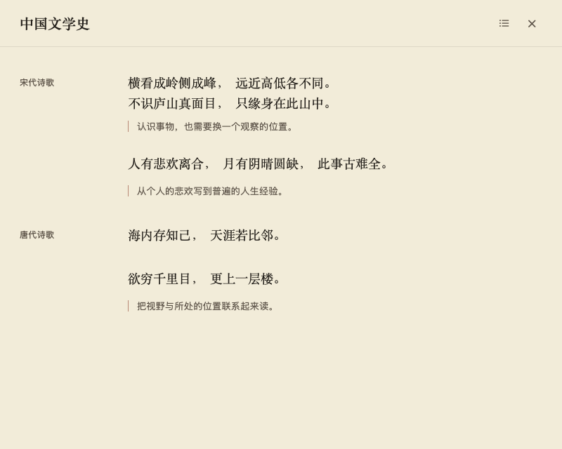
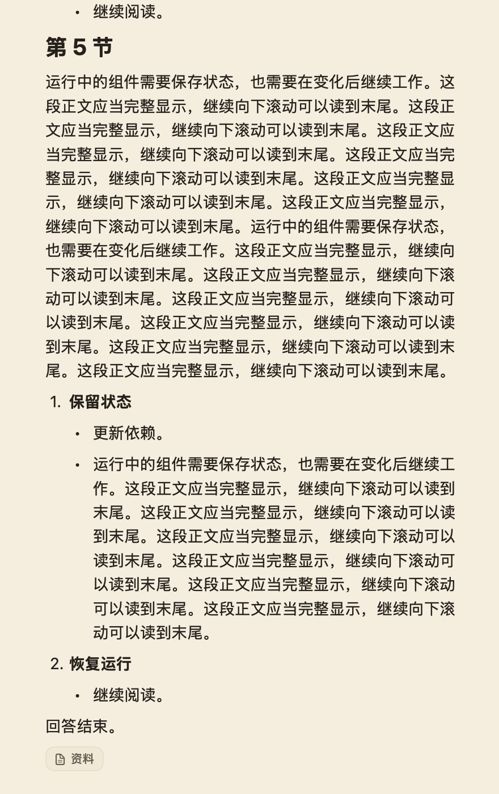

# 选区问记与书写体验修复

产品约定：每门课程一本摘抄本，按文稿分组；原文和批注独立保存，普通笔记不被修改。移除“加入笔记末尾”入口及对应写入路径。

## 摘抄本与原文往返

摘抄连续阅读，文稿名只在每组开头的页边出现一次；原文使用宋体，批注紧随其后，以细朱线区分。页首只保留课程名和文稿目录，取消重复标题、数量、卡片边框和常驻操作文案。目录按文稿跳转，每篇内部按原文位置排列。操作收进悬停或键盘聚焦出现的菜单，也支持右键。

文稿圆点先打开已有批注，点铅笔才编辑；查看时保留原文高亮，不改动尚未提交的批注草稿。浮窗中的书本按钮打开课程摘抄本并定位当前条目；文稿标题旁的书本按钮直接进入本篇摘抄。从摘抄本“回到原文”按保存的位置跳转并高亮，刷新标记不会反复抢走阅读位置。

交互参考：[Apple Books 的标记导航](https://support.apple.com/en-mide/guide/books/ibks3975f128/mac)、[Zotero 的原文与批注往返](https://www.zotero.org/support/pdf_reader)。界面沿用魏碑的纸色、宋体与朱砂标记。

## 根因与验证

- 会话追加复现：阅读上一条消息时，新回答在屏幕外生成，完成后滚到底，正文可视范围仍未到结尾，来源按钮却已出现。布局追踪发现 SwiftUI 同时试算实际宽度与极窄宽度（复现场景为 372 / 26 点），旧实现把试算宽度直接施加到正在显示的文字容器，反复重排并污染高度缓存。现在只按实际分配给正文的宽度排版，并在真实宽度变化时保存阅读位置；布局高度已同步时立即恢复位置，不等待不会再发生的回调。沿用末段测量，没有增加全文同步排版或更换渲染器。
- 新增真实会话组件回归：两条长回答、标题与嵌套列表、屏幕外逐步生成和完成、来源按钮、滑到底；同时检查已收到完整结尾、可见文字范围到达末尾，以及最后一行没有被裁切。隐藏窗口不会激活用户桌面。
- 原生 WebKit 会在后续输入时替换前一个引号，脚本直接输入的旧检查无法复现。新增检查经系统文字输入接口输入连续单双引号、中文引号与组合文本。
- 选区位置原来取整段下沿；现在取选择终点，区分正向与反向，并使用浮层实际尺寸避让窗口边界。
- 浮窗挂载前的焦点请求会被提前消耗；现在挂载后才确认请求完成。失焦后空的选区坐标不再覆盖已有位置。
- 标记原来逐个文字节点匹配，跨加粗、段落和换行的选区无法完整定位；现在按完整文稿的文字位置定位，重复文段分开，点击回传实时位置。
- 补充原生 WebKit 检查复现：查看标记后再次反向选择 HTML 原文，重画高亮会移动文字节点，清掉当前选区。共用标记更新逻辑现在按文稿文字位置恢复选区及正反方向，覆盖问与记的标记刷新。
- 摘抄原来发送“在光标处插入引用块”命令；现在独立保存记录，确认写盘后才清空批注。
- 空行的不可见字符会阻止列表规则；首次文字输入与清理放在同一次编辑中，避免清理过程中丢失首字。

## 并行整合

笔记排版任务 #443 与本任务重叠于编辑器、笔记界面、笔记桥接、工作区状态和编辑器构建脚本。#443 已先合入主线，本任务负责在该版本上整合选区、输入和摘抄改动并重新验证。静态检查整理 #444 同样已合入；沿用其检查边界。

## 体验验收

| 用户怎么操作 | 应该看到什么 | 是否通过 | 问题备注 |
| --- | --- | --- | --- |
| 从上往下、从下往上选多行文字，包含窗口边缘 | 胶囊跟随选择终点，在文字外完整显示 | 待候选版体验 | |
| 点问或记后直接输入，切换两种模式 | 第一次输入即可进入对应输入框 | 待候选版体验 | |
| 在 PDF、HTML、Markdown 选文并问记，再点击标记 | 下划线、句旁圆点可见，回访浮窗紧邻点击的文段 | 待候选版体验 | |
| 同课程的两篇文稿分别记，打开课程摘抄本 | 同一本中按文稿分组，原笔记正文未被修改 | 待候选版体验 | |
| 点文稿圆点看批注，再点铅笔修改 | 原文持续高亮；查看时不抢输入焦点，编辑时直接输入 | 待候选版体验 | |
| 从标记打开摘抄本，再从条目回到原文；包含重复文段和跨页 PDF | 摘抄本定位对应条目，返回时找到原来那一处，继续滚动不被拉回 | 待候选版体验 | |
| 连续输入单双引号、中文引号，再用拼音输入法写首字 | 引号保持输入形式，拼音正常组合，没有红色选区底色 | 待候选版体验 | 原生组合接口检查与系统输入法实机体验分开记录 |
| 在空行输入 `1. `，包括编辑后留下的空行 | 正常转换为列表，并保留第一字符的输入 | 待候选版体验 | |
| 在上一条回答处阅读，等新回答完成后继续向下滚动 | 不需要改窗口宽度，即可读到回答的最后一行和来源按钮 | 待修复候选版体验 | 用户在 1805 复现截断，改变宽度后恢复 |

## 当前自动检查证据

- 本次会话追加修复：`WEIBEI_SAFETY_TEST_MODE=1 swift test -j 4 --filter NativeChatMarkdownTests` 的 6 项检查通过，覆盖真实会话生成完成后滑到底、完整末行、长文连续缩放的阅读位置，以及公式、表格、代码、图片、选择复制和差量更新。修复前同一会话复现检查失败；缩放位置另用修复前代码对照，保留既有通过标准。
- 编辑器类型检查、30 项行为测试及资源一致性检查通过。
- 应用核心自检通过。
- 前一轮完整 WebKit 自检通过，包含最新主线的笔记排版和打字机模式。此次原生 WebKit 专项再次通过，覆盖引号、拼音组合、空行列表、选区方向、跨段落标记；新增检查验证 HTML / Markdown 重复文段的精确定位、保持高亮、刷新不抢滚动，以及拖选问记重叠的标记不会误开浮窗。
- 此次摘抄本、PDF 与工作区专项共 11 项通过，包括文稿内顺序、打开指定摘抄、查看不请求焦点或覆盖草稿、返回原文的定位信息、PDF 点击分流与持续高亮。原生界面截图使用同应用一致的主题环境。
- 专项 Swift 检查通过：课程和文稿隔离、磁盘保存及重开恢复、失败保留批注、首次焦点、跨页 PDF 标记与坐标更新。
- 补充验证笔记挂载前的焦点请求：旧实现可复现失败；修复后笔记桥接、输入框和选区摘抄共 14 项回归通过，窗口挂载后直接获得输入焦点。

以下为实际 SwiftUI 摘抄本界面，使用公开诗词在隐藏窗口渲染。它用于检查界面布局，不代替候选包的完整使用体验。

会话追加修复的隐藏窗口截图，使用合成示例：末句“回答结束。”及其下方来源按钮都完整可见。未显示过的段落允许使用高度估算，验收直接检查末行实际位置，不把全文估算高度当作完整显示的证据。

完整本机检查（提交 a56200a5）共 241 项：239 项通过、1 项按条件跳过、1 项失败。失败是主线已有的滚轮模拟测试：`AgentVisualizationSizingTests.testGenUIWheelInsideWebContentReachesConversationScroller` 在 macOS 27 上向 AppKit 发送默认初始化、仅覆盖属性的 NSEvent，系统拒绝事件类型 0。该测试与滚动实现未被本任务修改；本次选区、输入、PDF 和摘抄专项通过。各提交的云端检查及候选包状态以合并请求中的实际记录为准。
