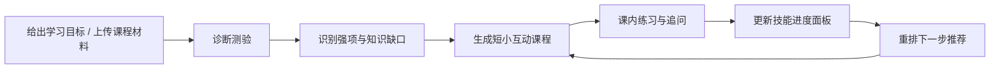
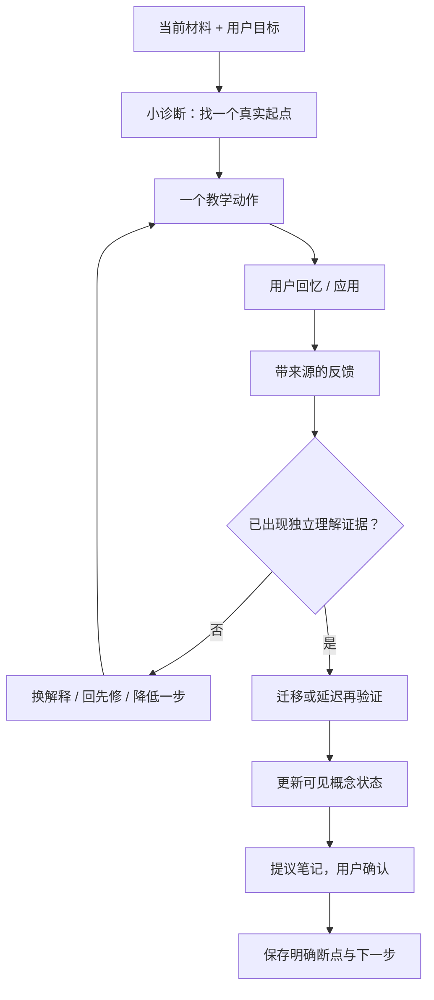

# 魏碑 Tutor 模式竞品研究：从“会回答”到“真的带人学会”

> 研究快照：2026-08-14  
> 范围：ChatGPT Study Mode、NotebookLM、Gemini Guided Learning / Study Notebooks、Hyperknow；补充成熟参照 Khanmigo。  
> 证据口径：只使用官方产品页、官方帮助中心、官方博客、官方论文或官方产品界面。未登录逐项实操，因此“官方已说明”不等于“本报告已亲手验证”。尤其是 Hyperknow，其公开证据主要来自厂商自己的营销页与博客，产品收益不能当作独立实验结论。

## 一句话结论

魏碑不该做“聊天框里多问几道题”，也不该复制一个考试备考后台。真正的机会是把它现有的材料、阅读、引用、对话和笔记连成一条可见的教学回路：**Tutor 主导下一步，用户始终知道为什么；每次判断都有材料来源和学习证据；暂停后能从明确的教学断点继续；理解变化会直接改变概念图和下一步，而不是只增加一条聊天记录。**

## 1. 市场已经走到哪一步

2025 年通用 AI 产品的学习模式主流做法还是“给普通聊天加一套苏格拉底式指令”；到 2026 年，领先产品已经分成四层：

1. **教学语气层**：从直接回答改成分步解释、反问、提示、检查理解。代表：ChatGPT Study Mode。
2. **材料工作台层**：围绕用户材料生成引用、学习指南、思维导图、卡片和测验。代表：NotebookLM。
3. **自适应教学状态层**：先诊断，再生成小课，记录技能状态并动态改计划。代表：Gemini Study Notebooks。
4. **学习行政层**：从课程文件、教学平台与截止日期生成日历、提醒和主动任务。代表：Hyperknow。

魏碑最值得进入的是第 2 层和第 3 层之间：它应比 NotebookLM 更会“教”，比 Gemini 的学习笔记本更贴近原始材料、阅读现场和用户自己的笔记，但第一版不必扩成 Hyperknow 式课程日历，也不必变成 Khan Academy 式完整课程平台。

## 2. 竞品全景图

“强 / 中 / 弱”是依据官方公开能力做的产品判断，不是学习效果实验分数。

| 产品 | 谁主导节奏 | 材料扎根 | 理解检查 | 来源 / 概念可视化 | 持久学习状态 | 核心强项 | 关键缺口 |
|---|---|---:|---:|---:|---:|---|---|
| ChatGPT Study Mode | Agent 主导，但用户可随时改节奏 | 中 | 中—强 | 弱—中 | 弱 | 最低门槛地把回答改成互动式教学 | 教学状态主要藏在对话里，官方仍承认会突然直接给答案 |
| NotebookLM Learning Guide | 用户选材料和任务；Agent 在一轮内引导 | 强 | 中 | 强 | 中 | 点击引用直达原文；材料可变成多种学习制品 | “制品很多”不等于形成持续教学回路 |
| Gemini Guided Learning | Agent 分步引导，用户可暂停追问 | 中 | 强 | 中—强 | 中 | 多模态教学、互动测验、友好的学习伙伴姿态 | 普通 Gemini 来源并非逐条必现，长期状态有限 |
| Gemini Study Notebooks | Agent 诊断、规划、推荐下一课；用户可浏览改选 | 中—强 | 强 | 强 | 强 | 诊断 → 小课 → 测验 → 技能面板 → 动态更新的闭环 | 目标不可编辑；当前官方帮助仍写明学习笔记本主要在网页；容易过度课程化 |
| Hyperknow | 快问时用户主导；Deep Learn / 日历时 Agent 主导 | 强（厂商声称） | 中—强（厂商声称） | 中—强 | 中，公开细节不足 | 材料优先、主动回忆、弱点诊断、课程计划连在一起 | 很多能力只见于自述；学习与生活行政边界过宽；未公开可审计的掌握证据模型 |
| Khanmigo | Agent 坚持用问题引导；教师 / 课程规定任务 | 强，但限于 Khan 内容 | 强 | 中 | 强，但依赖 Khan 课程体系 | Tutor 就在真实练习旁边，掌握度来自做题记录而非聊天自评 | 不是开放材料工作台；访问、题型、移动端和每日使用均有限制 |

## 3. 逐项研究

### 3.1 ChatGPT Study Mode：把普通对话改造成“边问边教”

#### 产品机制

OpenAI 将 Study Mode 定义为“分步引导而不是快速给答案”。进入后，它先用问题了解目标与能力，再用苏格拉底式提问、分层解释、开放题和反馈推进学习。官方说明它底层最初是与教师、科学家和教育专家共同编写的定制系统指令，而不是独立课程引擎；OpenAI 也明确说，这种做法有利于快速迭代，但会导致不同对话间的不一致。来源：[官方发布说明](https://openai.com/index/chatgpt-study-mode/)；[当前使用帮助](https://help.openai.com/en/articles/11780217-study-mode)。

| 观察项 | 当前做法 |
|---|---|
| 谁主导节奏 | Agent 会问“你已经知道什么、卡在哪里、下一步怎么做”，并按回答逐步展开；用户仍可要求慢一点、只问一题、先给提示或提高难度。 |
| 如何基于材料 | 可上传课程笔记、讲义、PDF、图片或题目照片，并指定页码 / 小节 / 问题。它能参考上传内容，但官方没有承诺每个教学判断都有页级引用。 |
| 如何提问与检查 | 开放题、分步提示、练习题、单题测验、错因解释和类闪卡复习；可要求先测后讲。 |
| 如何可视化 | 可以请求图表、图解或视觉解释，但是否出现生成图片或交互视觉取决于当前对话可用工具；没有固定概念图或技能面板。 |
| 如何恢复 | 同一普通聊天可从历史中搜索并继续；开启 Memory 后，可用已保存记忆和过去聊天做个性化，但官方提醒“不会记住过去聊天的每个细节”。来源：[聊天历史搜索](https://help.openai.com/en/articles/10056348-how-do-i-search-my-chat-history-in-chatgpt)、[过去聊天记忆](https://help.openai.com/en/articles/11146739-how-does-reference-saved-memories-work)。 |
| 明确局限 | 会犯错；可能违反教学姿态直接给答案；与普通模式共享模型和消息限额；不在 GPT / Project 对话中使用；没有官方公开的 Tutor 专属进度结构。 |

#### 魏碑该借什么

- 借“先校准再教学”：开场只问足够决定第一步的目标、已有理解和时间，不先生成一整套课程。
- 借“一次一个教学动作”：说明、提示、让用户作答、反馈、迁移练习应明确分步，降低认知负荷。
- 借“用户可直接调节教学方式”：慢一点、换例子、先测后讲、提高难度都应该是显眼控制，不要求用户会写提示词。

#### 魏碑不该照抄什么

- 不把 Tutor 仅实现成一段隐藏系统指令；否则恢复、进度、掌握证据和模式边界都不可靠。
- 不在同一条 Assistant 对话里随时开关 Tutor 人格。Study Mode 允许在普通对话里加 / 移除工具，但魏碑更需要让两种关系保持清楚：Assistant 解答，Tutor 组织教学。
- 不把“问过问题”当作“检查过理解”；只有用户自己的回答和后续迁移表现才是证据。

### 3.2 NotebookLM：目前最成熟的“材料—来源—学习制品”工作台

#### 产品机制

NotebookLM 的核心不是通用 Tutor，而是一个被材料约束的研究 / 学习空间。用户选择哪些来源参与回答；聊天使用来源中的直接文字、图片和引文，并提供内联引用。鼠标悬停可看原文摘录，点击引用会跳到材料中的对应位置。官方帮助明确说，普通 NotebookLM 聊天仅使用所选来源；来源里没有的信息可能不回答。来源：[聊天与引用](https://support.google.com/notebooklm/answer/16179559?hl=en)、[产品概览](https://support.google.com/notebooklm/answer/16164461?hl=en)。

在教学上，用户可把聊天风格切到 Learning Guide。Google 说它会用探究式开放问题促进参与，分解问题并根据用户需要调整解释。与此同时，Studio 可从同一批来源生成学习指南、报告、闪卡、测验、音频 / 视频概览和思维导图。来源：[Learning Guide 与学习功能发布](https://blog.google/innovation-and-ai/models-and-research/google-labs/notebooklm-student-features/)。

| 观察项 | 当前做法 |
|---|---|
| 谁主导节奏 | 用户先决定来源、聊天风格和要生成的制品；Learning Guide 在具体对话里主动追问和分步引导，但整个学习旅程仍偏用户点选。 |
| 如何基于材料 | 来源是一级对象，可逐个勾选；支持 PDF、网页、YouTube 字幕、音频、图片、Google 文档 / 幻灯片等。回答被所选来源约束。 |
| 如何提问与检查 | Learning Guide 追问；闪卡和测验可设置难度、数量和主题；错题可点 Explain，解释会带回原材料的引用。 |
| 如何可视化进度 | 闪卡可标记 Got it / Missed it，系统会记住进度；结束可看结果、重做全部或只练错题。来源：[闪卡与测验帮助](https://support.google.com/notebooklm/answer/16958963?hl=en-GB)。 |
| 如何可视化来源 / 概念 | 内联引用直达原文；思维导图把主题与关联做成可展开树，点节点可继续提问；可反复打开。来源：[思维导图帮助](https://support.google.com/notebooklm/answer/16212283?hl=en)。 |
| 如何恢复 | 聊天历史被保留；聊天回复可保存为笔记；思维导图与 Studio 制品留在笔记本；闪卡进度可继续。每个笔记本相互独立，不能同时跨多个笔记本取材。来源：[创建与管理笔记本](https://support.google.com/notebooklm/answer/16206563?hl=en)。 |
| 明确局限 | AI 仍会不准确；短来源不一定给到逐段引用；删除笔记当前无法恢复；安全过滤可能阻断历史或敏感材料；来源过多且问题模糊时检索会失准。来源：[官方常见问题](https://support.google.com/notebooklm/answer/16269187?hl=en)。 |

#### 魏碑该借什么

- 借“来源是界面对象，不是回答尾部装饰”：用户应能看见本轮用了哪些材料、为什么用了、点击后回到确切段落。
- 借“从概念节点继续问”：概念图不应只是一张静态总结图；点一个概念就应把材料、Tutor 问题和学习记录一起聚焦到这里。
- 借“错题直接回源”：反馈不是只说对错，而是把误解对应到原材料的具体证据。
- 借“学习产物持续存在”：测验、概念图和解释不是聊天气泡里的瞬时附件。

#### 魏碑不该照抄什么

- 不做一个 Studio 制品自助餐。闪卡、报告、音频、视频、导图如果彼此独立，会让用户忙于生成东西，而不是完成教学回路。
- 不把引用正确等同于理解发生；材料工作台可以非常可信，却仍然让学习停留在阅读与消费。
- 不采用“来源里没有就拒绝”的绝对封闭。魏碑可以把“课程材料说了什么”和“外部补充解释”清晰分层，而不是静默混合或一律拒绝。

### 3.3 Gemini：从 Guided Learning 进化到 Study Notebooks

这一项必须分成两个阶段看。只研究 2025 年的 Guided Learning 会低估 Gemini 截至 2026-08-14 的能力。

#### A. Guided Learning：多模态、探究式的教学对话

Google 说 Guided Learning 会通过探究式开放问题促成讨论，分步拆题并调整解释；回答可包含图片、图表、视频和互动测验。它可以从上传材料生成学习指南，也可以处理通用主题。来源：[首次发布](https://blog.google/products-and-platforms/products/education/guided-learning/)、[产品机制说明](https://blog.google/products-and-platforms/products/gemini/guided-learning-google-gemini/)、[当前帮助](https://support.google.com/gemini/answer/16448384?hl=en-gb)。

它和 ChatGPT Study Mode 的共同点是 Agent 会问问题而非立即交答案；差异是 Google 更强调多模态素材库、YouTube 视频、交互测验和专门为学习调优的 LearnLM。官方论文将其路线概括为“教学指令遵循”：让教师 / 开发者声明需要的教学行为，而不是假定唯一正确的教学法。来源：[LearnLM 官方论文](https://arxiv.org/abs/2412.16429)。

#### B. Study Notebooks：真正显式化的长期学习状态

2026 年 6 月，Google 发布 Study Notebooks。流程为：

官方描述显示，这已不是只靠对话上下文：它会把目标拆成 100 多个具体学习目标，按主题分组，并标记为 Strengths、Focus areas 或 Not started；测验后自动更新，优先推荐下一课，同时允许用户筛选和浏览。来源：[Study Notebooks 官方发布](https://blog.google/innovation-and-ai/products/gemini-app/gemini-study-notebooks/)、[当前帮助](https://support.google.com/gemini/answer/16972047?hl=en)。

| 观察项 | 当前做法 |
|---|---|
| 谁主导节奏 | Study Notebook 通过诊断决定初始计划，并按练习表现重排下一课；用户可暂停小课即时提问，也可跳到其他强项 / 弱项。 |
| 如何基于材料 | 可上传讲义、课程大纲、阅读材料或从 Drive 加入文件；测验和小课会利用这些材料。Notebook 与 NotebookLM 同步，但 Gemini Notebook 聊天也可使用网络搜索和 Gemini 工具，所以不是严格的“只来自来源”。 |
| 如何提问与检查 | 初始诊断建立基线；每节小课包含练习测验；后续表现更新弱项和推荐。Gemini 的独立测验还支持提示、追问和完成后的表现分析。 |
| 如何可视化进度 | 技能型面板实时显示强项、重点区域和未开始；按主题浏览，并显示优先下一课。 |
| 如何可视化来源 / 概念 | Guided Learning 已提供图、视频与互动测验；Study Notebook 可同步到 NotebookLM 生成闪卡、信息图等。2026-06 官方发布当时写的是“更多图解和交互视觉将在当年夏季稍后推出”，本报告没有一手证据确认截至 2026-08-14 已全量上线。 |
| 如何恢复 | Notebook 是持续空间，会记住来源、指令和讨论；课程、对话、测验、测试与材料都在同一 Notebook 中，并与 NotebookLM 同步。 |
| 明确局限 | 当前帮助页写明 Study Notebook 主要在网页端，Gemini 移动 App 尚不支持；当前帮助写的是个人账号，2026-06 发布稿则写学校账号“未来几周”推出，说明账号可用性仍在滚动；学习目标创建后不能编辑，换目标需新建 Notebook；普通 Gemini 不是所有回答都有来源链接；大文件可能漏掉跨文档细节。来源：[来源显示规则](https://support.google.com/gemini/answer/14143489)、[文件分析限制](https://support.google.com/gemini/answer/14903178)。 |

#### 魏碑该借什么

- 借“诊断先于计划”：第一版 Tutor 不该凭一句目标就宣布完整路径，至少要通过一小段材料内诊断建立起点。
- 借“进度影响下一步”：弱项标签若不改变下一教学动作，就只是装饰；Gemini 把面板和课程推荐连了起来。
- 借“用户可在小课中随时举手”：Tutor 主导课程并不等于锁死脚本，用户的真实困惑可以中断当前步骤。
- 借“学习状态是可见数据”：强项、重点、未开始和依据不应只存在于模型上下文。

#### 魏碑不该照抄什么

- 不在第一版把一个目标拆成 100 多项。魏碑更适合先证明一个材料片段能完整走完“解释 → 回忆 / 应用 → 反馈 → 再验证”。
- 不把目标设成不可修改。真实阅读过程中目标会变；应保留修订目标、解释影响并重新规划的能力。
- 不让面板成为主产品、对话变成执行面板的附属物。魏碑的优势是材料旁边真实发生的阅读与思考。
- 不把“测验答对”直接等同于长期掌握。至少区分看提示后答对、独立回忆、迁移应用和隔日再次验证。

### 3.4 Hyperknow：材料优先 + 主动回忆 + 学习行政

#### 先说证据强弱

Hyperknow 很接近用户描述的理想方向，但公开的一手资料以官网、产品博客、条款和公开登录界面为主；没有找到与 Gemini / Khanmigo 同等级的公开学习效果实验或透明掌握度方法。因此，下面应理解为“它公开宣称和展示的产品方向”，不是独立验证后的效果结论。

#### 产品机制

Hyperknow 官网把产品分成理解、生成、计划三类：能从课程文件生成测验、打印讲义、练习题与互动视频，也能从课程文件和教学平台（LMS）的截止日期组织待办并引导每次学习。它同时允许快问和系统化引导路径。来源：[官方首页](https://www.hyperknow.io/)。

官方博客给出的学习逻辑比一般功能列表更清楚：

1. **材料优先**：先上传讲义、教材和笔记，不让通用互联网知识偷偷替代具体课程要求。
2. **主动回忆优先**：默认先让学生闭卷作答，再看答案；Deep Learn Sessions 会根据答错内容调整互动辅导。
3. **弱点诊断**：对照学生笔记、教材和讲义，发现遗漏、错误描述和来源冲突。
4. **动态计划**：从课程材料与 LMS 提取截止日期、估计工作量；跳过一次学习后重新分配计划。
5. **长期画像**：Learner's Persona 根据学习模式积累并调整内容。

来源：[官方“如何用 AI 学习”文章](https://www.hyperknow.io/blogs/study-with-ai)。

| 观察项 | 当前做法 / 官方声称 |
|---|---|
| 谁主导节奏 | 快速问答由用户主导；Deep Learn Session 根据答错内容推进；课程日历进一步主动决定“现在该学什么、为什么”。 |
| 如何基于材料 | 支持教材章节、幻灯片、笔记、Word、PDF、讲座录音等；公开文章声称可处理最高 1,000 页。 |
| 如何提问与检查 | 从材料生成练习问题和测验；主动回忆后再展示答案；Deep Learn 根据错误自适应；通过材料交叉比对寻找盲点。 |
| 如何可视化进度 | 官网没有公开到足够细的学习进度面板结构。Learner's Persona、日历和 Deep Learn 暗示存在长期状态，但未公开“掌握证据如何记录 / 用户如何纠错”。 |
| 如何可视化来源 / 概念 | 可生成约两分钟的材料定制讲解视频；考试讲义按主题而非章节组织，跨章节交叉引用，并声称每个概念可回到具体页。来源：[讲义生成](https://www.hyperknow.io/blogs/ai-cheatsheet-generator)、[讲解视频](https://www.hyperknow.io/blogs/get-explainer-video)。 |
| 如何恢复 | 公开产品界面有 Deep Learn Sessions 和 Recent Conversations；Learner's Persona 声称跨月 / 学期积累。未找到公开材料证明它能恢复到明确的“教学动作断点”。来源：[公开 onboarding 界面](https://agent.hyperknow.io/onboarding/)。 |
| 明确局限 | 官方自己承认 AI 会幻觉，用户要核验；系统不知道教授口头强调却未进入材料的内容；视频只是初步理解，不能代替大量练习；公开竞品文章写明移动 App 仍在开发。来源：[官方竞品比较文章](https://www.hyperknow.io/blogs/quizlet-alternative)。 |

#### “主动推送 / 日历”边界必须单独判断

Hyperknow 条款明确写着：它可能依据活动和上传内容主动生成建议、学习任务、提醒、日程或学习材料，部分主动功能可在设置里关闭。来源：[官方服务条款第 9 节](https://www.hyperknow.io/terms-of-service)。这能证明“会主动生成”，但不能证明提醒一定通过系统通知送达，也不能证明排程准确或能提高成绩。

对魏碑而言，课程日历是**后续可选层**，不是 Tutor 第一版的前提：

- 适合借：在用户重新打开课程时，告诉他最值得继续的一个动作，并解释依据。
- 暂不借：接管所有课程、截止日期、LMS、通知和生活排程。
- 原因：魏碑当前最有价值的是“材料现场的教学质量”，不是充当校园任务管理器。过早做日历会同时引入权限、同步、错误截止日期、通知打扰和责任边界。

#### 魏碑该借什么

- 材料优先、主动回忆优先，而不是默认生成总结。
- 弱点应来自“学生的表达 vs 原材料 / 其他材料 / 后续表现”的差异，而不是模型凭感觉贴标签。
- 为同一难点准备不同表现形式，但只在当前表示失败时切换，例如文本解释无效再提供图或短动画。
- 重新进入课程时主动给出唯一、可解释的下一步，减少空白页决策成本。

#### 魏碑不该照抄什么

- 不照抄“全能学习 Agent”定位。理解、制品、日历、提醒、LMS 和长周期画像一起做，会模糊 Tutor 的核心价值。
- 不把所谓“学习风格”当固定人格标签。应该记的是可观察证据：在哪种任务、哪类材料、何种提示下表现如何。
- 不让日历或主动推送变成强迫；应以课程内可关闭的建议开始，且说明“为什么现在建议这个”。
- 不把厂商宣传中的 1,000 页、两分钟生成等规模指标当作魏碑成功指标；真正指标是用户能否在来源可核验的前提下独立解释和迁移。

### 3.5 补充成熟参照：Khanmigo

Khanmigo 的价值不在“更像聊天机器人”，而在它被嵌到真实课程内容和练习旁边。官方演示中，即使学生要求答案，它也会拒绝直接给出，并问“看到这个式子第一步该做什么”；因为它知道用户正在做哪一道 Khan Academy 练习，所以比脱离内容的通用问答更容易锚定。来源：[Khanmigo 官方入门演示](https://www.khanacademy.org/college-careers-more/khanmigo-for-students/x5443352261243283%3Aintroducing-khanmigo/x5443352261243283%3Agetting-started-with-khanmigo/v/khanmigo-for-students-what-is-khanmigo-and-how-does-it-work)。

| 观察项 | 当前做法 |
|---|---|
| 谁主导节奏 | Tutor 主导提问与提示；教师或 Khan 课程决定任务和目标；学生通过作答推进。 |
| 如何基于材料 | 直接锚定经过专家审阅的 Khan Academy 视频、文章和练习，不是开放上传材料。 |
| 如何提问与检查 | 识别学生卡点、追问、填理解缺口；掌握证据来自课程练习、技能等级和作业，而不只是聊天内容。 |
| 如何可视化进度 | Khan 既有教师面板提供学习时间、技能理解、Mastery、作业完成等；教师还可查看 Khanmigo 活动与对话历史。来源：[教师报告](https://support.khanacademy.org/hc/en-us/articles/360031129891-What-reporting-options-are-available-on-Khan-Academy-for-teachers-to-track-student-performance)。 |
| 如何恢复 | Learner Home 有 Chat History；教师 / 家长可查看学生历史；课程练习和 Mastery 状态天然持续。 |
| 明确局限 | 不在部分标准化考试内容、测验、单元测试、课程挑战和掌握挑战页面提供 Tutor；移动 App 体验有限；官方设置每日交互上限，因为长会话可能重复或偏离教育目的；官方承认可能给错信息，不能替代教师。来源：[可用位置与限制](https://support.khanacademy.org/hc/en-us/articles/13982530363533-Where-can-I-access-Khanmigo-while-working-on-Khan-Academy)、[安全限制](https://support.khanacademy.org/hc/en-us/articles/14394814244365-What-safety-features-does-Khanmigo-have)。 |

Khan Academy 在 2026 年还公开了一个重要实验结论：给 Khanmigo 提供结构化的近期练习、技能水平和先修进度，比塞入难解析的原始历史更有效；约 1,500 万条辅导线程的多轮产品测试中，结构化历史带来下一题正确率累计 6.1% 的提升，而部分难解析数据没有可测收益。来源：[官方实验复盘](https://blog.khanacademy.org/how-khan-academy-is-building-a-better-ai-tutor-our-most-recent-learnings/)。

这对魏碑的直接启示是：**不要把整段聊天记录全塞给模型并叫它“记忆”。把少量、可解释、可纠正的学习证据结构化，既更省，也更可能真的改善下一次教学。**

## 4. 横向拆解：真正的分水岭不在“会不会问问题”

### 4.1 节奏控制

| 模式 | 代表 | 优点 | 风险 | 魏碑判断 |
|---|---|---|---|---|
| 用户完全主导 | NotebookLM 默认聊天 / Studio | 自由，不打扰 | 容易停在总结和制品生成 | Assistant 适合，Tutor 不够 |
| Agent 在单轮内主导 | Study Mode、Guided Learning、Learning Guide | 低成本进入教学姿态 | 状态容易随对话漂移 | Tutor 的最低门槛，不是完成态 |
| Agent 依据持久状态主导 | Gemini Study Notebook、Hyperknow Deep Learn | 可诊断、重排下一步 | 可能把用户关进固定课程机器 | 魏碑应做轻量版本 |
| 课程 / 教师主导 | Khanmigo | 目标稳定，证据可靠 | 不适合开放材料与自学目标 | 借锚定方式，不复制课程平台 |

最佳关系不是“Agent 全权控制”，而是：**Tutor 负责提出下一教学动作；用户负责回答、质疑、调整目标、暂停和最终确认学习产物。**

### 4.2 材料与来源

目前最强的两个模式分别是：

- NotebookLM：来源选择明确、回答被来源约束、点击可回原文。
- Khanmigo：Tutor 直接知道用户正在看的专家审核内容和练习。

魏碑可以把二者合在一起：当前阅读位置天然成为 Tutor 的上下文，引用保持可点击；Tutor 也能跨课程材料找先修概念或冲突，但必须告诉用户本轮具体用了哪些材料。

### 4.3 理解检查

市场常见的误区是“生成一个 Quiz 就算有评估”。更可靠的证据阶梯应该是：

| 证据等级 | 用户行为 | 能说明什么 | 不能说明什么 |
|---|---|---|---|
| 0. 看过 | 阅读 / 听完解释 | 接触过 | 是否理解 |
| 1. 识别 | 在选项中选对 | 能辨认 | 能否独立回忆 |
| 2. 回忆 | 不看材料用自己的话说明 | 初步理解 | 能否用于新情境 |
| 3. 应用 | 解决同型新题 / 分析新例子 | 会使用 | 是否真正迁移 |
| 4. 迁移 | 解释陌生情境、比较相邻概念 | 较稳固理解 | 能否长期保持 |
| 5. 延迟验证 | 隔一段时间再次独立完成 | 有保持证据 | 仍非永久掌握 |

Tutor 第一版至少应覆盖 2 → 3；不能只靠 1，也不能从一次正确直接宣布 mastered。

### 4.4 可视化

竞品有三类“视觉”：

1. **表现形式视觉**：图、视频、信息图，帮助解释。Gemini / Hyperknow 强。
2. **知识结构视觉**：思维导图、跨章节关系。NotebookLM 强。
3. **学习状态视觉**：强项、弱项、未开始、下一课。Gemini Study Notebook / Khan 进度体系强。

魏碑的空白不是再生成一张漂亮图，而是把三类视觉合并：**概念节点本身同时显示材料来源、当前证据状态、误解和下一教学动作。**

## 5. 魏碑应该借什么、不该抄什么

### 必须借：第一版就该存在

| 借鉴点 | 来自哪里 | 魏碑化后的最小形态 |
|---|---|---|
| 材料是一级对象、点击引用回原文 | NotebookLM | 每个解释、问题、反馈都能展开“本轮依据”，点开定位阅读区 |
| Tutor 一次只做一个教学动作 | Study Mode / Guided Learning | 当前动作清楚标记：解释、让你回忆、应用、反馈或再验证 |
| 小诊断决定起点 | Gemini Study Notebook | 进入 Tutor 后先用 2—4 个高信息量问题，不生成庞大课程 |
| 进度会改变下一步 | Gemini Study Notebook | 一个概念的“需复习 / 已验证”会直接改变下个动作 |
| 主动回忆优先 | Hyperknow | 默认先让用户说 / 做，再揭示完整解释；可显式选择“我现在只想先听懂” |
| Tutor 就在真实内容旁边 | Khanmigo | 当前材料、选中文字和阅读位置自动成为教学情境 |
| 结构化、可解释的学习证据 | Khanmigo 实验 | 存储少量表现事实，而不是把整段聊天当记忆 |
| 可恢复的明确断点 | 各家仍未完整解决 | 重开时显示：目标、刚完成、仍不稳、上次停点、建议下一步 |

### 选择性借：第一版只留入口，不全面铺开

| 能力 | 为什么有价值 | 何时再做 |
|---|---|---|
| 概念关系图 | 让全局与当前节点同时可见 | 当一个完整教学单元已能稳定更新状态后 |
| 短视频 / 动态图解 | 文本解释失效时可切换表示 | 当图片 / 图表已有稳定来源与生成质量保障后 |
| 闪卡与间隔复习 | 支持长期保持 | 先有可信概念证据和课程内复习，再做跨日排程 |
| 主动提醒 | 降低重新开始的摩擦 | 用户主动开启，并能看见触发依据和一键关闭时 |
| 教师 / 家长视图 | 真实教学关系里有价值 | 魏碑明确进入班级 / 机构场景后 |

### 明确不抄：会让 Tutor 变重或变假

- 不复制 Hyperknow 的全课程日历、LMS 和主动推送作为首发范围。
- 不复制 NotebookLM 的大量独立生成器菜单。
- 不复制 Gemini “100+ 学习目标”的早期复杂度，也不锁死目标。
- 不复制 ChatGPT 在同一会话中切换普通回答与 Tutor 姿态的模糊边界。
- 不复制“答对一题 = 已掌握”或游戏化分数制造的假进度。
- 不复制“永远不给答案”的机械苏格拉底法；当用户缺少先修知识、反复失败或明确需要示范时，Tutor 应先教再测。
- 不把“学习风格”做成静态人格标签；记录具体行为证据。
- 不把来源藏在一个通用 Sources 按钮里；来源应贴着具体主张、问题与反馈。

## 6. 市场仍未满足、魏碑可以占住的空白

### 空白 1：来源与教学判断没有真正绑定

NotebookLM 的来源最强，但教学状态弱；Gemini 的教学状态最强，但普通回答来源不是每条必现。魏碑可以让“为什么问这题、为什么判为薄弱、为什么建议重学”都能展开查看材料与用户表现证据。

### 空白 2：恢复的是聊天，不是教学

ChatGPT、Gemini 普通聊天和 Hyperknow 都能找回历史；NotebookLM 能找回制品；但“上次停在哪个教学动作、已经验证到什么层级、现在最小下一步是什么”仍少见。魏碑应把这张恢复卡当核心界面，而不是把用户扔回很长的对话末尾。

### 空白 3：概念图和掌握图是两张图

NotebookLM 展示概念关系，Gemini 展示技能状态。魏碑可以让同一概念节点既显示先修 / 关联，又显示来源、误解、证据和当前状态。

### 空白 4：笔记没有进入教学闭环

NotebookLM 可以保存回答为笔记，但它主要是收藏动作。魏碑可以在用户完成一次解释或迁移后，由 Tutor 提议一条真正值得留下的笔记，展示来源与措辞，用户确认后再写入；后续复习从这条用户确认过的知识重新出发。

### 空白 5：Assistant 与 Tutor 的关系普遍模糊

多数产品是给同一聊天挂一个学习工具或风格。魏碑可以把关系讲清：

- Assistant：用户决定问题，系统直接回答并提供材料依据，然后停止。
- Tutor：系统根据目标和证据决定下一教学动作，直到用户暂停或完成本轮验证。
- 两者共享课程材料与经过用户确认的学习记忆，但不共享隐含人格和未验证判断。

### 空白 6：用户很难反驳 AI 对自己的判断

学习面板通常给出 Strength / Focus area，却没有明确的申诉链路。魏碑应允许用户点开状态，看见证据，标记“这不是我的问题”“题目有歧义”“材料彼此冲突”，Tutor 再重新判断。

## 7. 对魏碑 Tutor 的产品原则建议

1. **不是答案模式，是关系模式。** Tutor 的差异是持续承担教学责任，不是多说“让我问你一个问题”。
2. **材料先于模型常识。** 外部知识可补充，但必须和课程材料分层显示。
3. **证据先于标签。** 先保存用户做了什么，再推导“需复习 / 已验证”。
4. **一个动作先于一条长计划。** 计划只展示足够建立方向的粒度；下一步必须具体。
5. **表现形式服从学习障碍。** 只有现有解释失败或概念天然需要空间 / 动态表达时才切图、视频或模拟。
6. **恢复先于长期画像。** 先做到每次回来不丢教学断点，再谈跨学期 Learner Persona。
7. **建议先于推送。** 首先在课程内给一个可解释建议；用户需要后再开放提醒。
8. **确认先于写笔记。** Tutor 可以提炼，但正式知识仍由用户确认。
9. **掌握必须可被推翻。** 新表现、延迟遗忘或来源冲突都能让状态退回待验证。
10. **Tutor 主导动作，用户拥有方向。** 用户始终能暂停、改目标、看依据、纠正状态和退出教学循环。

## 8. 最重要的产品判定

如果魏碑只实现“Study Mode 式提示词”，它会很快拥有 Tutor 的语气，却没有 Tutor 的责任。

如果魏碑直接实现“Gemini Study Notebook 式完整技能后台”，它会很快拥有 Tutor 的仪表盘，却可能失去魏碑独有的阅读、来源、笔记和人类确认关系。

因此最合理的第一条主线是：

这个回路比制品数量、课程规模、Agent 主动程度都更重要。它一旦真实成立，后续的概念图、复习、短视频、跨日提醒和长期画像都有可靠的地基；它不成立，其他功能只会把“看起来在学习”做得更精致。

## 9. 官方来源索引

### OpenAI

- [Introducing study mode](https://openai.com/index/chatgpt-study-mode/)
- [Using Study Mode in ChatGPT](https://help.openai.com/en/articles/11780217-study-mode)
- [How to search chat history](https://help.openai.com/en/articles/10056348-how-do-i-search-my-chat-history-in-chatgpt)
- [How reference saved memories / chat history works](https://help.openai.com/en/articles/11146739-how-does-reference-saved-memories-work)

### Google NotebookLM

- [Learn about NotebookLM](https://support.google.com/notebooklm/answer/16164461?hl=en)
- [Use chat in NotebookLM](https://support.google.com/notebooklm/answer/16179559?hl=en)
- [NotebookLM learning features and Learning Guide](https://blog.google/innovation-and-ai/models-and-research/google-labs/notebooklm-student-features/)
- [Generate Flashcards or Quizzes](https://support.google.com/notebooklm/answer/16958963?hl=en-GB)
- [Use Mind Maps](https://support.google.com/notebooklm/answer/16212283?hl=en)
- [NotebookLM FAQ](https://support.google.com/notebooklm/answer/16269187?hl=en)
- [Create a notebook in NotebookLM](https://support.google.com/notebooklm/answer/16206563?hl=en)

### Google Gemini

- [Guided Learning: From answers to understanding](https://blog.google/products-and-platforms/products/education/guided-learning/)
- [How Guided Learning works](https://blog.google/products-and-platforms/products/gemini/guided-learning-google-gemini/)
- [Use learning tools in Gemini Apps](https://support.google.com/gemini/answer/16448384?hl=en-gb)
- [Study notebooks in the Gemini app](https://blog.google/innovation-and-ai/products/gemini-app/gemini-study-notebooks/)
- [Create and use notebooks in Gemini Apps](https://support.google.com/gemini/answer/16972047?hl=en)
- [View related sources](https://support.google.com/gemini/answer/14143489)
- [Upload and analyze files](https://support.google.com/gemini/answer/14903178)
- [LearnLM: Improving Gemini for Learning](https://arxiv.org/abs/2412.16429)

### Hyperknow

- [Hyperknow official product page](https://www.hyperknow.io/)
- [How to Study with AI](https://www.hyperknow.io/blogs/study-with-ai)
- [AI Cheatsheet Generator](https://www.hyperknow.io/blogs/ai-cheatsheet-generator)
- [AI Tutorial Video Maker](https://www.hyperknow.io/blogs/get-explainer-video)
- [Official comparison with Quizlet and other study products](https://www.hyperknow.io/blogs/quizlet-alternative)
- [Terms of Service: proactive features and AI limitations](https://www.hyperknow.io/terms-of-service)
- [Public onboarding surface](https://agent.hyperknow.io/onboarding/)

### Khan Academy / Khanmigo

- [What is Khanmigo and how does it work](https://www.khanacademy.org/college-careers-more/khanmigo-for-students/x5443352261243283%3Aintroducing-khanmigo/x5443352261243283%3Agetting-started-with-khanmigo/v/khanmigo-for-students-what-is-khanmigo-and-how-does-it-work)
- [Khanmigo access locations and limitations](https://support.khanacademy.org/hc/en-us/articles/13982530363533-Where-can-I-access-Khanmigo-while-working-on-Khan-Academy)
- [Khanmigo safety features and daily limits](https://support.khanacademy.org/hc/en-us/articles/14394814244365-What-safety-features-does-Khanmigo-have)
- [Teacher performance reports](https://support.khanacademy.org/hc/en-us/articles/360031129891-What-reporting-options-are-available-on-Khan-Academy-for-teachers-to-track-student-performance)
- [How Khan Academy is building a better AI tutor](https://blog.khanacademy.org/how-khan-academy-is-building-a-better-ai-tutor-our-most-recent-learnings/)
