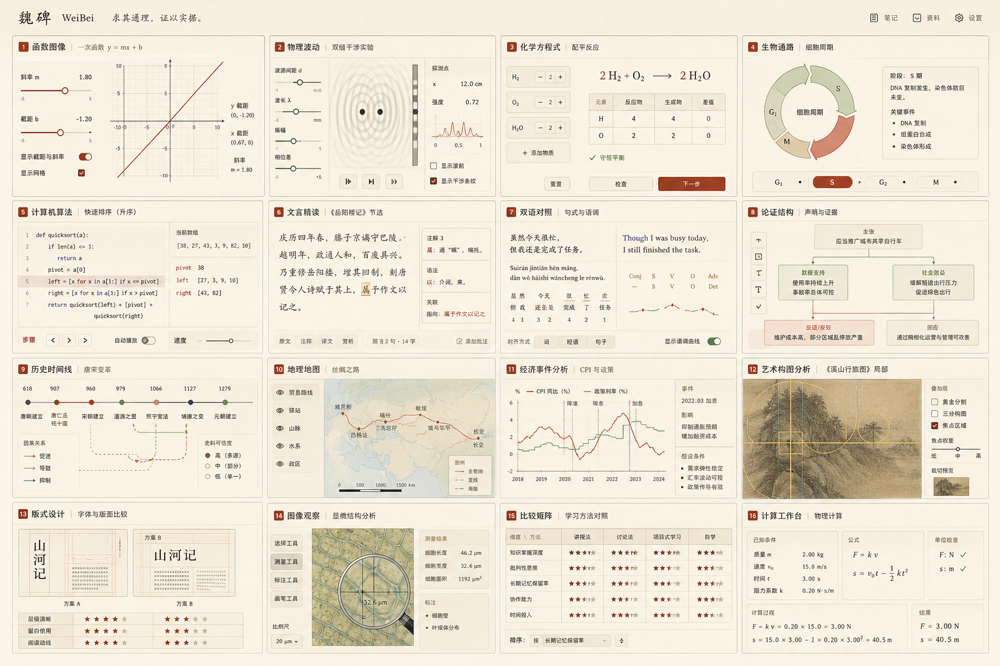
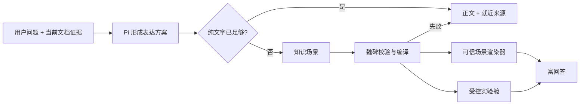

# 魏碑富回答系统方案

状态：主链路已落地，真实模型全量验收进行中；整体待用户验收
日期：2026-07-18

> 2026-07-18 落地校正：HTML/Web 仍然是高复杂度视觉与交互的上限，但当前真实实现是同一透明宿主内的混合架构：T1 深组件主要由本地 Web 运行时承载，T2 可组合原语当前由受控 SwiftUI 渲染器承载。两者共用同一份来源、布局、交互与降级契约；不再把“未来应有的 Web 上限”写成“当前已全量 Web 渲染”。

## 当前落地状态

这轮已经完成网页主运行时、原生可信宿主、正文内联序列、动态组件目录、T1 深组件与 T2 允许集合的主链路，但仍不能称为完整富回答已经交付：

- **闸门 A 主链路完成**：协议、来源绑定、T1/T2 二选一、动态组件目录、T2 允许集合、有限状态、预算、批量失败诊断和正文内联标记均有自动检查。压力矩阵当前是 **40 条富回答成功题 + 6 条应保持纯文本的形态选择题 + 9 条诚实降级题 + 1 条确定性非法协议故障**，不是固定能力清单。
- **闸门 B 尚未通过最终真实验收**：早期提到的 7 道真实 Pi 样本没有逐题保存模型原始输出、完整魏碑窗口截图和交互前后证据，只能说明链路曾经跑通，不能再写成“7 题通过”。40 条富回答、6 条纯文本、9 条诚实降级和 1 条非法协议必须全部重新运行、逐题留档，并在修复共性问题后完成三轮稳定性复测。
- **闸门 C 只有早期宿主样本通过，不等于当前场景验收通过**：T1 二次函数、T2 单摆和通用论证序列曾在真实魏碑窗口呈现，透明内联、宽度响应和动态高度已有样本证据；但当前首轮截图又暴露纯黑帧、回放进程在标记前被终止、辅助功能窗口树为空和输入框覆盖组件底部等 P0 问题。56 题仍必须分别保存真实完整窗口结果，富回答还要保存主互动操作前后两张；截图缺失、纯黑、只有夹具或只有日志时一律不得计为通过。
- **闸门 D 尚未完成正式评估**：个别已验证样本证明富回答不必退成文字换排版，真实交互也可以改变知识对象与读数；但这不能外推到全矩阵。跨学科的学习增益、误导率和用户理解速度仍需正式比较纯文字基线。

截至 2026-07-18 当前证据快照：首轮已有 **14 / 56** 题完成真实模型调用，其中旧验收口径记录为 6 条通过、8 条失败；这 8 条包含多项验证器误杀，已按知识对象、语义义务和交互结果修正架构，但尚未重新运行。首轮 14 题的真实窗口截图为 **0 / 14 合格**，不得用残留纯黑或未登记图片补数。剩余 42 题和后三轮稳定性复测涉及把题目与测试材料发送到配置的外部 Pi 模型服务，必须在用户明确知情授权后继续。

后续合并请求和对外汇报必须沿用这四个闸门分别报状态，不得用“支持八类”替代“八类均可真实使用”，也不得用本地截图替代真实 Pi 端到端证据。

已认可的二次函数、论证剖面、现金流传导、抽样分布、算法执行、政策证据链、空间图层等画面只作为质量参考，不定义“七个内核”，也不构成封闭组件清单。十二场景文件只是视觉与主交互参考；真正的当前验收面是 40+6+9+1 矩阵与持续增长的隐藏题，不存在固定数量上限。

## 这次要解决的不是组件清单

魏碑需要从第一阶段就具备广泛的富回答能力。目标不是先做两三个案例，随后再慢慢扩能力；也不是恢复旧版 28 个固定组件。要建立的是一套可以覆盖不同知识对象、学科结构和表达任务的生成与呈现系统。

案例只用于施压和验收，不能反过来成为能力边界。

## 不可退让的产品约束

1. **广能力前置**：函数、数据、实验、图像辅助、比例与构图、时间、空间、关系、证据、过程、比较等表达能力必须从系统设计起点就被容纳。
2. **统一气质**：所有结果必须属于魏碑，而不是像模型临时生成的任意网页。
3. **形态有区分**：不同知识结构不能只换标题和数据后继续使用同一张卡片。
4. **不过度设计**：不做 Hero、导航、功能卡片墙、网页落地页式包装，不让视觉装饰压过知识。
5. **有用才生成**：不能因为支持图形就逢问必画。富回答必须比文字更快地帮助观察、理解、比较、推导、试验或判断。
6. **Agent 默认判断**：模型根据当前文档、问题和证据选择表达方式；用户可以显式要求、替换或拒绝。
7. **真实 Pi 前置**：尽早验证真实模型能否完成判断与生成，测试夹具只能验证渲染，不能冒充端到端完成。
8. **笔记写回后置**：当前把富回答当作学习辅助，不默认形成笔记或学习资产。
9. **开放能力谱系**：高质量深组件、T2 允许集合与专业渲染能力同时增长；不能用七个、十二个或任何固定数量给生成式 UI 封顶。
10. **技术路线保持候选状态**：OpenUI、ECharts、JSXGraph、Plotly、Python 及以后新增路线都只是可注册候选，不是固定内核或必选栈。Python 默认承担计算、规格与产物，但具体场景若由 Bokeh、Panel、Pyodide 等受控适配器更合适，并满足内联、安全、性能和生命周期要求，也可以采用。

## 整体任务完成定义

只有下面八项同时通过，才可以向用户汇报“富回答整体任务完成”；原型、截图或单个场景通过只能报告阶段成果：

| 验收面 | 必须证明什么 |
| --- | --- |
| 内容与专业性 | 结论、公式、单位、因果边界和学科表达正确，不用视觉掩盖知识错误 |
| 当前材料依据 | 关键判断、数据和摘录逐项对应本轮真实材料；无法确认的内容明确标出 |
| 回答内联 | 正文与视觉块可自然交错，不追加第二篇回答，不出现独立网页的页头、导航和背景 |
| 视觉增益 | 去掉装饰后仍能更快看懂关系、过程、空间、证据或变量变化，不只是文字换排版 |
| 交互真实性 | 拖动、步进、筛选、叠层等操作真实改变知识对象和读数，无假按钮、假计算和假状态 |
| 开放组合能力 | 优秀深组件继续可用；没有专属组件的新问题也能由 T2 允许集合和注册渲染能力组合，不因题库外问题退成模板或纯文字 |
| 魏碑适配 | 透明融入 Agent 回答流；窄宽、设备像素比、深浅色、减少动画、动态高度、键盘、来源跳转与长回答均稳定 |
| 真实端到端 | 真实 Pi 自主判断或响应用户要求，生成、校验、持久化、恢复和真实窗口运行全部通过，并更新分支与合并请求证据 |

## 两种“互动”必须分开

### 现在就需要：回答内部的直接操控

- 拖动函数或实验参数并立即看到确定性结果
- 开关图层、比较方案、切换状态、逐步查看过程
- 缩放图像、移动观察区域、叠加比例线或标注
- 悬停查看数据与来源、筛选或排序对象

这些操作是富回答本身的一部分，不依赖 Agent 再跑一轮，也不应后置。

### 后续再做：跨回合的认知互动

- Agent 理解用户刚才如何操作、哪里犹豫、犯了什么错
- 根据操作继续追问、解释或调整教学路径
- 教会用户这类工具可以怎样使用
- 把操作结果变成学习记忆、练习记录或笔记

这是一条更重的学习闭环，需要单独设计用户认知、状态语义和隐私边界，不应阻塞第一版富回答能力。

## 本轮研究必须回答的问题

1. 广泛能力应按什么深层结构组织，避免退化成无穷组件表？
2. 怎样形成一套统一但不雷同的魏碑视觉语法？
3. 什么叫“不是网页”，边界怎样在协议和渲染层落实？
4. Pi 应生成组件名、表达计划，还是更底层的知识场景？
5. 原生结构化渲染与隔离 HTML 分别承担什么？
6. 第一批真实 Pi 验证应覆盖多少类能力和哪些失败情况？
7. 怎样证明富回答有用，而不是只是看起来更丰富？

## 并行研究分工

| 工作流 | 负责问题 | 交付 |
| --- | --- | --- |
| 能力版图 | 广泛知识对象、关系和表达动作怎样组合 | 能力模型与跨学科压力检验 |
| 视觉语言 | 统一气质与任务差异怎样同时成立 | 视觉语法、表面规则与反模式 |
| Pi 架构 | 判断、生成、协议、校验、降级怎样稳定 | Agent 决策链与协议草图 |
| 前端承载 | SwiftUI、WebKit 和现有回答链路怎样接入 | 模块接口、接入缝和实施切片 |
| 验收体系 | 怎样用足够广的真实问题给系统施压 | 跨学科问题集与 Pass/Fail 标准 |
| 学习有效性 | 怎样有用、怎样渐进暴露、哪些互动后置 | 认知负担和可发现性规则 |

## 生图模型怎样参与设计

生图模型不负责证明方案正确，也不直接产出最终 UI。它作为视觉探索器，批量生成不同知识结构的候选形态，再由产品、设计和实现规则反向筛选。

第一轮总览板已经覆盖函数、物理波动、化学配平、生物通路、算法跟踪、文本精读、双语对照、论证结构、历史时间线、地理地图、经济事件、艺术构图、版式比例、图像观察、比较矩阵和计算工作台：



这张图是探索材料，不是界面规格。后续还要分别生成并评审：

1. 文本、论证、时间与证据专题板。
2. 函数、数据、计算与实验专题板。
3. 图像、空间、地图与设计专题板。

每轮生图都要按五条标准淘汰：是否像魏碑、是否真的承载知识关系、是否与其他形态有实质差异、是否仍像网页或卡片墙、交互是否能够被真实实现。

## 已形成的第一轮共识

1. Pi 不直接选择组件名，而是先形成“学习动作、证据形状、操作需要、表面重量”的表达方案。
2. 回答内部的直接操控第一版就需要；跨回合教学互动和学习状态后置。
3. 第一批真实 Pi 不是两条演示，而应是覆盖约 15 个领域的广能力压力运行，并包含失败与降级链路。
4. 前端应在消息渲染之前建立独立的富回答呈现模块，避免把业务判断继续散进 `WorkspaceStore` 和 `editor.js`。
5. 统一来自纸墨视觉、来源行为、控件语义和生命周期；差异来自知识结构本身，而不是随机换色和换卡片。

## 总体方案

魏碑富回答采用“一条可信主路 + 一个受控出口”：

1. **可信主路：知识场景语法。** Pi 输出知识对象、关系、操作、坐标框架和证据绑定；魏碑决定最终视觉并使用可信渲染器运行。
2. **受控出口：实验舱。** 当可信渲染器无法表达高价值实验时，Pi 仍不生成完整网页，而是提交受限学习工具包，由魏碑在无网络、无文件、无外链、无持久存储的沙箱中运行。
3. **永远存在的退路：正文与来源。** 任一结构、来源、安全、性能或渲染检查失败，都保留可读答案并诚实说明降级。



这不是“原生组件还是 HTML”二选一。主系统始终由魏碑控制，实验舱只是为无法预先枚举的新形态保留创造力。

## 核心抽象：Pi 生成知识场景，不选择组件

旧版最大的问题不是有 28 种，而是把 Agent 的选择直接绑定到 28 个组件名。新系统把外部接口压成一套更深的表达语法。

### 表达方案

Pi 在生成任何富对象前，先形成以下判断：

| 决策 | 要回答的问题 |
| --- | --- |
| 学习动作 | 用户需要观察、比较、推导、试验、定位、追踪、判断、练习，还是短答？ |
| 证据状态 | 当前选区、材料、笔记和搜索是否足够？哪些内容仍未确认？ |
| 知识形状 | 当前证据是文本片段、数量序列、公式、矩阵、关系图、步骤、状态、时间、空间还是图像区域？ |
| 直接操控 | 用户是否需要拖动、切换、逐步、缩放、叠层、筛选、排序或核验？ |
| 表面重量 | 应留在正文、展开成宽面，还是进入聚焦实验面？ |
| 信息层级 | 什么必须同时出现，什么可以按需展开，什么不能伪装成已确认事实？ |

### 知识场景

```text
RichAnswerEnvelope
├── narrative            正文结论与解释，可用受控场景标记指定插入位置
├── expressionPlan       学习动作、证据形状、表面重量
├── scenes[]             一个或多个知识场景
├── evidenceLedger[]     可校验来源与支持关系
└── fallback             失败时保留的文字表达

RichAnswerPresentation
└── parts[]              校验后形成正文片段与场景片段交错的有序序列

KnowledgeScene
├── objects[]            文本、量、公式、事件、区域、状态、主张等
├── relations[]          因果、支持、反驳、顺序、对齐、包含、转化等
├── operations[]         拖动、切换、逐步、缩放、叠层、筛选等
├── frames[]             数轴、坐标、时间、空间、图像、文本等框架
├── evidenceBindings[]   每个关键对象和关系对应的材料证据
└── placement            正文内、展开面、实验面
```

函数图、时间线、关系图、图像叠层、实验和设计比例不再是六个互不相干的组件。它们是对象、关系、操作和框架的不同组合。

### 最小外部接口

Pi 只提交一个 `RichAnswerEnvelope`。魏碑的深模块 `RichAnswerEngine` 隐藏协议校验、来源核对、渲染选择、主题编译、宽度降级和失败处理。

```swift
RichAnswerEngine.prepare(
    envelope: RichAnswerEnvelope,
    environment: RichAnswerEnvironment
) -> RichAnswerPresentation
```

调用者不需要知道八类能力如何实现，也不需要知道最终使用 SwiftUI、CoreGraphics、PDFKit 还是可信 WebKit。

## 第一版就要有的广能力底座

这里不是“以后再扩能力”的清单，而是第一版系统必须同时容纳的八类引擎。每类至少落一个可真实使用的实现，随后通过同一语法继续加深。

| 能力引擎 | 核心知识对象 | 第一版直接操控 | 覆盖例子 |
| --- | --- | --- | --- |
| 文本与对齐 | 原文片段、术语、译文、批注、语法关系 | 高亮、对齐、展开边注、切换译法 | 精读、双语、法律条文、文献校勘 |
| 数量与坐标 | 数值、变量、公式、单位、序列、分布 | 滑杆、探针、刷选、缩放、显示区间 | 函数、统计、物理、金融、实验数据 |
| 过程与状态 | 步骤、状态、转移、输入、输出、条件 | 前进后退、播放、切换状态、检查守恒 | 算法、化学反应、生物通路、操作流程 |
| 关系与证据 | 主张、证据、反证、因果、依赖、置信边界 | 展开来源、筛选关系、聚焦路径 | 哲学、历史、政策、论文论证、知识关系 |
| 时间与空间 | 事件、区间、位置、路径、区域、尺度、图层 | 拖动时间、图层开关、区域聚焦、路径比较 | 历史、地理、地质、建筑、生物演化 |
| 图像与叠层 | 图片、区域、标尺、焦点、构图线、观察镜头 | 圈选、量尺、缩放、图层、裁切预览 | 艺术、设计、医学图像、地图、书法结构 |
| 比较与评价 | 对象、维度、标准、差异、权衡、限制 | 排序、维度开关、方案切换、差异聚焦 | 概念辨析、方案比较、政策权衡、设计评审 |
| 计算与约束 | 公式、量纲、输入、规则、验证条件、结果范围 | 改输入、单位换算、逐步检查、重置 | 计算器、单位检查、配平、概率、现金流 |

练习、揭晓和小测不是独立视觉世界，而是可以施加在这些知识场景上的“核验动作”。例如函数场景可以先预测后拖动，文本场景可以先找证据再揭晓，过程场景可以让用户先排列步骤。

### 为什么这不是另一个 28 组件表

- 八类是内部渲染能力，不是 Pi 必须背诵的 UI 名称。
- 同一个场景可以组合多个引擎，例如经济事件分析同时使用数量坐标、时间和证据。
- 新形态优先通过扩展对象、关系、操作或框架产生，而不是新增一个从头到尾独立的组件。
- 真正无法表达的新实验才申请实验舱能力。

## 三种呈现表面

“体验规格”必须具体到用户在哪里看到什么，而不是只写抽象层级。

| 表面 | 用户看到什么 | 适用范围 | 硬边界 |
| --- | --- | --- | --- |
| 正文内插图 | 回答正文之间自然出现小图、小表、局部批注或简短步骤 | 一屏能理解、操作不超过一个主动作 | 不出现标题栏、导航、全套工具栏和内部长滚动 |
| 展开研习面 | 当前回答中的对象向横向或纵向展开，仍保留对话和来源 | 比较、时间线、关系、推导、数据观察 | 最多一个主要工作对象，随时收回正文 |
| 聚焦实验面 | 临时占据主要空间的函数、模拟、图像或空间实验 | 多变量调节、复杂图像观察、组合模拟 | 保留魏碑宿主壳、返回路径和来源；不是独立网站 |

表面不是由学科决定，而由任务重量决定。同一个函数可以是一张正文小图，也可以在用户要求调参时进入聚焦实验面。

## “不能做成网页”的具体边界

禁止靠审美口号约束模型，必须把边界写进能力 manifest 和运行时。

### 富回答中禁止

- 独立导航、页眉页脚、路由、多页面结构
- Hero、Features、CTA、营销区块和卡片墙
- 任意 HTML、CSS、JavaScript、SVG 字符串
- 外部网络、外链脚本、远程字体、外部图片和 iframe
- 下载、弹窗、文件读写、剪贴板、持久存储和后台任务
- 无上限节点、数据点、动画、内存和运行时间
- 模型自定义主题色、字体、阴影和控件形态
- 没有材料证据却伪装成精确测量、评分、因果或实时数据

### 受控实验舱允许

- 一个明确学习目标的单一学习器
- 魏碑内置可信 Canvas/WebGL/图形与计算能力
- manifest 明确允许的输入、操作、数据预算和计算规则
- 来源使用宿主分配的 `sourceID`，不能自行构造跳转
- 宿主控制标题、主题、宽度、来源、错误、关闭和降级

实验舱的本质是“受限运行时”，不是给模型一张空白网页。

### 对 LeAgent / OpenUI 的吸收边界

本轮源码复核基于 LeAgent `main` 的 `1f16badc834abbd829d3cb7e9f8fcb5b2d57f443`。它验证了一条有价值的生成链路：模型先读取按需指南与组件目录，再提交声明式树；运行时负责校验、局部状态、动作分发、后续补丁和坏产物重生成。魏碑应吸收这套**生成与运行机制**，而不是照搬它的业务组件和默认视觉。

- **保留并深化**：动态指南与目录、严格结构校验、结构化错误、完整重提交流程、局部状态、受控学习动作、后续可加入的增量补丁与补丁后完整快照。
- **明确不搬**：`KPI` 看板、幻灯片、画廊、天气卡等固定业务枚举，以及把任意 `HTML / JavaScript / iframe` 当默认逃生口。
- **魏碑必须额外具备**：逐对象来源绑定、T1 深组件与 T2 允许集合并存、知识状态真实联动、正文内联布局、学科知识形状差异和 56 题真实窗口验收。
- **补丁前置条件**：任何增量补丁都必须再次通过同一 schema，并持久化应用补丁后的完整快照；坏树只能完整重发，不能在错误结构上继续局部修补。

因此 LeAgent 可以证明“声明式生成 UI 链路可行”，不能证明它现有的固定组件目录足以覆盖魏碑的跨学科学习场景。

源码复核后，魏碑不需要再照着 LeAgent 新造一套目录工具或错误回灌工具；这些主能力已经存在。真正的差距只有少数几项，必须分清“已有、待补、拒绝”，避免把借鉴变成重复开发。

| LeAgent 机制 | 魏碑当前判断 | 处理方式 |
| --- | --- | --- |
| 按需组件目录与生成指南 | 已有 `weibei_ui_catalog`，会根据学习动作、知识形状、来源媒介和直接操作返回相关 T1 签名、T2 允许字段和渲染器适配提示 | 保留现有工具，不再复制一套 `list_learning_components` 或把完整目录塞回系统提示词 |
| 声明式树校验 | LeAgent 对树外壳、节点种类、深度和数量有约束，但 `props` 仍是开放对象；魏碑已有 `schemaVersion = 2`、未知字段拦截、预算、对象/关系/过程、证据账本和当前材料修订校验 | 继续以魏碑协议为主；不把 LeAgent 的宽松 `props` 和通用卡片 schema 搬进学习语义校验 |
| 结构化错误与再生成 | 已有 `weibei.rich_answer.repair_fault`、字段路径、剩余次数和完整重提交要求 | 保留“坏树完整重发”，不采用在错误树上继续局部补丁的宽松修复 |
| 聊天内联渲染 | 魏碑已经把正文与场景标记编译为交替序列，并使用透明、按消息宽度响应的宿主 | 继续修真实窗口、动态高度和输入区遮挡，不退回整页画布或右侧独立网站 |
| 局部状态与受控动作 | 魏碑已有 binding、控件和派生视觉状态，但当前 T1/T2 互动值只活在本轮运行时，仍需用 56 题证明动作真的改变知识对象 | 借鉴事件总线的解耦方式；后续只持久化 binding 值、当前步骤、选中证据/对象和图层开关，不保存 hover、窗口高度、滚动位置等宿主瞬时状态 |
| `ui_tree / ui_patch` 流式旁路 | 当前缺少成熟的场景级增量流；现阶段仍以完整、已校验包为基线 | 先完成 56 题首轮与真实窗口修复；之后只允许带 `contextRevision + sequence + baseDigest` 的补丁，且禁止补丁改写证据账本和来源摘录 |
| 最终树持久化与重开回放 | 当前校验后的 `RichAnswerPresentation` 已随消息写入工作区，重开课程可以复现同一回答；但原始工具结果、完整工具轨迹、版本迁移诊断和 T1/T2 互动语义状态尚未持久化 | 保留现有消息快照；补 schema 版本迁移与失败可见性。未来有补丁后，再保存应用补丁后的完整包、`finalDigest / finalSequence` 和证据状态，不把补丁日志当唯一回放源 |
| PDF / DOCX / PPTX 导出 | 可作为后续学习讲义能力，但不是当前富回答成立的证明 | 只有已校验的富回答包可以导出，且来源与证据账本必须随内容一起导出 |
| 任意 `HtmlFrame`、脚本和 iframe | 与魏碑正文内联、来源可信和宿主安全目标冲突 | 明确拒绝作为默认生成路径；可信计算或图形能力只能通过魏碑注册的受限运行时开放 |

当前阶段的优先级因此不是“移植 LeAgent”，而是：先修真实宿主与 56 题暴露的共性问题；再补**可校验的增量流**和**最终快照回放**。导出与更开放的实验舱后置，不能挤占富回答本体的正确性、审美和学习有效性验收。

## 统一但不雷同的视觉系统

### 统一由宿主掌握

| 统一项 | 魏碑规则 |
| --- | --- |
| 材质 | 暖纸、墨色、砚石深色；不做玻璃和霓虹 |
| 语义色 | 朱砂用于当前焦点/错误，苔绿用于守恒/确认，蓝墨用于可跳来源 |
| 字体 | 正文用中文阅读字体，控件用系统无衬线，坐标和数值用等宽 |
| 控件 | 滑杆、探针、图层、步进、来源、重置使用统一行为与焦点样式 |
| 生命周期 | 规划、生成、校验、可用、失败和降级使用统一语言 |
| 证据 | 来源贴近对象、关系、数据点和图像区域，同时保留总来源 |

### 差异由知识结构决定

| 知识结构 | 主要视觉组织 |
| --- | --- |
| 连续变量 | 坐标、曲线、探针、参数尺 |
| 顺序与变化 | 时间轴、步骤、状态带、回放 |
| 论证与关系 | 原文边注、证据线、支持/反驳结构 |
| 空间与图像 | 原图、叠层、量尺、局部镜头、路径 |
| 比较与权衡 | 对齐、差异标记、维度切换，不使用无依据星级 |
| 计算与约束 | 公式、当前输入、约束检查和结果范围同屏 |

同一纸墨外壳不能继续变成同一张卡片。函数实验可以没有卡片边框，时间线可以沿正文展开，图像分析应让原图成为主画布，论证结构应从原文边缘生长。

### 第一张生图参考的判断

第一轮总览板评分约 7/10。函数、波动、化学配平、算法跟踪、文言精读、双语、时间线、地图和图像观察方向成立；论证流程图、经济 dashboard、星级设计评审、星级比较矩阵和卡片化计算工作台需要淘汰或重做。

后续三张专题板必须避免 4×4 卡片墙，且每个候选都必须同时出现：原材料锚点、转化后的知识结构、一个可信直接操作、失败或不确定提示位。

## Pi 的判断与生成链路

### 不再用 Markdown 围栏夹 JSON

真实 Pi 通过一个明确工具提交 `RichAnswerEnvelope`。普通正文仍可流式输出，但富回答结构走工具协议，避免源码先露出、完成后突然替换。

### 生命周期

```text
readingContext
→ planningExpression
→ streamingNarrative
→ proposingScene
→ validatingEvidence
→ compilingPresentation
→ ready
  ↘ repairTwice
  ↘ fallbackToText
```

1. Pi 必须先读当前上下文并判断证据是否足够。
2. Pi 可以先提交轻量表达骨架，让界面出现真实进度。
3. 完整场景提交后由魏碑校验 `contextRevision`、来源、预算、对象关系和运行能力。
4. 工具最多接收三次提交：首次生成后最多两轮修复；第三次仍失败就退回正文，不无限重试。校验器在每一阶段一次返回多条可修复问题，避免一轮只暴露一个低级错误。
5. Pi 不提供颜色、CSS 和任意布局，只提供知识语义和有限 `styleIntent`。

新生成链路只接受 `schemaVersion = 2`。核心引擎保留对 v1 的解析，仅用于展示用户本机早期已持久化的历史消息；模型、工具和当前用例不得新产出 v1。

### 真实 Pi 要尽早跑，但分两次验收

| 验收 | 什么时候跑 | 证明什么 |
| --- | --- | --- |
| 规划压力运行 | 表达方案和工具协议完成后立即运行 | Pi 是否会选择合适形态、是否知道何时纯文字、是否能诚实降级 |
| 完整窗口运行 | 对应渲染引擎可用后运行 | 真实 Pi 输出能否经过校验，在真实魏碑窗口呈现并可操作 |

这样不会等全部前端做完才发现模型根本不会稳定生成，也不会拿规划 JSON 冒充最终体验。

## 广能力压力矩阵

“黄金案例”改名为“广能力压力矩阵”。案例只是探针，系统能力仍由知识场景语法定义。

### 首批 15 个核心领域探针

| 领域 | 真实问题方向 | 要施压的能力 |
| --- | --- | --- |
| 数学 | 推导二次函数顶点公式并解释每步合法性 | 公式、步骤、证据 |
| 物理 | 根据斜面材料展示受力并判断摩擦方向 | 空间、关系、图示 |
| 化学 | 配平氧化还原反应并标电子转移 | 计算、守恒、过程 |
| 生物 | 解释 DNA 突变到蛋白质变化的机制 | 状态、通路、因果 |
| 计算机 | 跟踪循环代码变量和最终输出 | 代码、状态、步进 |
| 语言 | 分析英文长句主干、修饰和歧义 | 文本、对齐、结构 |
| 文学 | 细读原文并说明意象如何服务主题 | 原文、边注、证据 |
| 历史 | 从多材料整理时间线并区分原因层次 | 时间、因果、来源 |
| 哲学 | 拆解前提、结论、反例和偷换概念 | 论证、反驳、边界 |
| 艺术设计 | 在真实图像上指出构图、层级和比例问题 | 图像、叠层、评价 |
| 地理 | 根据等高线判断河流流向和坡度 | 地图、空间、尺度 |
| 经济金融 | 用供需关系解释价格上限与短缺条件 | 曲线、情境、因果边界 |
| 法律政策 | 根据给定条文展示功能是否触发告知义务 | 文本、条件、风险 |
| 统计数据 | 计算并解释均值、中位数、异常值 | 数据、计算、分布 |
| 日常技能 | 根据故障现象设计安全排查顺序 | 条件、步骤、安全 |

这 15 个领域只是核心覆盖索引，不是首批只跑 15 题。当前固定矩阵已扩展为 40 条富回答成功题、6 条纯文本选择题、9 条降级题和 1 条确定性非法协议题。

### 三层题库

1. **40 条富回答固定回归**：跨学科验证 T1 深组件、T2 允许集合与注册渲染能力，防止模型只背专属模板。
2. **6 条纯文本 + 9 条降级 + 1 条非法协议**：验证何时不画、何时诚实收手，以及错误协议不能漏到用户界面。
3. **真实模型分层抽验**：持续从上述三类中抽取不同知识形状、媒介和交互运行，不用几个成功题代替全矩阵。
4. **隐藏影子题库**：从真实用户问题中滚动抽样，数字、名称、材料顺序持续变化。

### 56 题真实验收与证据包

协议自检、确定性夹具和少量真实模型抽样只负责尽早暴露问题，不能替代最终验收。当前整体验收必须完整运行 `40 + 6 + 9 + 1` 共 56 题，并遵守以下硬门槛：

1. 第一轮先完整运行 56 题。40 条富回答题必须保存真实魏碑窗口的完整操作前、操作后截图；6 条纯文本、9 条降级和 1 条非法协议也必须保存真实窗口结果，不能只留日志或夹具截图。
2. 每题留存题目与材料、模型原始回答、形态判断、T1/T2/渲染计划、协议校验、来源绑定、耗时、失败原因、修复与复测记录。早期未逐题留档的真实 Pi 样本一律重新运行，不能补写或推断证据。
3. 第一轮完成后，每题至少再运行三次稳定性检查。回答内容、形态或交互结构发生变化时，必须补留对应窗口截图并记录差异；不能只保存最漂亮的一次。
4. 每题同时接受专业正确性、来源绑定、渲染器适配、学习增益、真实知识状态互动、视觉多样性、窄宽/设备像素比/深浅色/减少动画、诚实降级和四轮稳定性审查。多题出现同类失败时修协议、渲染能力、宿主或选择策略，不按题增加硬编码。
5. 最终产物必须是用户能逐题或分批浏览的验收包，能从索引进入原始模型输出、协议记录、窗口截图和复测差异。未经用户本人明确确认，整体状态只能写“待用户验收”，不得写“完成”或“已通过”。

验收矩阵保留专业义务、来源义务和形态目标，但不得把通过条件写成必须出现某个底层路径、线段、点对象、固定组件名或专属视觉答案。复杂函数、几何、三维、图像叠层、地图、模拟和出版级图表应先检查是否选择了合适的注册渲染器或允许集合；能力不匹配时记录 `capability_mismatch`、重新规划或诚实降级，不能用低级图元硬凑。

### 二元验收

| 维度 | Pass | Fail |
| --- | --- | --- |
| 形态选择 | 选择属于允许集合，纯文字足够时保持克制 | 所有题都画图或所有题都堆 Markdown |
| 信息正确 | 事实、公式、单位、方向和边界正确 | 关键知识错误或编造计算结果 |
| 渲染适配 | 所选 T1/T2/专业渲染器适合知识形状和当前运行预算 | 用不合适的通用图形硬凑，或脱离允许集合 |
| 视觉增益 | 比文字更快展示关系、过程、空间或变量 | 只是漂亮、没有信息增益 |
| 来源 | 关键对象和关系贴近真实材料证据 | 来源与结论不匹配或伪造跳转 |
| 操作可信 | 操作可预测、即时、可撤回，并真实改变知识状态 | 假按钮、假状态、不可解释变化 |
| 视觉多样性 | 构图和主互动来自学科知识结构 | 全矩阵复用同一外壳、同一线图或同一控件组合 |
| 环境适配 | 360pt 窄栏、宽栏、设备像素比、浅色/深色和减少动画均可读可用 | 缩成不可读网页、标签碰撞、动效不可关闭或深色失效 |
| 降级 | 明确说明证据或能力缺口，并保留正文 | 空白、原始 JSON、无限等待或假装完成 |
| 四轮稳定 | 56 题首轮加三轮复测内容、形态、互动和证据稳定，差异真实留档 | 只保存最好一次或复测漂移无记录 |
| 性能 | 10 秒内有真实进度，外层预算内完成或受控失败 | 长时间无进度、反复闪动或卡死窗口 |

## 实现模块与接入位置

现有真实链路是 `PiAgentRuntime → WorkspaceStore.askAgent → AgentMessage → NotesAgentView → RichMarkdownEditorView/WebKit`。富回答模块应放在“消息文本准备进入呈现”这个 seam，而不是继续往 Store 和 `editor.js` 里堆判断。

| 模块 | 职责 | 写入位置建议 |
| --- | --- | --- |
| `RichAnswerEngine` | 协议、校验、证据、编译、降级 | 新增于 `WeiBeiCore` |
| `RichAnswerHost` | 正文内、展开面、实验面的统一宿主 | 新增 SwiftUI 文件 |
| 场景渲染器族 | 文本、数量、过程、关系、时空、图像、比较、计算 | 按引擎拆分新文件 |
| `TrustedWebSceneAdapter` | 复用 KaTeX、Mermaid、可信 Canvas 运行时 | 独立于普通 Markdown editor |
| Pi 表达工具与技能 | 提交表达计划和知识场景 | `AgentResources` 与 Pi RPC 层 |
| 压力测试 | 真实 Pi、协议、自检、窗口截图 | 独立检查与验证场景 |

第一片应避免修改 `WorkspaceStore.swift`。`NotesAgentView.swift` 只替换助手消息渲染入口；聚焦实验面需要修改共享 `ContentView.swift` 时另开切片并声明占用。

## 如何分工

不是按“前端做页面、后端写 Prompt”粗分，而是按稳定 seam 分工。

| 工作线 | 负责内容 | 不负责什么 | 依赖 |
| --- | --- | --- | --- |
| 系统架构线 | 知识场景语法、Envelope、validator、manifest、降级 | 不实现具体视觉 | 最先定接口 |
| Pi Agent 线 | 表达规划技能、工具提交、目录参数约束、批量诊断、最多两轮修复、真模型压力运行 | 不决定颜色和最终布局 | 依赖 Envelope |
| 呈现宿主线 | 三种表面、生命周期、主题、来源、错误、宽度 | 不理解学科语义 | 依赖 Presentation 接口 |
| 文本/关系/时间线 | 文本对齐、证据、论证、时间与比较 | 不碰数学和图像 runtime | 依赖场景语法 |
| 数量/过程/计算线 | 图表、函数、状态、算法、配平、单位和实验 | 不碰图像分析 | 依赖场景语法与计算预算 |
| 图像/空间/设计线 | 图像叠层、量尺、地图、构图、比例、空间路径 | 不做任意图像生成网页 | 依赖图片来源与坐标框架 |
| 受控实验舱线 | manifest、沙箱、可信图形运行时、超时和截图降级 | 不替代常用原生渲染器 | 在主路稳定后并行开闸 |
| 验收线 | 40+6+9+1/隐藏题库、真实 Pi、真实窗口、深浅/窄宽/失败 | 不为测试硬编码产物 | 从第一天开始 |
| 视觉探索线 | 生图专题板、竞品实验台参考、坏味道淘汰 | 不直接交付实现稿 | 持续服务各渲染线 |

主 Agent 负责接口取舍、模块 seam、风险、合并和最终验收；子代理可以并行研究、实现分离的渲染引擎和整理证据，但不能各自发明一套协议。

## 推进方式：并行工作线 + 集成闸门

用户反对的是把广能力拖到最后，不是反对有依赖关系。正确推进方式不是五个串行阶段，而是多个工作线同时推进，通过四个闸门收口。

### 闸门 A：系统能表达

- 八类能力都能用知识场景语法描述。
- 40 条富回答题、6 条纯文本题、9 条降级题与 1 条非法协议题都有可重复的确定性验收。
- 不能表达的部分明确申请实验舱，不偷偷塞 HTML。

### 闸门 B：真实 Pi 会生成

- 真实模型抽验覆盖富回答、纯文本选择和诚实降级，且新的未预制题仍能选择合适 T1、T2 允许集合或注册渲染器。
- 形态选择、来源和降级通过二元验收。
- 不是 fixture，不向 Prompt 暴露标准答案和目标组件名。

### 闸门 C：真实 App 会呈现

- 八类能力各有至少一个可真实使用的实现。
- 正文内、展开面、实验面均可用。
- 深浅色、360pt、宽栏、设备像素比、减少动画、键盘、来源跳转、失败降级和长回答通过。

### 闸门 D：用户真的受益

- 用户可以亲自触发，不需要知道工具名。
- 富回答比纯文字更快解释目标关系。
- 直接操控可预测、即时、可撤回。
- 无用或误导的富回答会被淘汰，而不是靠视觉打分掩盖。

## 明确后置的内容

- Agent 自动解释用户刚才如何操作
- 根据操作推断掌握、犹豫、错误和下一步教学路径
- 把操作写入学习记忆、错题、笔记或复习计划
- 复杂多轮测验模式与用户分层教学
- 富回答偏好长期个性化

这些能力需要用户认知教育、状态语义、隐私和长期一致性，不阻塞第一版广能力富回答。

## 最终判断

魏碑不应造一个“会生成很多组件的聊天框”，而应造一个**资料上的知识实验台**：

- Pi 负责理解问题、证据与表达意图。
- 魏碑负责把知识场景编译成统一而不雷同的学习工具。
- 常见能力走可信渲染器，未知高价值实验进入受控实验舱。
- 本地直接操控第一版存在，跨回合认知互动后置。
- 广能力从第一版就进入架构与验收，不再叫“以后扩展”。
- 生图模型持续提供视觉候选，但所有候选都要经过知识真实性、实现可信度和非网页化审查。
