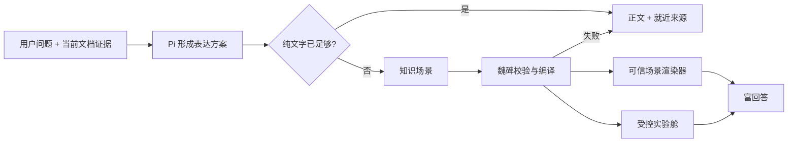

# 魏碑富回答系统方案

状态：方案草案，待确认后进入实现
日期：2026-07-17

## 这次要解决的不是组件清单

魏碑需要从第一阶段就具备广泛的富回答能力。目标不是先做两三个案例，随后再慢慢扩能力；也不是恢复旧版 28 个固定组件。要建立的是一套可以覆盖不同知识对象、学科结构和表达任务的生成与呈现系统。

案例只用于施压和验收，不能反过来成为能力边界。

## 不可退让的产品约束

1. **广能力前置**：函数、数据、实验、图像辅助、比例与构图、时间、空间、关系、证据、过程、比较等表达能力必须从系统设计起点就被容纳。
2. **统一气质**：所有结果必须属于魏碑，而不是像模型临时生成的任意网页。
3. **形态有区分**：不同知识结构不能只换标题和数据后继续使用同一张卡片。
4. **不过度设计**：不做 Hero、导航、功能卡片墙、网页落地页式包装，不让视觉装饰压过知识。
5. **有用才生成**：不能因为支持图形就逢问必画。富回答必须比文字更快地帮助观察、理解、比较、推导、试验或判断。
6. **Agent 默认判断**：模型根据当前文档、问题和证据选择表达方式；用户可以显式要求、替换或拒绝。
7. **真实 Pi 前置**：尽早验证真实模型能否完成判断与生成，测试夹具只能验证渲染，不能冒充端到端完成。
8. **笔记写回后置**：当前把富回答当作学习辅助，不默认形成笔记或学习资产。

## 两种“互动”必须分开

### 现在就需要：回答内部的直接操控

- 拖动函数或实验参数并立即看到确定性结果
- 开关图层、比较方案、切换状态、逐步查看过程
- 缩放图像、移动观察区域、叠加比例线或标注
- 悬停查看数据与来源、筛选或排序对象

这些操作是富回答本身的一部分，不依赖 Agent 再跑一轮，也不应后置。

### 后续再做：跨回合的认知互动

- Agent 理解用户刚才如何操作、哪里犹豫、犯了什么错
- 根据操作继续追问、解释或调整教学路径
- 教会用户这类工具可以怎样使用
- 把操作结果变成学习记忆、练习记录或笔记

这是一条更重的学习闭环，需要单独设计用户认知、状态语义和隐私边界，不应阻塞第一版富回答能力。

## 本轮研究必须回答的问题

1. 广泛能力应按什么深层结构组织，避免退化成无穷组件表？
2. 怎样形成一套统一但不雷同的魏碑视觉语法？
3. 什么叫“不是网页”，边界怎样在协议和渲染层落实？
4. Pi 应生成组件名、表达计划，还是更底层的知识场景？
5. 原生结构化渲染与隔离 HTML 分别承担什么？
6. 第一批真实 Pi 验证应覆盖多少类能力和哪些失败情况？
7. 怎样证明富回答有用，而不是只是看起来更丰富？

## 并行研究分工

| 工作流 | 负责问题 | 交付 |
| --- | --- | --- |
| 能力版图 | 广泛知识对象、关系和表达动作怎样组合 | 能力模型与跨学科压力检验 |
| 视觉语言 | 统一气质与任务差异怎样同时成立 | 视觉语法、表面规则与反模式 |
| Pi 架构 | 判断、生成、协议、校验、降级怎样稳定 | Agent 决策链与协议草图 |
| 前端承载 | SwiftUI、WebKit 和现有回答链路怎样接入 | 模块接口、接入缝和实施切片 |
| 验收体系 | 怎样用足够广的真实问题给系统施压 | 跨学科问题集与 Pass/Fail 标准 |
| 学习有效性 | 怎样有用、怎样渐进暴露、哪些互动后置 | 认知负担和可发现性规则 |

## 生图模型怎样参与设计

生图模型不负责证明方案正确，也不直接产出最终 UI。它作为视觉探索器，批量生成不同知识结构的候选形态，再由产品、设计和实现规则反向筛选。

第一轮总览板已经覆盖函数、物理波动、化学配平、生物通路、算法跟踪、文本精读、双语对照、论证结构、历史时间线、地理地图、经济事件、艺术构图、版式比例、图像观察、比较矩阵和计算工作台：


这张图是探索材料，不是界面规格。后续还要分别生成并评审：

1. 文本、论证、时间与证据专题板。
2. 函数、数据、计算与实验专题板。
3. 图像、空间、地图与设计专题板。

每轮生图都要按五条标准淘汰：是否像魏碑、是否真的承载知识关系、是否与其他形态有实质差异、是否仍像网页或卡片墙、交互是否能够被真实实现。

## 已形成的第一轮共识

1. Pi 不直接选择组件名，而是先形成“学习动作、证据形状、操作需要、表面重量”的表达方案。
2. 回答内部的直接操控第一版就需要；跨回合教学互动和学习状态后置。
3. 第一批真实 Pi 不是两条演示，而应是覆盖约 15 个领域的广能力压力运行，并包含失败与降级链路。
4. 前端应在消息渲染之前建立独立的富回答呈现模块，避免把业务判断继续散进 `WorkspaceStore` 和 `editor.js`。
5. 统一来自纸墨视觉、来源行为、控件语义和生命周期；差异来自知识结构本身，而不是随机换色和换卡片。

## 总体方案

魏碑富回答采用“一条可信主路 + 一个受控出口”：

1. **可信主路：知识场景语法。** Pi 输出知识对象、关系、操作、坐标框架和证据绑定；魏碑决定最终视觉并使用可信渲染器运行。
2. **受控出口：实验舱。** 当可信渲染器无法表达高价值实验时，Pi 仍不生成完整网页，而是提交受限学习工具包，由魏碑在无网络、无文件、无外链、无持久存储的沙箱中运行。
3. **永远存在的退路：正文与来源。** 任一结构、来源、安全、性能或渲染检查失败，都保留可读答案并诚实说明降级。



这不是“原生组件还是 HTML”二选一。主系统始终由魏碑控制，实验舱只是为无法预先枚举的新形态保留创造力。

## 核心抽象：Pi 生成知识场景，不选择组件

旧版最大的问题不是有 28 种，而是把 Agent 的选择直接绑定到 28 个组件名。新系统把外部接口压成一套更深的表达语法。

### 表达方案

Pi 在生成任何富对象前，先形成以下判断：

| 决策 | 要回答的问题 |
| --- | --- |
| 学习动作 | 用户需要观察、比较、推导、试验、定位、追踪、判断、练习，还是短答？ |
| 证据状态 | 当前选区、材料、笔记和搜索是否足够？哪些内容仍未确认？ |
| 知识形状 | 当前证据是文本片段、数量序列、公式、矩阵、关系图、步骤、状态、时间、空间还是图像区域？ |
| 直接操控 | 用户是否需要拖动、切换、逐步、缩放、叠层、筛选、排序或核验？ |
| 表面重量 | 应留在正文、展开成宽面，还是进入聚焦实验面？ |
| 信息层级 | 什么必须同时出现，什么可以按需展开，什么不能伪装成已确认事实？ |

### 知识场景

```text
RichAnswerEnvelope
├── narrative            正文结论与解释
├── expressionPlan       学习动作、证据形状、表面重量
├── scenes[]             一个或多个知识场景
├── evidenceLedger[]     可校验来源与支持关系
└── fallback             失败时保留的文字表达

KnowledgeScene
├── objects[]            文本、量、公式、事件、区域、状态、主张等
├── relations[]          因果、支持、反驳、顺序、对齐、包含、转化等
├── operations[]         拖动、切换、逐步、缩放、叠层、筛选等
├── frames[]             数轴、坐标、时间、空间、图像、文本等框架
├── evidenceBindings[]   每个关键对象和关系对应的材料证据
└── placement            正文内、展开面、实验面
```

函数图、时间线、关系图、图像叠层、实验和设计比例不再是六个互不相干的组件。它们是对象、关系、操作和框架的不同组合。

### 最小外部接口

Pi 只提交一个 `RichAnswerEnvelope`。魏碑的深模块 `RichAnswerEngine` 隐藏协议校验、来源核对、渲染选择、主题编译、宽度降级和失败处理。

```swift
RichAnswerEngine.prepare(
    envelope: RichAnswerEnvelope,
    environment: RichAnswerEnvironment
) -> RichAnswerPresentation
```

调用者不需要知道八类能力如何实现，也不需要知道最终使用 SwiftUI、CoreGraphics、PDFKit 还是可信 WebKit。

## 第一版就要有的广能力底座

这里不是“以后再扩能力”的清单，而是第一版系统必须同时容纳的八类引擎。每类至少落一个可真实使用的实现，随后通过同一语法继续加深。

| 能力引擎 | 核心知识对象 | 第一版直接操控 | 覆盖例子 |
| --- | --- | --- | --- |
| 文本与对齐 | 原文片段、术语、译文、批注、语法关系 | 高亮、对齐、展开边注、切换译法 | 精读、双语、法律条文、文献校勘 |
| 数量与坐标 | 数值、变量、公式、单位、序列、分布 | 滑杆、探针、刷选、缩放、显示区间 | 函数、统计、物理、金融、实验数据 |
| 过程与状态 | 步骤、状态、转移、输入、输出、条件 | 前进后退、播放、切换状态、检查守恒 | 算法、化学反应、生物通路、操作流程 |
| 关系与证据 | 主张、证据、反证、因果、依赖、置信边界 | 展开来源、筛选关系、聚焦路径 | 哲学、历史、政策、论文论证、知识关系 |
| 时间与空间 | 事件、区间、位置、路径、区域、尺度、图层 | 拖动时间、图层开关、区域聚焦、路径比较 | 历史、地理、地质、建筑、生物演化 |
| 图像与叠层 | 图片、区域、标尺、焦点、构图线、观察镜头 | 圈选、量尺、缩放、图层、裁切预览 | 艺术、设计、医学图像、地图、书法结构 |
| 比较与评价 | 对象、维度、标准、差异、权衡、限制 | 排序、维度开关、方案切换、差异聚焦 | 概念辨析、方案比较、政策权衡、设计评审 |
| 计算与约束 | 公式、量纲、输入、规则、验证条件、结果范围 | 改输入、单位换算、逐步检查、重置 | 计算器、单位检查、配平、概率、现金流 |

练习、揭晓和小测不是独立视觉世界，而是可以施加在这些知识场景上的“核验动作”。例如函数场景可以先预测后拖动，文本场景可以先找证据再揭晓，过程场景可以让用户先排列步骤。

### 为什么这不是另一个 28 组件表

- 八类是内部渲染能力，不是 Pi 必须背诵的 UI 名称。
- 同一个场景可以组合多个引擎，例如经济事件分析同时使用数量坐标、时间和证据。
- 新形态优先通过扩展对象、关系、操作或框架产生，而不是新增一个从头到尾独立的组件。
- 真正无法表达的新实验才申请实验舱能力。

## 三种呈现表面

“体验规格”必须具体到用户在哪里看到什么，而不是只写抽象层级。

| 表面 | 用户看到什么 | 适用范围 | 硬边界 |
| --- | --- | --- | --- |
| 正文内插图 | 回答正文之间自然出现小图、小表、局部批注或简短步骤 | 一屏能理解、操作不超过一个主动作 | 不出现标题栏、导航、全套工具栏和内部长滚动 |
| 展开研习面 | 当前回答中的对象向横向或纵向展开，仍保留对话和来源 | 比较、时间线、关系、推导、数据观察 | 最多一个主要工作对象，随时收回正文 |
| 聚焦实验面 | 临时占据主要空间的函数、模拟、图像或空间实验 | 多变量调节、复杂图像观察、组合模拟 | 保留魏碑宿主壳、返回路径和来源；不是独立网站 |

表面不是由学科决定，而由任务重量决定。同一个函数可以是一张正文小图，也可以在用户要求调参时进入聚焦实验面。

## “不能做成网页”的具体边界

禁止靠审美口号约束模型，必须把边界写进能力 manifest 和运行时。

### 富回答中禁止

- 独立导航、页眉页脚、路由、多页面结构
- Hero、Features、CTA、营销区块和卡片墙
- 任意 HTML、CSS、JavaScript、SVG 字符串
- 外部网络、外链脚本、远程字体、外部图片和 iframe
- 下载、弹窗、文件读写、剪贴板、持久存储和后台任务
- 无上限节点、数据点、动画、内存和运行时间
- 模型自定义主题色、字体、阴影和控件形态
- 没有材料证据却伪装成精确测量、评分、因果或实时数据

### 受控实验舱允许

- 一个明确学习目标的单一学习器
- 魏碑内置可信 Canvas/WebGL/图形与计算能力
- manifest 明确允许的输入、操作、数据预算和计算规则
- 来源使用宿主分配的 `sourceID`，不能自行构造跳转
- 宿主控制标题、主题、宽度、来源、错误、关闭和降级

实验舱的本质是“受限运行时”，不是给模型一张空白网页。

## 统一但不雷同的视觉系统

### 统一由宿主掌握

| 统一项 | 魏碑规则 |
| --- | --- |
| 材质 | 暖纸、墨色、砚石深色；不做玻璃和霓虹 |
| 语义色 | 朱砂用于当前焦点/错误，苔绿用于守恒/确认，蓝墨用于可跳来源 |
| 字体 | 正文用中文阅读字体，控件用系统无衬线，坐标和数值用等宽 |
| 控件 | 滑杆、探针、图层、步进、来源、重置使用统一行为与焦点样式 |
| 生命周期 | 规划、生成、校验、可用、失败和降级使用统一语言 |
| 证据 | 来源贴近对象、关系、数据点和图像区域，同时保留总来源 |

### 差异由知识结构决定

| 知识结构 | 主要视觉组织 |
| --- | --- |
| 连续变量 | 坐标、曲线、探针、参数尺 |
| 顺序与变化 | 时间轴、步骤、状态带、回放 |
| 论证与关系 | 原文边注、证据线、支持/反驳结构 |
| 空间与图像 | 原图、叠层、量尺、局部镜头、路径 |
| 比较与权衡 | 对齐、差异标记、维度切换，不使用无依据星级 |
| 计算与约束 | 公式、当前输入、约束检查和结果范围同屏 |

同一纸墨外壳不能继续变成同一张卡片。函数实验可以没有卡片边框，时间线可以沿正文展开，图像分析应让原图成为主画布，论证结构应从原文边缘生长。

### 第一张生图参考的判断

第一轮总览板评分约 7/10。函数、波动、化学配平、算法跟踪、文言精读、双语、时间线、地图和图像观察方向成立；论证流程图、经济 dashboard、星级设计评审、星级比较矩阵和卡片化计算工作台需要淘汰或重做。

后续三张专题板必须避免 4×4 卡片墙，且每个候选都必须同时出现：原材料锚点、转化后的知识结构、一个可信直接操作、失败或不确定提示位。

## Pi 的判断与生成链路

### 不再用 Markdown 围栏夹 JSON

真实 Pi 通过一个明确工具提交 `RichAnswerEnvelope`。普通正文仍可流式输出，但富回答结构走工具协议，避免源码先露出、完成后突然替换。

### 生命周期

```text
readingContext
→ planningExpression
→ streamingNarrative
→ proposingScene
→ validatingEvidence
→ compilingPresentation
→ ready
  ↘ repairOnce
  ↘ fallbackToText
```

1. Pi 必须先读当前上下文并判断证据是否足够。
2. Pi 可以先提交轻量表达骨架，让界面出现真实进度。
3. 完整场景提交后由魏碑校验 `contextRevision`、来源、预算、对象关系和运行能力。
4. 结构错误只允许修复一次；再失败就退回正文，不无限重试。
5. Pi 不提供颜色、CSS 和任意布局，只提供知识语义和有限 `styleIntent`。

### 真实 Pi 要尽早跑，但分两次验收

| 验收 | 什么时候跑 | 证明什么 |
| --- | --- | --- |
| 规划压力运行 | 表达方案和工具协议完成后立即运行 | Pi 是否会选择合适形态、是否知道何时纯文字、是否能诚实降级 |
| 完整窗口运行 | 对应渲染引擎可用后运行 | 真实 Pi 输出能否经过校验，在真实魏碑窗口呈现并可操作 |

这样不会等全部前端做完才发现模型根本不会稳定生成，也不会拿规划 JSON 冒充最终体验。

## 广能力压力矩阵

“黄金案例”改名为“广能力压力矩阵”。案例只是探针，系统能力仍由知识场景语法定义。

### 首批 15 条真实 Pi 运行

| 领域 | 真实问题方向 | 要施压的能力 |
| --- | --- | --- |
| 数学 | 推导二次函数顶点公式并解释每步合法性 | 公式、步骤、证据 |
| 物理 | 根据斜面材料展示受力并判断摩擦方向 | 空间、关系、图示 |
| 化学 | 配平氧化还原反应并标电子转移 | 计算、守恒、过程 |
| 生物 | 解释 DNA 突变到蛋白质变化的机制 | 状态、通路、因果 |
| 计算机 | 跟踪循环代码变量和最终输出 | 代码、状态、步进 |
| 语言 | 分析英文长句主干、修饰和歧义 | 文本、对齐、结构 |
| 文学 | 细读原文并说明意象如何服务主题 | 原文、边注、证据 |
| 历史 | 从多材料整理时间线并区分原因层次 | 时间、因果、来源 |
| 哲学 | 拆解前提、结论、反例和偷换概念 | 论证、反驳、边界 |
| 艺术设计 | 在真实图像上指出构图、层级和比例问题 | 图像、叠层、评价 |
| 地理 | 根据等高线判断河流流向和坡度 | 地图、空间、尺度 |
| 经济金融 | 用供需关系解释价格上限与短缺条件 | 曲线、情境、因果边界 |
| 法律政策 | 根据给定条文展示功能是否触发告知义务 | 文本、条件、风险 |
| 统计数据 | 计算并解释均值、中位数、异常值 | 数据、计算、分布 |
| 日常技能 | 根据故障现象设计安全排查顺序 | 条件、步骤、安全 |

另外固定加入四类失败题：证据不足、材料截断、协议结构错误、实验舱超时或被拒绝。

### 三层题库

1. **15 条首批真实运行**：覆盖不同领域和能力引擎。
2. **40 条固定回归**：同一认知动作跨多个学科，防止模型只背学科模板。
3. **隐藏影子题库**：从真实用户问题中滚动抽样，数字、名称、材料顺序持续变化。

### 二元验收

| 维度 | Pass | Fail |
| --- | --- | --- |
| 形态选择 | 选择属于允许集合，纯文字足够时保持克制 | 所有题都画图或所有题都堆 Markdown |
| 信息正确 | 事实、公式、单位、方向和边界正确 | 关键知识错误或编造计算结果 |
| 视觉增益 | 比文字更快展示关系、过程、空间或变量 | 只是漂亮、没有信息增益 |
| 来源 | 关键对象和关系贴近真实材料证据 | 来源与结论不匹配或伪造跳转 |
| 操作可信 | 操作可预测、即时、可撤回、不假装写回 | 假按钮、假状态、不可解释变化 |
| 降级 | 明确说明证据或能力缺口，并保留正文 | 空白、原始 JSON、无限等待或假装完成 |
| 性能 | 10 秒内有真实进度，外层预算内完成或受控失败 | 长时间无进度、反复闪动或卡死窗口 |

## 实现模块与接入位置

现有真实链路是 `PiAgentRuntime → WorkspaceStore.askAgent → AgentMessage → NotesAgentView → RichMarkdownEditorView/WebKit`。富回答模块应放在“消息文本准备进入呈现”这个 seam，而不是继续往 Store 和 `editor.js` 里堆判断。

| 模块 | 职责 | 写入位置建议 |
| --- | --- | --- |
| `RichAnswerEngine` | 协议、校验、证据、编译、降级 | 新增于 `WeiBeiCore` |
| `RichAnswerHost` | 正文内、展开面、实验面的统一宿主 | 新增 SwiftUI 文件 |
| 场景渲染器族 | 文本、数量、过程、关系、时空、图像、比较、计算 | 按引擎拆分新文件 |
| `TrustedWebSceneAdapter` | 复用 KaTeX、Mermaid、可信 Canvas 运行时 | 独立于普通 Markdown editor |
| Pi 表达工具与技能 | 提交表达计划和知识场景 | `AgentResources` 与 Pi RPC 层 |
| 压力测试 | 真实 Pi、协议、自检、窗口截图 | 独立检查与验证场景 |

第一片应避免修改 `WorkspaceStore.swift`。`NotesAgentView.swift` 只替换助手消息渲染入口；聚焦实验面需要修改共享 `ContentView.swift` 时另开切片并声明占用。

## 如何分工

不是按“前端做页面、后端写 Prompt”粗分，而是按稳定 seam 分工。

| 工作线 | 负责内容 | 不负责什么 | 依赖 |
| --- | --- | --- | --- |
| 系统架构线 | 知识场景语法、Envelope、validator、manifest、降级 | 不实现具体视觉 | 最先定接口 |
| Pi Agent 线 | 表达规划技能、工具提交、few-shot、修复一次、规划压力运行 | 不决定颜色和最终布局 | 依赖 Envelope |
| 呈现宿主线 | 三种表面、生命周期、主题、来源、错误、宽度 | 不理解学科语义 | 依赖 Presentation 接口 |
| 文本/关系/时间线 | 文本对齐、证据、论证、时间与比较 | 不碰数学和图像 runtime | 依赖场景语法 |
| 数量/过程/计算线 | 图表、函数、状态、算法、配平、单位和实验 | 不碰图像分析 | 依赖场景语法与计算预算 |
| 图像/空间/设计线 | 图像叠层、量尺、地图、构图、比例、空间路径 | 不做任意图像生成网页 | 依赖图片来源与坐标框架 |
| 受控实验舱线 | manifest、沙箱、可信图形运行时、超时和截图降级 | 不替代常用原生渲染器 | 在主路稳定后并行开闸 |
| 验收线 | 15/40/隐藏题库、真实 Pi、真实窗口、深浅/窄宽/失败 | 不为测试硬编码产物 | 从第一天开始 |
| 视觉探索线 | 生图专题板、竞品实验台参考、坏味道淘汰 | 不直接交付实现稿 | 持续服务各渲染线 |

主 Agent 负责接口取舍、模块 seam、风险、合并和最终验收；子代理可以并行研究、实现分离的渲染引擎和整理证据，但不能各自发明一套协议。

## 推进方式：并行工作线 + 集成闸门

用户反对的是把广能力拖到最后，不是反对有依赖关系。正确推进方式不是五个串行阶段，而是多个工作线同时推进，通过四个闸门收口。

### 闸门 A：系统能表达

- 八类能力都能用知识场景语法描述。
- 15 条首批问题都能形成合法 Envelope。
- 不能表达的部分明确申请实验舱，不偷偷塞 HTML。

### 闸门 B：真实 Pi 会生成

- 15 条规划压力运行全部完成。
- 形态选择、来源和降级通过二元验收。
- 不是 fixture，不向 Prompt 暴露标准答案和目标组件名。

### 闸门 C：真实 App 会呈现

- 八类能力各有至少一个可真实使用的实现。
- 正文内、展开面、实验面均可用。
- 深浅色、360pt、键盘、来源跳转、失败降级和长回答通过。

### 闸门 D：用户真的受益

- 用户可以亲自触发，不需要知道工具名。
- 富回答比纯文字更快解释目标关系。
- 直接操控可预测、即时、可撤回。
- 无用或误导的富回答会被淘汰，而不是靠视觉打分掩盖。

## 明确后置的内容

- Agent 自动解释用户刚才如何操作
- 根据操作推断掌握、犹豫、错误和下一步教学路径
- 把操作写入学习记忆、错题、笔记或复习计划
- 复杂多轮测验模式与用户分层教学
- 富回答偏好长期个性化

这些能力需要用户认知教育、状态语义、隐私和长期一致性，不阻塞第一版广能力富回答。

## 最终判断

魏碑不应造一个“会生成很多组件的聊天框”，而应造一个**资料上的知识实验台**：

- Pi 负责理解问题、证据与表达意图。
- 魏碑负责把知识场景编译成统一而不雷同的学习工具。
- 常见能力走可信渲染器，未知高价值实验进入受控实验舱。
- 本地直接操控第一版存在，跨回合认知互动后置。
- 广能力从第一版就进入架构与验收，不再叫“以后扩展”。
- 生图模型持续提供视觉候选，但所有候选都要经过知识真实性、实现可信度和非网页化审查。
