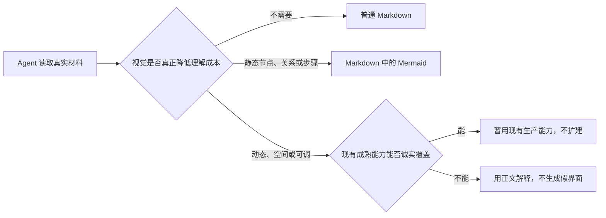

# 魏碑 Visualize 生成式界面基础决策

状态：Markdown / Mermaid 分流已经落地；ExtensionKit 容器路线已拒绝；任意模型 JavaScript 暂不进入魏碑
依据：Codex Visualize `1.0.19`、魏碑当前生产链、本机 WebKit 敌对样本
日期：2026-08-07

## 结论

魏碑应该沿 Visualize 的方法重构生成式界面，但不应该为了复制 Visualize 的 HTML 能力，自造一个 macOS 沙盒浏览器。

当前正式路线只有三层：

1. 普通解释继续使用普通 Markdown。
2. 静态、有标注的节点、关系和步骤优先使用现有 Mermaid。
3. 只有动态变化、空间运动或可调输入确实能改善学习时，才考虑动态体验；现有成熟能力能诚实覆盖就暂时使用，覆盖不了就用正文解释，不执行任意模型 JavaScript，也不扩建旧目录。

这台开发机的实时系统是 macOS 26.5、Apple M4、arm64。工程文件另有一条最低兼容版本设置；两者都不再决定生成式界面的架构。之前围绕旧系统版本反复设计 ExtensionKit，是把一个错误实现方案误升格成产品前提。

| 判断 | 分数 | 结论 |
| --- | ---: | --- |
| Visualize 作为生成原则 | 9/10 | 最接近“让 Agent 选择最合适的解释介质” |
| 现有 Markdown / Mermaid 分流 | 9/10 | 已有生产渲染器，不需要新协议和新宿主 |
| 停止扩建旧 family / renderer / Schema | 10/10 | 立即执行 |
| 当前主 App 运行任意模型 JavaScript | 0/10 | 已拒绝 |
| ExtensionKit / XPC 充当 JavaScript 沙盒 | 0/10 | 已拒绝，不再尖峰 |
| 自造新的浏览器沙盒或编译器 | 0/10 | 不做 |
| 最终删除旧富回答体系 | 8/10 | 方向成立，但必须先有真实替代链路 |

## 用户的判断是对的

旧体系把表达问题做成了协议问题：

- Agent 先查能力目录，再从三套提交路线中选择。
- 每条路线都有自己的 family、intent、renderer、对象、关系、图元和修复合同。
- 同一个选择在 Agent、Swift、网页运行时和自检中被重复实现。
- 新的表达需求往往继续增加字段、组件、适配器和拒绝规则。

这会同时伤害两件事：

- 模型被迫先学魏碑自造的 UI 语言，不能直接选择最自然的解释方式。
- 工程承担了大量分派和校验，却没有因此自动获得更好的学习价值、来源可信度或用户确认。

而先前的 ExtensionKit 方案又犯了同一种错误：为了获得“任意 HTML/JavaScript”，开始设计扩展点、远程界面、XPC、打包、签名、网络隔离和进程回收。它会把生成式 UI 变成另一个平台工程，不是当前魏碑需要承担的产品能力。

## 从 Visualize 真正吸收什么

| Visualize 原则 | 魏碑处理 |
| --- | --- |
| 先判断视觉是否值得生成 | 成为第一判断，不为装饰生成界面 |
| 文本足够时保持文本 | 直接使用普通 Markdown |
| 静态节点和关系使用 Mermaid | 直接走现有 Markdown 渲染链 |
| 动态、空间、可调输入才需要动态体验 | 作为必要性门槛，不等于立即执行任意代码 |
| 一个主要视觉、最少控件 | 保留为生成质量原则 |
| 第一帧无需操作也有价值 | 保留为学习价值要求 |
| 正文负责解释，视觉负责看见和操作 | 不生成第二篇重复答案 |
| 筛选、探针和显隐默认留在本地 | 不为每次操作调用 Agent |
| 继续解释必须由用户明确触发 | 沿用魏碑的人类确认边界 |
| 真实渲染后再验收 | Mermaid 和未来动态能力都必须走生产渲染器检查 |

不照抄 Codex 宿主特有内容：

- 不复制文件引用协议、`window.openai`、Codex CSS 工具类或固定宽度。
- 不复制 CDN、远程字体、远程脚本和在线数据加载。
- 不把 Visualize 的 HTML 片段合同当成魏碑现在已经具备的运行能力。
- 不把每条审美建议重新写成模型 Schema 或拒绝器。

## 为什么任意模型 JavaScript 暂不进入魏碑

模型生成的代码不能被当作可信代码。课程材料可能包含提示注入，页面也可能静默发送内容、持续占用资源或尝试访问宿主能力。

本机无窗口敌对样本已经证明：

- `connect-src 'none'` 与 `webrtc 'none'` 没有阻止 WebRTC 发出真实 STUN 数据包。
- 覆盖 `RTCPeerConnection` 只能阻止当前已知入口，不能构成平台级断网。
- 页面执行死循环后，释放 `WKWebView` 不能停止对应 WebContent 的持续 CPU 占用；只有宿主进程退出后才停止。
- 新建 `WKProcessPool`、字符串黑名单、超时和 iframe 都不能提供可靠的逐场景终止能力。

因此当前结论不是“再造一个更复杂的容器”，而是：

> 在出现成熟、可断网、可终止、可嵌入且维护成本合理的现成运行环境之前，魏碑不执行任意模型 JavaScript。

这条边界与电脑系统版本无关。

## 已拒绝的实现路线

### ExtensionKit / UI App Extension / XPC

已正式拒绝，不再作为候选，也不再安排 G0、打包或签名尖峰。

原因不是某个系统版本缺少 API，而是整条路线要求魏碑自行建设和维护：

- 独立扩展目标与远程界面生命周期
- XPC 数据合同与失联恢复
- 网页进程网络和资源限制
- App、扩展和嵌套内容的打包与交付
- 一整套只为运行模型 JavaScript 存在的验收矩阵

这与当前学习产品的核心价值不成比例，也没有解决 WebKit 零网络和逐场景硬终止的全部问题。

### 当前主 App 的 WKWebView 补丁

已由真实敌对样本否定。不会通过覆盖网络 API、补 CSP、增加超时、重建进程池或扩大黑名单重新包装成“安全”。

### 自建 TSX / React 编译胶囊或浏览器沙盒

会引入编译器、虚拟文件、依赖图、缓存、ABI、沙盒、资源回收和调试系统。它比旧富回答体系更重，直接拒绝。

### 新增第四条 HTML 路线

同时保留旧三路线和新 HTML 路线会把复杂度推到最高。没有真实替代链路前不新增；替代链路成立后则应删除旧路线，而不是长期并存。

## 当前已经落地什么

Agent 系统契约和“富回答导演”Skill 已按以下顺序工作：

1. 视觉没有明显增益时直接回答。
2. 静态节点、关系和步骤直接在普通 Markdown 中输出一个 Mermaid 图，不读取富回答 Skill，不调用能力目录和富回答工具。
3. 只有动态、空间或可调输入确有增益时，才进入现有富回答判断；现有能力不能诚实表达就回到正常文本。

这不是临时兼容层。无论未来动态体验采用什么成熟技术，Markdown 和 Mermaid 分流都会保留。

Mermaid 也不是纸面方案：魏碑已经锁定 Mermaid 11.16，最终聊天 Markdown 使用现有网页 Markdown 渲染器，现有网页编辑器检查会确认 fenced `mermaid` 实际生成 SVG，而不是显示占位文字。

本次已经完成：

- 生产 Agent 资源已包含新的分流规则。
- Swift 全量构建通过。
- 魏碑应用自检通过。
- 网页编辑器检查通过，包含 Mermaid 转 SVG 和最终聊天 Markdown 尺寸检查。
- 草稿 PR 的远端快速编译与核心自检通过。

尚未完成：真实 Pi 根据真实课程材料选择 Mermaid，以及真实魏碑窗口中的明暗主题、窄宽、来源和重开验收。

## 旧体系现在怎么处理

立即冻结：

- 不新增 family、intent、renderer、图元 Schema 或组件目录。
- 不新增旧协议的修复轮次、关键词拒绝器和模型可见能力字段。
- 不为了证明动态能力继续增加 fixture、回放或隐藏验证入口。

暂不删除：

- 当前仍被真实回答使用的生产富回答链。
- 正文、来源、消息顺序和重开所依赖的外壳。
- 已经可用且没有替代品的动态学习体验。

删除必须满足一个条件：真实替代链路已经用真实材料、真实 Pi 和真实窗口证明覆盖了对应用户价值。不能先删旧实现，再用静态截图或空接口冒充替代完成。

## 迁移顺序

### 当前阶段

1. 保留已经落地的 Markdown / Mermaid 分流。
2. 用真实课程材料和真实 Pi 验证“应该保持文本”和“应该生成 Mermaid”两类回答。
3. 在真实魏碑窗口验证 Mermaid 的来源、窄宽、明暗主题、键盘、VoiceOver 和重开。
4. 冻结旧生成式 UI 协议，不再扩建。
5. 等 PR #144 释放其占用的富回答宿主、消息持久化和共享核心文件。

### 以后出现真实动态需求时

1. 先描述用户必须完成的学习动作，不先选择运行技术。
2. 优先评估魏碑已有能力、原生平台能力和成熟维护库。
3. 只有出现成熟、现成、可断网且可终止的运行环境时，才重新评估模型生成的动态页面。
4. 没有成熟运行环境，就保持正文、Mermaid 或现有受控动态能力；不自造浏览器沙盒。
5. 真实替代链路通过后，再从调用者向内删除旧目录、Schema、renderer 和浅测试。

## 最终删除目标

替代链路成立后，按真实调用关系删除：

- `weibei_ui_catalog`、路线推荐和能力子集
- `program / renderPlan / ui` 三套模型提交 Schema 与修复循环
- family、intent、renderer 选择与组件目录
- 旧图元、坐标框、语义校验和重复 JSON 类型
- 固定 renderer 分派、程序样例和浅层 fixture
- 只验证 renderer ID、固定中文句子和旧字段的测试

仍然保留：

- 普通 Markdown 与 Mermaid
- 消息级来源、素材允许列表和真实跳转
- 用户确认后的笔记、关系和继续解释动作
- 消息持久化、重开恢复、键盘与辅助功能
- 真实生产边界上的构建、自检和窗口验收

## 完成定义

Visualize 基础采用完成需要：

- Agent 已稳定按“Markdown → Mermaid → 必要时才考虑动态”做判断。
- 真实 Pi 在真实课程材料上正确选择文本或 Mermaid。
- 真实魏碑窗口通过来源、窄宽、明暗主题、键盘、VoiceOver 和重开验收。
- 旧三路线没有继续增加模型可见复杂性。

整个旧富回答体系替换完成还需要：

- 每一项被删除的旧用户价值都有真实替代，不靠空协议、fixture 或截图。
- 正式 App 中没有旧路线分派、生产回放或隐藏验证后门。
- 旧类型、验证器、渲染分派、模型入口和浅测试已经没有调用者并被删除。
- 用户确认新的学习体验确实更好，而不只是工程代码变少。

任意模型 JavaScript、ExtensionKit 容器和系统版本迁移都不属于当前完成条件。
