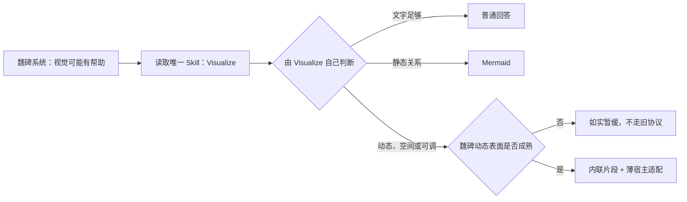

# 魏碑直接接入 Visualize 决策

状态：唯一目标已冻结；重复 system / Director 分流已撤回；等待共享自检入口释放并确认上游再分发许可后原子接入
上游：Codex Visualize `1.0.19`
日期：2026-08-07

## 结论

魏碑不再“参考 Visualize，再设计一套魏碑生成式 UI”。

**Visualize 本身就是魏碑唯一的生成式 UI Skill。** 它自己的判断、构图、交互、图表、地图、排版、主题、无障碍和生成后检查继续由原 Skill 维护；魏碑不再复制第二份 Director、质量规则、组件目录或表达协议。

魏碑只增加一层极薄宿主适配：

| Visualize 的 Codex 宿主接口 | 魏碑适配 |
| --- | --- |
| 文件与 content-reference | 魏碑消息中的内联显示 |
| `window.openai` follow-up | 先进入原生输入框，由用户确认后发送 |
| CDN 与远程依赖 | 安装包内已经存在并锁定版本的本地资源 |

除此之外不改写 Visualize 的生成思想。

当前动态执行环境尚未成熟，所以接入分两部分：

- Visualize 的文字判断与 Mermaid 路由可以直接使用。
- Visualize 选择 HTML 片段时，魏碑如实说明当前动态表面不可用；不调用旧富回答协议，不在主 App 中执行任意模型 JavaScript，也不为此重写 Visualize。

这张图只是 Visualize 原判断链与魏碑宿主状态的连接关系，不是第二套生成规则。

## 为什么之前的方案走偏

旧富回答体系已经维护：

- “富回答导演”和三个专业 Skill
- `weibei_ui_catalog` 能力目录
- family、intent、renderer 与组件选择
- `program / renderPlan / ui` 三套提交结构
- 第二套质量规则、来源账本、素材允许列表、上下文修订和修复循环
- Agent、Swift、网页运行时与自检中的重复定义

先前方案又在它之外设计动态片段协议、页面 ABI、状态协议、ExtensionKit、XPC、扩展打包和容器闸门。那不是简化，而是第四套系统。

正确的删除方向是：**让 Visualize 负责生成判断，魏碑只负责显示与真实副作用。**

## 唯一 Skill 边界

系统契约不再复制 Visualize 的判断链。最终只保留一条意思：

> 当视觉可能明显帮助用户理解或探索时，读取 `skill://visualize` 并遵循它；否则正常回答。

Skill 注册表只暴露 `visualize`。以下旧 Skill 不再注册，也不再打包为模型可读资源：

- `rich-answer-director`
- `professional-visualization`
- `deep-interaction-components`
- `generative-composition`

以下旧生成工具不再暴露给模型：

- `weibei_ui_catalog`
- `weibei_compute_artifact`
- `weibei_rich_answer`

Visualize 不需要先查能力目录，不需要从三种协议中选择，也不需要把同一个回答复制成 narrative、fallback、evidence ledger 和 scene tree。

## 内容与引用

Visualize 可以自由使用本轮对话、用户输入、通用知识、示例或课程材料。魏碑不为视觉额外建立：

- 当前课程来源允许列表
- 素材允许列表
- evidence ledger
- context revision
- 图形对象到来源 ID 的强制绑定

**来源不是生成许可。** 当前对话、用户输入、通用知识、公式、模型生成示例和课程材料都可以直接成为视觉内容；没有来源本身不能阻止生成。

只有回答或视觉显式声称某条结论来自某条来源时，才按普通回答规则校验真实性；只有显式引用某个本机素材时，才校验该素材是否获准使用。普通引用继续放在 Markdown 正文中，视觉不是第二套证据系统。

不新增 `dataOrigin`、`assetDependency`、`coordinateFrame`、无来源披露或其他生成许可分支。

## 魏碑只守两个真边界

### 1. 页面不能偷偷读取或发送数据

动态页面不能联网，不能读取任意本地文件，也不能接触工作区、令牌、聊天数据库或原生命令。

### 2. 页面不能绕过用户产生真实副作用

页面不能直接：

- 写笔记
- 修改或删除文件
- 建立课程关系
- 发送用户消息
- 调用其他会改变用户数据的动作

页面只能提出一个可见意图；魏碑把它放进原生确认界面，用户确认后才沿现有正式能力执行。

来源协议、组件选择、表达质量和审美判断不再伪装成宿主安全边界。

## 动态 HTML 当前状态

本机敌对样本已经证明，当前主 App 的 `WKWebView` 不能作为任意模型 JavaScript 的成熟执行环境：

- WebRTC 可以绕过当前 CSP 的断网预期。
- 释放视图不能逐场景终止死循环 WebContent。
- 字符串黑名单、覆盖 API、超时、iframe 和新建进程池都不是硬隔离。

因此：

- 不在主 App `WKWebView` 上补丁上线任意 JavaScript。
- 不继续 ExtensionKit、UI App Extension、XPC、G0 或系统版本容器路线。
- 不自建 TSX 编译器、虚拟文件系统或沙盒浏览器。
- 没有成熟动态表面时，不把旧富回答工具冒充 Visualize HTML 适配器。

动态表面未来只有在出现成熟、现成、可断网、可终止且维护成本合理的运行环境时才重新评估。这个等待不会改变 Visualize Skill，也不会阻止文字和 Mermaid 先工作。

## 最小真实接入

这次接入必须是一条原子改动，不能留下“两套 Skill 都可见”的中间状态：

1. 取得明确再分发授权后，将上游 Visualize `1.0.19` 作为唯一 UI Skill 随 App 打包。
2. 在 Skill 最前面只加魏碑宿主差异，不复制或重写其生成规则。
3. 系统契约改成只在视觉可能有帮助时指向 `skill://visualize`。
4. Skill 注册表只登记 Visualize。
5. 停止注册能力目录、受控富回答计算和旧富回答提交工具。
6. 删除四个旧富回答 Skill。
7. 更新资源完整性、自检和工具清单，使它们验证“唯一 Visualize”，不再验证旧目录存在。
8. 用真实课程问题验证文字与 Mermaid；动态问题验证诚实暂缓且不调用旧工具。

不新增 `weibei_visualize` 空工具、片段 Schema、页面 ABI、状态对象、Adapter interface 或未来容器占位符。

## 当前仓库状态

本 PR 之前加入的“system.md 复制三段分流 + 富回答 Director 再复制一次分流”已经撤回，因为它仍是第二套判断逻辑，不是直接复用 Visualize。

真正的原子接入尚未提交，有两个真实前置条件：

1. PR #144 正在修改共享自检入口；当前自检还硬编码要求旧 Director、目录和旧工具存在。在它释放前同时修改会违反共享核心文件单任务占用，也会迫使本 PR 留下假的兼容字符串。
2. 本机 Visualize `1.0.19` 的插件清单明确标记为 `Proprietary`，包内没有 `LICENSE` 或 `NOTICE`。魏碑是 MIT 公仓，在获得明确再分发授权前不能把原文件复制进仓库或安装包；也不通过改写一份近似 Skill 绕开这项许可问题。

因此 PR #147 当前只冻结最终架构和删除目标，不把重复 prompt 改动或未接通的 Skill 冒充完成。

## #144 释放后的删除顺序

从模型入口向内一次完成：

1. System 只指向 Visualize。
2. `read` 只登记 Visualize。
3. 删除四个旧 Skill。
4. 删除旧三个模型工具的注册与必需工具清单。
5. 删除工具对应的目录、Schema、修复与来源账本代码。
6. 删除 Pi 对旧富回答事件的处理。
7. 在确认没有调用者后，删除 Swift 类型、网页 renderer 与旧测试。

每一步都以调用者搜索和可运行检查为准；不为旧协议写兼容层，也不先删用户仍依赖的界面后用空白占位。

## 验证标准

最小接入完成必须同时证明：

- Agent 只看到一个 UI Skill：Visualize。
- System 没有复制 Visualize 的完整判断链。
- 文字足够的问题不生成视觉。
- 静态关系问题输出真实可渲染 Mermaid。
- 动态问题在当前环境诚实暂缓，且没有调用旧目录或富回答工具。
- 普通知识和示例不被课程来源允许列表错误拒绝。
- 课程事实仍能在普通正文中正常引用。
- 页面能力不能联网、读本地文件或绕过用户产生副作用。
- 构建、自检、真实 Pi、真实魏碑窗口和重开全部通过。

## 完成定义

PR #147 的设计决策完成条件：

- “原版 Visualize + 极薄魏碑适配”是唯一目标。
- ExtensionKit、页面 ABI、来源账本和重复 Director 方案已从最终差异删除。
- PR 正文不再把旧 prompt 改动写成直接接入成果。

实际接入完成条件：

- #144 已释放共享自检入口。
- 已取得上游 Visualize 的明确再分发授权。
- 上述原子替换完整落地，没有两套 Skill 并存。
- 真实 Pi 和真实魏碑窗口完成文字、Mermaid、动态暂缓与普通引用验收。

在此之前，不声称魏碑已经完成 Visualize 接入。
