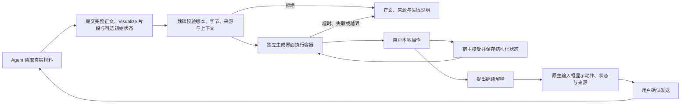
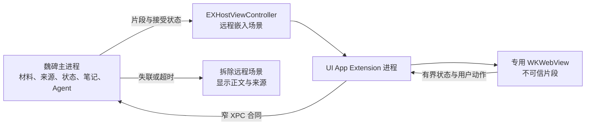

# 魏碑 Visualize-native 生成式学习界面重构决策

状态：外层有序内容接口已定；可执行 Visualize 页面 ABI 与容器仍是候选，四道闸门通过后才冻结
依据：Codex Visualize `1.0.19`、魏碑 `origin/main` `f105f1fd`、2026-08-07 本机 WebKit 敌对样本
日期：2026-08-07

## 结论

魏碑应该沿 Visualize 的路线重构整个生成式界面能力，但必须把两件事分开：

1. **模型怎么表达**：直接收成一个 HTML 片段，不再让 Agent 学 `program / renderPlan / ui`、family、renderer、组件目录和图元 Schema。
2. **片段在哪里执行**：不能直接复用当前 App 内的 `WKWebView`。先证明一个可销毁、可断网、可嵌入的独立执行容器；通过后才进入生产替换。

这不是增加第四条路线。目标仍是用 Visualize-native 替换旧三路线，并删除旧入口、验证器、分派和渲染目录。

当前判断：

| 判断 | 分数 | 结论 |
| --- | ---: | --- |
| Visualize 作为产品方向 | 9/10 | 最接近“Agent 临时生成最合适的学习器” |
| 极简模型接口 | 9/10 | 现有 JSON、来源、状态和正文足以承载 |
| 直接在主 App 的 WKWebView 执行任意 JS | 2/10 | 本机已实测断网和资源回收失败 |
| 独立 UI Extension 容器方向 | 6/10 | 面向 macOS 14 的旧运行时接口已通过双架构编译；包装、断网和销毁仍未证明 |
| 魏碑现在直接进入容器实现 | 3/10 | 当前机器缺完整 Xcode 与官方扩展生成工具，G0 尚未接通 |
| 全量替换旧体系 | 7/10 | 方向可行；执行容器是唯一真正的前置闸门 |

**该删的是模型可见的伪复杂性；该保留的是不可信代码与用户数据之间的真实边界。**



## 用户的判断哪里是对的

旧体系把审美与表达问题误写成了协议问题：

- Agent 先调用能力目录，再选择三条提交路线之一。
- 每条路线又有自己的对象、关系、图元、组件、渲染器和修复合同。
- 同一选择分别复制到 Agent TypeScript、Swift 类型与验证器、网页运行时和自检。
- 新表达往往意味着继续补 Schema、renderer 和分派。

仅七个中心 Swift 文件已经约 12,860 行；网页生成目录中的运行时、样例与同目录自检合计约 16,941 行；Agent 扩展单文件 11,148 行。代码量并没有换来同等深度的学习闭环：

- 首轮真实窗口只有 22/56 通过、34/56 失败。
- 至少九个真实 Pi 场景被固定 family、intent、关键词或低级图元合同误拒。
- 网页已经发出状态事件，Swift 宿主没有消费。
- 动作被压成自由文本后立即以用户身份发送，没有真正的用户确认。

所以旧体系应停止扩建。它约束了模型，却没有替用户守住最重要的状态、来源和确认。

## 哪些复杂性不能假装不存在

Visualize Skill 负责“生成什么”，不负责替第三方 App 解决不可信网页代码的进程、网络、文件、权限和资源隔离。Codex 自己拥有的运行环境不能直接等同于魏碑的 WKWebView。

| 偶然复杂性，应删除 | 真实复杂性，只能集中 |
| --- | --- |
| 三套模型提交协议 | 任意代码不能碰工作区、令牌和原生命令 |
| family、intent、renderer 选择 | 片段不得把课程内容静默发走 |
| 固定组件表和图元 Schema | 死循环与内存爆炸必须能被限时回收 |
| 用关键词和审美预算拒绝回答 | 来源、素材和状态必须由宿主复核 |
| 每种视觉再写一个 Adapter | follow-up 必须由用户确认 |
| 重复的样例、fixture 和浅自检 | 失败必须只降级当前场景并保留正文 |

新的深模块只承担右栏。它不再替模型选择图表、地图、布局或组件。

## 从 Visualize 直接吸收什么

| Visualize 原则 | 魏碑处理 |
| --- | --- |
| 文本足够时不生成 | 成为 Agent 的第一判断 |
| 只写片段，不造完整网页 | 直接采用；回答外壳由魏碑掌握 |
| 一个主视觉、最少控件 | 进入唯一生成 Skill 和真实窗口审查 |
| 初始状态无需操作也有用 | 成为学习价值门槛 |
| 筛选、探针和显隐留在本地 | 直接采用，不为拖动调用 Agent |
| 明确的继续解释动作 | 先形成原生待发送动作，用户确认后才调用 Agent |
| 语义 HTML、原生控件、键盘和窄宽 | 进入生成 Skill、修复循环和真实验收 |
| 图表轴、单位、范围和标签避让 | 作为专业正确性要求，不再变成 Schema |
| 地图使用真实几何和坐标 | 作为来源与素材准入要求 |
| 失败保留可读正文 | 直接采用，且只降级当前场景 |

不照抄的部分：

- 不使用 CDN、网络字体、远程脚本或远程数据。
- 不使用 `window.openai`；魏碑只暴露自己的小型页面 ABI。
- 不复制 Codex 的 CSS 工具类、固定宽度或宿主视觉。
- 不让模型提交页头、导航、下载、外部链接或原生桥名称。
- 不把每条质量建议重新写成 Swift 或 TypeScript 拒绝规则。

首版只允许浏览器原生 DOM、SVG、Canvas，以及安装包里已经锁定的 ECharts 5.6.0。不新增 React、编译器、包管理器、虚拟文件系统或依赖下载。

## 唯一模型接口

Agent 只看到一个 `weibei_rich_answer` 工具。固定版本由宿主写入，模型只提交有序内容：

```json
{
  "parts": [
    {
      "kind": "markdown",
      "markdown": "先比较原始数据中的集中位置。"
    },
    {
      "kind": "visualize",
      "fragment": "<figure>...</figure><style>...</style><script>...</script>",
      "initialState": {
        "selectedRange": [2, 7]
      }
    },
    {
      "kind": "markdown",
      "markdown": "现在再观察异常值为什么改变均值。"
    }
  ]
}
```

`parts` 只允许 `markdown` 和 `visualize`，顺序就是回答中的真实顺序。`initialState` 可省略，宿主按空对象处理。默认最多一个 `visualize`；只有多个体验承担不可合并的学习动作时才增加。

模型不提交常量版本号，也不再为界面复制一份专用失败正文。宿主接受后自行写入保存版本；移除所有 `visualize` part 后，剩余 Markdown 必须仍是一份完整可读的回答。

模型不再重复声明来源、素材和动作清单：

- 来源仍来自当前回答已经核验的消息级来源账本。
- 素材仍来自当前上下文已经核验的素材账本。
- 动作 ID、来源 ID 和素材 ID 直接写在片段的语义元素上，宿主使用时再与账本核对。
- 场景 ID、消息 ID、上下文修订和状态修订由宿主分配。

没有以下字段：

- route、family、renderer、component 或 capability group
- 图表类型、布局树、坐标图元或视觉质量预算
- evidenceIDs、assetIDs、actions 的重复清单
- 网络地址、脚本地址、文件路径或原生桥名称
- 自动发给 Agent 的自由文本

`fragment` 只接受片段，不接受 `doctype / html / head / body`。这条约束用于保证宿主装配清晰，不限制片段内部选择哪种语义 HTML、SVG、Canvas、CSS 或本地 JavaScript。

## 页面 ABI v1

页面只需要知道这些固定能力：

| 能力 | 固定合同 |
| --- | --- |
| 根节点 | 宿主在模型脚本执行前创建 `#weibei-visual-root` 并写入当前状态 |
| 主题 | `--wb-background`、`--wb-foreground`、`--wb-muted`、`--wb-muted-foreground`、`--wb-border`、`--wb-accent`、`--wb-accent-foreground`、`--wb-series-1…6`、`--wb-font-size-base` |
| 本地库 | 浏览器 DOM、SVG、Canvas；首版额外提供本地 `window.echarts` 5.6.0 |
| 素材 | `` |
| 来源 | 原生按钮或链接使用 `data-weibei-source="来源 ID"` |
| follow-up | 原生按钮使用 `data-weibei-follow-up="稳定动作 ID"`；可见名称就是用户将确认的动作名称 |
| 当前状态 | 根节点的 `data-weibei-state` 和 `data-weibei-state-revision`，由宿主写入 |
| 状态提议 | 页面写 `data-weibei-state-proposal` 后派发无 payload 的 `weibei:state-proposed` |
| 状态接受 | 宿主校验、保存并回写后派发 `weibei:state-accepted` |
| 环境变化 | 宿主更新主题、字号、减少动画和容器宽度后派发 `weibei:environment-changed` |

状态不通过 `CustomEvent.detail` 或可任意扩大的原生消息传递。隔离世界只读取共享 DOM 上长度受限的 JSON 字符串，再交给原生宿主。

```javascript
const root = document.getElementById("weibei-visual-root");

function acceptedState() {
  return JSON.parse(root.dataset.weibeiState);
}

function proposeState(nextState) {
  root.dataset.weibeiStateProposal = JSON.stringify(nextState);
  root.dispatchEvent(new Event("weibei:state-proposed", { bubbles: true }));
}

root.addEventListener("weibei:state-accepted", () => render(acceptedState()));
root.addEventListener("weibei:environment-changed", () => render(acceptedState()));
render(acceptedState());
```

宿主把状态当成有界 JSON 对象，只校验 JSON 类型、深度、数量、数值范围和总字节；不要求状态必须复刻 `initialState` 的键结构。页面可以改变自己的 DOM，但宿主保存的接受状态始终是唯一权威。

## 最小装配方式

保留一个由浏览器原生能力承担的隔离层：固定父页只创建一个 `sandbox="allow-scripts"` 的 `srcdoc` 子框架，不授予同源、表单、弹窗、下载、顶层跳转或子框架能力。

`srcdoc` 会继承父页 CSP，因此不能再使用“父页只认 nonce、子页再放开内联脚本”的矛盾策略。父页策略必须从一开始就是子页的安全上界：

```text
default-src 'none';
script-src 'unsafe-inline'; style-src 'unsafe-inline';
img-src data: blob:; connect-src 'none'; webrtc 'none';
worker-src 'none'; object-src 'none'; media-src 'none'; font-src 'none';
form-action 'none'; base-uri 'none'; frame-src 'self'
```

父页只有魏碑固定代码，没有模型内容；子页继承该策略后再增加 `frame-src 'none'`，模型不能把策略放宽。`webrtc 'none'` 在当前 WebKit 尚未生效，只保留为面向未来的纵深防御，不能算零网络证明。

装配顺序：

1. WebKit 用 `loadHTMLString(..., baseURL: nil)` 加载固定父页，不再授予安装包资源目录读取权。
2. 原生代码通过 `callAsyncJavaScript(arguments:)` 把片段和初始状态作为结构化参数交给父页挂载函数，不把模型字符串插进父页源码。
3. 父页只创建一个内容固定的 `srcdoc` 子文档；CSP、主题变量、本地 ECharts 和可信启动代码都来自安装包，子文档源码里没有模型字符串。
4. 子文档加载后，父页用一次性 `postMessage` 发送片段和状态。可信启动代码只接收首个且 `event.source === parent` 的初始化消息，先用 DOM API 建根节点和写状态，再用惰性的 `template` 解析片段，最后按文档顺序显式激活其中的脚本。
5. 模型脚本在无同源权限的子页 page world 运行，无法读取父页。任何不可信字符串都不参与父页或子页源码拼接。
6. 原生消息处理器只注册在隔离的 `WKContentWorld`；可信监控在文档开始时注入所有 frame，通过 DOM 属性和无 payload 事件读取状态、来源和 follow-up。
7. 初次父页与唯一子页建立后，所有后续导航、新窗口、下载、文件选择、媒体权限、JavaScript 对话框和拖入文件一律拒绝。

模型可以破坏子文档，但子文档里没有可信原生 UI、工作区对象或密钥。破坏只会让当前场景降级。

## 2026-08-07 本机 WebKit 尖峰

这组无窗口测试运行在 macOS 26.5（25F71）、WebKit 21624.2.5.11.4，用本机回环 UDP 监听和真实 WebContent 进程取证。它不是 macOS 14 或跨系统发布证明，但足以否定“现有 WKWebView 直接承载任意 JS 已经安全”。

| 敌对样本 | 实际结果 | 判断 |
| --- | --- | --- |
| CSP 同时设置 `connect-src 'none'` 与 `webrtc 'none'`，脚本向 `stun:127.0.0.1:34789` 建立 PeerConnection | UDP 监听器实际收到连续 STUN Binding Request | 当前 WebKit 的 CSP 不能保证 WebRTC 断网 |
| 文档开始时把 `RTCPeerConnection` 与别名冻结为 `undefined` | 这一次直接构造被阻止，监听器未收到包 | 可做纵深防御，不足以替代平台级断网证明 |
| 页面执行 `while (true) {}`，8 秒后原生释放 WKWebView | 原生计时器正常；WebContent PID 74364 变成 PPID 1，继续 99.1% CPU，直到宿主进程退出 | 主 App 不会一起卡死，但移除视图不能回收失控脚本 |
| 签名的 App Sandbox 样本不授予网络或 `nsurlsessiond` 查询 | 本地 WKWebView 没有完成加载 | “不给网络权限即可正常本地渲染”未成立 |
| 只增加 `nsurlsessiond` mach-lookup 例外，不授予 `network.client` | 本地页面恢复；WebRTC STUN 仍实际到达监听器 | WebKit 能启动不等于 WebRTC 被系统沙盒挡住 |

这些现象与公开平台事实一致：

- CSP 为 WebRTC 单独定义了 `webrtc` 指令，但 WebKit 的支持缺口仍是公开未解决问题。[W3C CSP](https://www.w3.org/TR/CSP/)、[WebKit Bug 255651](https://bugs.webkit.org/show_bug.cgi?id=255651)
- 多个 `WKProcessPool` 自 macOS 12 起不再产生隔离效果，WebView 到达实现定义的数量后可以共享 WebContent 进程。[Apple WKProcessPool](https://developer.apple.com/documentation/webkit/wkprocesspool)
- WebKit 当前源码仍检查宿主的网络权限或 `nsurlsessiond` 查询能力，并注明真正无网络的 WebKit 尚未完成。[WebKit XPC 入口](https://github.com/WebKit/WebKit/blob/main/Source/WebKit/Shared/EntryPointUtilities/Cocoa/XPCService/XPCServiceEntryPoint.mm)

因此，当前 App 内的 WKWebView 路线从生产候选中删除，不再围绕它补更多字符串黑名单、超时或假进程池。

## 唯一执行容器候选

当前只保留一个值得验证的候选：面向魏碑最低 macOS 14、随 App 安装的界面扩展（bundle-only UI App Extension）。



它值得验证的原因：

- `EXHostViewController` 是 Apple 公开的远程 UI 容器，可嵌进 AppKit/SwiftUI。[Apple 远程界面文档](https://developer.apple.com/documentation/extensionkit/including-extension-based-ui-in-your-interface)
- bundle-only 扩展按官方定义默认启用，不应要求用户先到系统设置开开关。[Apple 扩展发现文档](https://developer.apple.com/documentation/extensionkit/exappextensionbrowserviewcontroller)
- 生成页面、WebKit 和模型脚本可以离开魏碑主进程。
- 场景通过 XPC 只接收片段、状态、主题、来源与素材快照，不拿工作区、令牌或 App 命令。

它目前仍不是已选定的生产实现：

- 魏碑当前是 SwiftPM + 手工 `.app` 打包，没有 `.appex`、macOS 14 适用的扩展点元数据、嵌套签名和公证链。
- Apple 当前自动生成扩展点的新 API 面向 macOS 26；魏碑最低 macOS 14 需要验证旧系统适用的扩展点元数据和身份发现 API。[Apple 扩展点文档](https://developer.apple.com/documentation/extensionfoundation/adding-support-for-app-extensions-to-your-app)
- 普通 XPC 服务虽有独立沙箱，却没有公开的可嵌交互远程 UI，不能替代 UI Extension。
- Enhanced Security 扩展明确不能呈现 UI，也不能用于这条路径。
- ExtensionKit 没有公开“立即杀掉该扩展及其 WebContent”的承诺；必须实测拆除场景后的资源回收。
- 本机沙盒样本已经证明：仅靠不授予 `network.client` 不能推导出 WKWebView 零网络。

### 2026-08-07 G0 工具链尖峰

已证明的只有源码兼容性：最小宿主与最小界面扩展轮廓均使用旧运行时接口，以 macOS 14 为最低目标编成 arm64、x86_64 Mach-O 对象；当前 SDK 下的完整最小扩展可执行文件也标记为 `minos 14.0`。这说明魏碑的最低系统目标不会在源码层面直接否决该方向。

G0 仍未通过：本机只有 Command Line Tools，没有完整 Xcode、macOS 14 运行环境和可调用的官方扩展元数据生成工具；SwiftPM 也没有 App Extension 产品类型。因此 `.appex` 生成、宿主扩展点声明、自然发现、签名安装与远程场景激活都不能据此宣布完成。

手工拼装 bundle、照抄系统 App 的内部元数据或手动注册插件，即使能在当前系统运行，也只算定位问题的诊断，不算 macOS 14 产品证据。下一次 G0 必须使用完整 Xcode 的正式双目标构建能力，在干净 macOS 14 环境中从自然安装开始验证。

## 执行容器四道硬闸门

在这四项全部通过前，不改生产模型入口，不新增正式库目标、XPC 抽象或兼容层。

按最便宜的否决顺序执行，前一道失败就停止，不先造完整产品：

| 闸门 | 必须证明 | 失败时 |
| --- | --- | --- |
| G0 最小接通 | 完整 Xcode 正式生成最小 App、扩展及扩展点元数据；本地签名产物在当前系统和干净 macOS 14 环境中自然安装后，无需设置即可发现、激活并嵌入固定文字 | 停止 ExtensionKit 路线 |
| G1 零网络 | 使用计划中的最终沙盒权限，只运行最小脚本；对 fetch、XHR、WebSocket、EventSource、Beacon、图片、样式、表单、Worker、WebTransport、WebRTC/STUN/TURN 和 DNS 做进程级抓包，结果为零 | 任意 JS 不得进入产品 |
| G2 可销毁 | 死循环、DOM 爆炸和持续内存增长下，魏碑主进程保持响应；拆除远程场景后，扩展及对应 WebContent 在明确时限内停止 CPU 与内存消耗 | 任意 JS 不得进入产品 |
| G3 完整能力与交付 | 再加入 SVG、Canvas、ECharts、键盘和辅助功能；社区签名、Developer ID、公证与 DMG 均通过，并对同一最终安装包复跑 G1、G2 | 不进入学习闭环和生产替换 |

G1 中仍应在文档开始时冻结 `RTCPeerConnection`、`webkitRTCPeerConnection` 和后续发现的非 CSP 网络入口，但这些只算纵深防御。抓包为零才算通过。

G2 不能用“窗口消失”“App 没崩”或“WKWebView 已释放”冒充通过；必须核对真实进程和资源。

如果候选失败，不自动退回旧三路线，也不偷偷上线“看起来离线”的任意 JavaScript。届时只剩两个需要重新做产品选择的方向：

1. Visualize-native 的 HTML/CSS/SVG 静态片段，加一个很小但明确受限的宿主交互合同。
2. 提高系统基线或更换具有公开进程终止和网络封锁能力的执行技术。

## 生产深模块

只有执行容器通过四道闸门后，才建立一个生产深模块，暂称 `GeneratedLearningSurface`：

```text
render(experience, hostContext)
→ ready | size | state | source | followUp | error
```

调用者只知道：

- 当前回答、场景和上下文身份
- 已核验的来源账本和可信素材
- 已保存的宿主权威状态
- 主题、语言、字号、减少动画和容器尺寸
- 当前页面 ABI

模块内部集中：

- JSON 解码和最小硬准入
- 执行容器激活、失联和销毁
- 固定空壳、CSP、页面装配和隔离世界监控
- 素材注入、来源打开、主题与动态高度
- 状态规范化、保存和重开恢复
- follow-up 预览、输入框附件与用户确认
- 超时、崩溃、资源越界和正文降级

不提前为“以后也许还有第二种容器”建立 Adapter、factory 或配置系统。四道闸门只会留下一个实际实现。

## 双向事件与用户确认

| 事件 | 产生者 | 内容 | 是否调用 Agent |
| --- | --- | --- | --- |
| `ready` | 可信监控 | 文档已加载、固定根存在、布局非零且短暂稳定 | 否 |
| `size` | 可信监控 | 有限且夹取的内容高度 | 否 |
| `state` | 页面提议，宿主校验 | 修订与有界 JSON 状态 | 否 |
| `source` | 真实用户点击提议 | 当前消息账本中存在的来源 ID | 否 |
| `followUp` | 真实用户点击提议 | 动作 ID、可见名称、宿主状态和来源 ID | 仅在原生输入框确认发送后 |
| `error` | 可信监控 | 超时、失联、导航、进程、预算或可观测脚本失败 | 否 |

页面提出 follow-up 后，宿主创建一个可见、可移除的待发送学习动作：

```text
messageID + sceneID + actionID + actionLabel + stateRevision
hostAcceptedState + evidenceIDs + deterministicPreview
```

- 页面不能提交自由编写的“用户消息”；动作 ID 和可见名称必须经过长度、字符与当前场景校验。
- 原生预览固定展示动作、当前状态和依据。
- `evidenceIDs` 只取真实点击目标或其语义父级声明、且仍存在于当前消息账本的来源 ID；没有就保持为空，不新增动作清单字段。
- 用户可编辑正文、移除附件或取消；取消不调用 Agent。
- 发送时，正文照常成为用户消息；结构化动作只作为下一次调用的临时上下文，并记录在该用户消息的来源元数据中。
- Agent 完成、用户取消、切换会话或上下文修订失效后立即清除。

`event.isTrusted` 只用于阻止后台自动触发，不证明动作、标签或状态可信。宿主仍要核对消息、场景、来源、修订、字节和当前输入框确认。

## 状态、来源与重开

片段、初始状态、当前宿主权威状态、宿主写入的保存版本与页面 ABI、内容摘要和失败原因随 `AgentMessage.richAnswer` 保存，不新建第二套持久化数据库。

状态在内存中即时接受并回写；连续输入只合并最新状态，静止 300ms 后最多保存一次。follow-up、场景离开、App 进入后台或正常退出前补刷。

重开时：

1. 重新执行版本、摘要、来源、素材和预算准入。
2. 在完全离线状态恢复同一片段和宿主权威状态，不再次调用模型。
3. 来源仍由当前消息的真实来源账本解析。
4. 当前页面 ABI 不支持、容器不可用或准入失败时，只显示原有完整正文、来源和简短失败说明。

旧 `program / renderPlan / ui` 历史不建设兼容运行时；迁移完成后只保留正文与来源，不再执行旧协议。

## 唯一生成 Skill 的质量规则

不再使用“导演 → 专业 → 深组件 → 组合”的四 Skill 路由。一个生成式学习界面 Skill 保留这些规则：

- 文本足够时不生成。
- 一个问题默认一个主要学习目标、一个主视觉或主交互。
- 初始状态无需操作也能读懂关键关系、数值和来源。
- 正文解释留在回答流；片段只放必要标题、标签、图例、值、控件和可访问替代。
- 不生成页头、导航、标签页、看板、指标卡墙或重复答案。
- 不发明无关搜索、筛选、重置或第二套状态机制来填空间。
- 每个控件改变真实知识对象、关系或读数，不只改变控件自己的数字。
- 使用语义 HTML、原生控件和自然 Tab 顺序，不伪造按钮和输入框。
- 宽度不足时换行、堆叠和减少次要标注，不裁切、不内部滚屏、不缩成小字。
- ECharts 和 Canvas 在环境变化时重新读取主题、字号和减少动画并重绘。
- 轴、单位、数据域、系列身份、来源和派生关系可核对。
- 标签避让或删除次要项；颜色必须配合文字、形状或线型。
- 地图使用真实几何和坐标；图像叠层使用材料真实像素与尺寸。
- 失败只影响当前场景，并保留正文、来源和已保存状态。

这些规则用于生成、修复和真实审查，不再变成 family、renderer 或 UI 节点 Schema。

## 第一条真实学习闭环

四道执行容器闸门通过后，首题使用真实材料和真实 Pi 重新生成“均值、中位数与异常值”，不使用 fixture 或旧回放冒充。

1. 用户针对真实课程材料提问，不指定图表类型。
2. Agent 判断视觉确有增益并提交一个 Visualize part。
3. 初始片段直接显示分布、均值、中位数、异常值和就近来源。
4. 用户调整样本区间；图形和读数本地同步变化。
5. 宿主接受并合并保存结构化状态；消息数和模型调用数不变。
6. 用户点击“解释当前选择”；输入框出现可移除的真实状态附件。
7. 取消不发送；确认后只发送一次。
8. Agent 收到动作 ID、状态值和来源 ID，继续解释当前区间。
9. 退出魏碑进程，断网重开同一工作区；片段、状态和来源恢复，不重新调用模型。

这条闭环通过前，不新增地图、三维、图像叠层或第二套生成协议。

## 全量替换前的行为覆盖

一条闭环只证明生产边界可用。删除旧体系前，新接口仍要用真实材料覆盖：

- 文本已经足够时正确不生成界面
- 单一选择、范围或参数变化驱动知识对象和读数
- 多系列或多变量在同一观察位置比较
- 步进、过程或因果关系随状态前进
- 二维或空间对象可直接操作并有可读替代
- 宿主可信图像、地图几何或其他素材参与表达
- 多来源与当前可见对象直接绑定
- DOM/SVG、Canvas 图表和素材三种表面都经过同一宿主

每项至少有真实 Pi、真实材料、真实窗口和来源证据。随机失败在共性修复后重跑同一材料和一个相邻材料；不复刻旧 renderer 名单，也不规定一个漂亮但无意义的总题数。

所有安全、来源、状态、确认、重开、无障碍与故障项目必须 hard pass；学习价值由用户确认。全部成立后，旧模型入口和运行分派才一起删除。

## 迁移顺序

### 当前阶段

- 冻结旧三路线的新 renderer、UI 节点、能力目录和语义验证器。
- 当前草稿 PR #144 占用 `Package.swift`、`script/`、`.github/`、`WorkspaceStore.swift`、App 入口、主内容视图、稳定文档工作区、自检以及现有富回答宿主和运行时。
- 新执行容器、打包、App 外验收和持久化都会与这些位置重叠。#144 必须释放其声明和实际 diff 中的相关共享文件，才能从最新 `origin/main` 开始实现并登记占用。
- 在等待期间只保留本决策和临时尖峰，不把未证明的 ExtensionKit 结构写进生产代码。

### 容器通过后尽量复用

- Pi 的透明 JSON 传输
- 上下文修订、来源和素材二次校验
- `RichAnswerEvidence` 与正文片段
- `AgentMessage.richAnswer` 的会话持久化
- 消息更新后的现有保存路径
- 来源打开前的消息级真实性复核
- 现有本地 ECharts 5.6.0

### 不新增

- 编译器、虚拟文件系统或包管理器
- 第二套 Agent/消息总线或第二套消息持久化；执行容器只保留一条必需的最小 XPC 合同
- 旧三路线到新路线的兼容 Adapter
- 为一个生产容器预建 factory、插件系统或配置矩阵
- 重新塞回正式 App 的 fixture、回放、隐藏环境变量或自动点击后门

现有富回答证据脚本必须在 PR #144 之后逐项重审：依赖 `--verify`、`WEIBEI_VERIFY_*`、生产夹具或隐藏 App 后门的脚本删除；仍有价值的检查改为驱动正常签名 App、真实 UI、扩展进程、网络和保存后的工作区副本。

## 通过删除测试后清理什么

Agent 侧：

- `weibei_ui_catalog`、路线推荐和能力子集
- `program / renderPlan / ui` 三套提交 Schema 与修复循环
- 四个旧富回答 Skill，替换为一个生成式学习界面 Skill

Core：

- `RichAnswerUI*`、`RichAnswerRenderPlan*` 和能力协商类型
- renderer 注册与模型路线选择
- 对象、关系、操作、坐标框和三路线语义校验
- 旧协议专用 JSON 值类型；新合同使用自己的最小值类型

宿主与网页运行时：

- 旧类型和三路线分派；仍服务正文、来源和场景顺序的外壳保留
- 固定 family 分派
- `setProgram / setPrograms / setRenderPlan / setRenderPlans`
- OpenUI 组件目录、程序样例、渲染器注册表和六套模型可见 renderer

测试：

- 删除针对旧浅模块、固定中文句子和 renderer ID 的测试。
- 新证据只跨真实生产边界验证准入、来源、状态、确认、恢复、隔离、网络、销毁和降级。

具体文件是否整份删除，实施时先检查全部调用者。本决策承诺删除旧职责，不用文件名预先制造假完成。

## 拒绝的替代方案

### 继续扩展语义协议

即使把三路线收成一个“语义场景 Schema”，模型仍要学习字段、意图、记录、关系和交互，魏碑仍要替每种新视觉写 Adapter。问题只会改名。

### 可编译 TSX/React 胶囊

它会增加编译 helper、虚拟文件、缓存、依赖清单、ABI 和冷启动，却仍承受任意 JavaScript 的断网和资源回收风险。

### 在当前 WKWebView 继续补丁

字符串黑名单、覆盖 `fetch`、启动超时、CSP、iframe 和假进程池都不能终止已经失控的 WebContent，也不能单独封住 WebRTC。本机尖峰已经否定这条路。

### 新增第四条 HTML 路线

这会同时保留旧目录、旧 Schema、旧 renderer 和新容器，复杂度最高。Visualize-native 只能作为替代者存在。

## 完成定义

只有同时满足以下条件，才能宣布替换完成：

- 执行容器 G0—G3 全部通过真实签名产物验收。
- 新回答由宿主保存为 `weibei.rich-answer.v3`，只含 Markdown 与 Visualize part，没有旧路线产出。
- 真实学习闭环、宿主变体、敌对样本和行为覆盖全部通过。
- 正式 App 中没有旧路线分派、生产 fixture、回放或隐藏验证后门。
- 旧历史只保留正文与来源，不执行旧协议。
- 旧类型、验证器、渲染分派、模型入口和浅测试没有调用者并已经删除。
- 候选 App 对应同一干净提交，来源锁、App 指纹、网络记录、进程记录、窗口证据和保存后的工作区可相互核对。
- 已完成真实魏碑窗口的来源、确认、重开、键盘和 VoiceOver 验收。
- 用户确认学习价值，不只是“网页成功显示”。

文档、Schema 自检、fixture、单张截图或“App 没一起崩”都不能代替这些证据。
