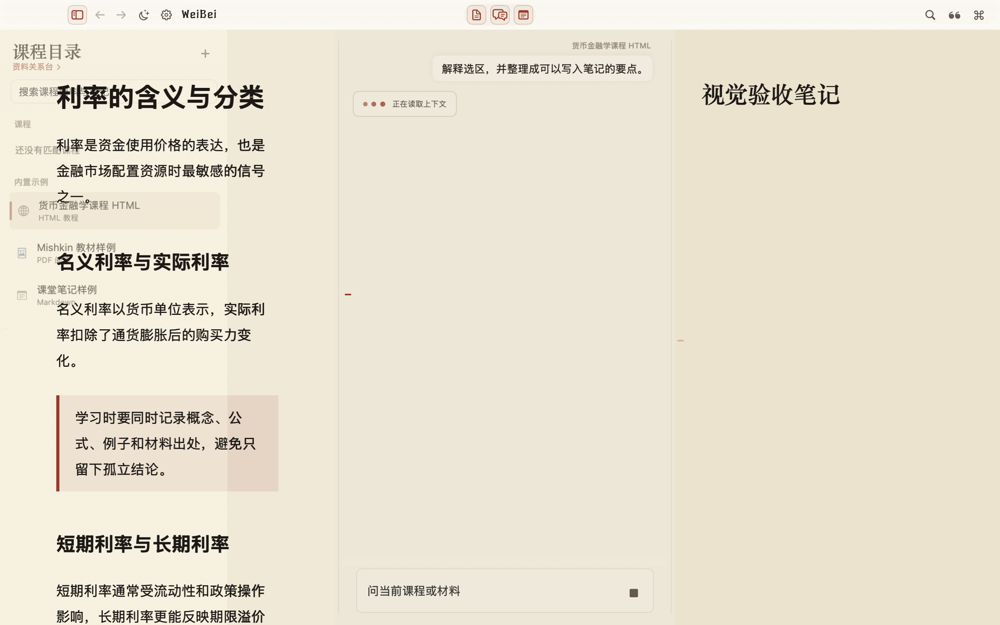
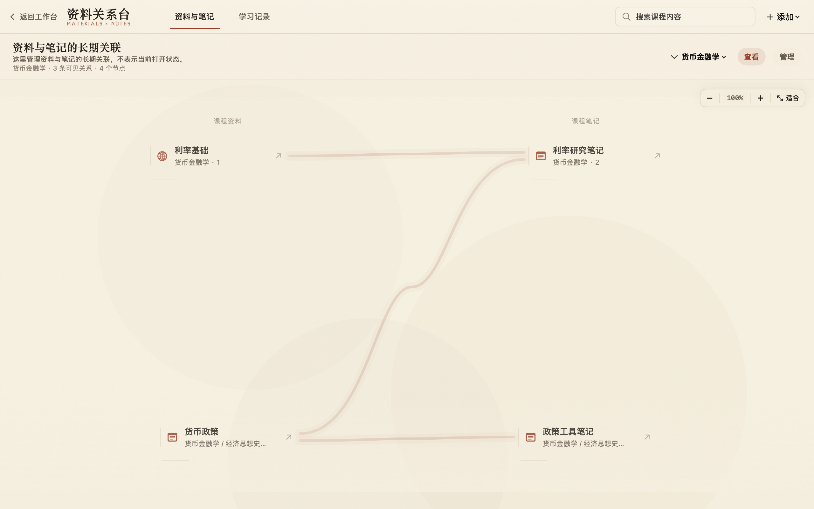

English | **[中文](README.md)**

<!-- WEIBEI_VISUAL:hero:START -->

<!-- WEIBEI_VISUAL:hero:END -->

# WeiBei / 魏碑

WeiBei is a place for reading and keeping notes.

> Long-form reading, excerpting, and note-taking by hand are meaningful in themselves — even with the AI taken out entirely.

So the core is fully local: importing a course, reading, full-text search, notes, and source relationships all work without any model. Connect one when you want AI — it answers on top of your own material, with citations that jump back to the source, and note updates that wait for your approval. Don't connect one, and WeiBei is still a calm, complete reader and notebook — no more juggling a PDF, an AI chat page, and a notes app on revision night.

<p align="center">
  <a href="https://github.com/weibei-app/weibei/releases/download/v1.0.0/WeiBei-1.0.0-macOS-arm64.dmg">⬇ <strong>Download WeiBei 1.0.0</strong></a>
  · macOS 14 or later · Apple silicon · Checksums in <a href="https://github.com/weibei-app/weibei/releases">Releases</a>
</p>

<p align="center">
  <a href="https://github.com/weibei-app/weibei/releases"></a>
  
  <a href="LICENSE"></a>
  
</p>

## ▍What a revision night usually looks like

A lecture PDF and an HTML page open in your browser, an AI chat in another window, a notes app in a third. Every jump breaks the context you had just built: answers drift away from the pages they came from, notes forget which question produced them, and "where did I read that?" becomes the evening's refrain.

WeiBei keeps the material, the question, its evidence, and the resulting note as one connected object. I built it during my own final-exam revision — the night the window-juggling finally became unbearable.

## ▍Compared with "an AI chat page + a notes app"

| | Chat window + notes app | WeiBei |
|---|---|---|
| Your material | re-pasted or attached in pieces | a whole folder imported as a course, indexed locally, open in the same window |
| Answers | may sound right, sources unclear | every answer cites its sources; one click back to the page or section |
| A week later | scrolling chat history to reconstruct why | the underlined passage reopens its exact thread |
| Notes | you retype the useful parts by hand | AI proposes, you review and accept — never silent edits |
| Without AI | close the chat page and nothing is left | reading, search, notes, and relationships keep working |
| Your data | split across services | local-first, on your Mac only |

## ▍One window, three steps: read → ask → keep

Read and keep work fully offline, with no model required; ask is optional — without a provider connected, WeiBei is still a complete study workspace.

<!-- WEIBEI_VISUAL:workspace:START -->
<p align="center">
  
</p>
<!-- WEIBEI_VISUAL:workspace:END -->

**Read: import a folder, and it's a course.** PDF, HTML, Markdown, and plain text all work. Everything is indexed and searchable locally; the reader jumps straight to a PDF page or an HTML section.

**Ask: select a passage, ask right there.** Answers arrive with citation labels — click one to jump back to the exact file, page, or section. The passage keeps a cinnabar underline that reopens its question thread whenever you return: the conversation stays attached to the text it was about. Math renders in KaTeX, diagrams in Mermaid, interactive fragments run in a sandbox — with readable plain text always underneath.

**Keep: anything worth saving comes to you as a proposal.** Notes live in a WYSIWYG editor with slash commands, images, and code blocks. When the Agent has something worth saving, it proposes a note update as a card you review and accept — your notes are never silently rewritten. Meaningful learning moments are remembered automatically, with a light notice so you always know what was stored. Every note links to its sources as real many-to-many relationships, managed on the relationship bench:

<!-- WEIBEI_VISUAL:course-relations:START -->
<p align="center">
  
</p>
<!-- WEIBEI_VISUAL:course-relations:END -->

## ▍Privacy is structure, not a setting

- Your library and full-text index stay on your Mac.
- The Agent only reads through a fixed set of host-mediated tools. No shell, no open file system; each request sees a bounded snapshot of the current material.
- Citations, source jumps, memory writes, note proposals, and rich-answer payloads are all validated by the local host before anything is displayed or applied.
- Web pages and materials are treated strictly as data, never as instructions — a page telling the Agent to do something can't change its behavior. Search queries carry only the public topic of your question, never your course text, notes, or local paths.
- Choose your own model: dozens of built-in profiles (OpenAI, Anthropic, Google, DeepSeek, Kimi, OpenRouter, and more), OAuth subscriptions, a local llama.cpp, or any OpenAI-compatible endpoint.

## ▍Five minutes to get started

1. Launch WeiBei and import a folder of your own material as a course. No sample data ships in the app; nothing is bundled that you didn't bring.
2. (Optional) Connect a model provider in Settings. WeiBei is fully usable without one — reading, search, and notes are unaffected; this step only enables 3 and 5 below.
3. Select a passage in the reader and ask from the selection.
4. Click a citation label to jump back to the source.
5. Ask the Agent to save something to your notes, then review the proposal card before it is applied.

The first launch is blocked by Gatekeeper (the community build is not Apple-notarized). Approve it once and later launches open normally; each newly downloaded version needs the same one-time approval:

- macOS 15 or later: double-click to trigger the block once, then open **System Settings → Privacy & Security**, click **Open Anyway** at the bottom, and confirm. The old right-click "Open" shortcut was removed by Apple in macOS 15.
- macOS 14: right-click `魏碑.app` in Applications, choose **Open**, then confirm **Open**.

This allows WeiBei only — don't disable Gatekeeper globally. WeiBei checks for new versions from Settings, so you don't need to watch the Releases page.

A Homebrew cask is planned; until the tap is published, use the DMG or build from source.

## ▍Made for long nights

WeiBei is named after the stele inscription style, and it leans into that: paper, xuan, inkstone, and stele themes alongside four frosted-glass variants; app-wide text scaling (⌘+ / ⌘−) for 3 a.m. eyes; quiet skeleton states instead of blank flashes while long documents load; and a daily calligraphy line from the stele tradition as a background watermark — every one of the 50 lines carries its source and rights basis in a ledger you can open in Settings.

## ▍Current limits

- This repository and its public downloads currently support macOS 14 or later only; packaged builds target Apple silicon.
- Course files and indexes are fully local. Reading and note-taking need no network — only AI responses do.
- Learning memory is written automatically, with a light end-of-answer notice; formal notes and relationship changes still need your confirmation.
- Large or difficult source files may be reported as partially indexed — honestly, never passed off as complete.
- The community build is not Apple-notarized; the first launch needs a manual allow.

---

## ▍For developers

Everything below is for people building WeiBei itself. WeiBei was born in the Education track of OpenAI Build Week 2026 and has been developed as an ongoing product since; the submission record lives in [Docs/build-week.md](Docs/build-week.md).

### Build from source

Requirements: macOS 14+, Xcode Command Line Tools with Swift 5.9, a configured model provider for live Agent responses, and Node.js only when rebuilding the Milkdown web editor.

```bash
git clone https://github.com/weibei-app/weibei.git
cd weibei
./script/build_and_run.sh
```

The script builds and opens `dist/魏碑.app`.

### How it is built

WeiBei is a native Swift 5.9 application: SwiftUI for the interface, AppKit hosting the long-lived reader, Agent, and note panes. PDFKit reads PDFs, WebKit renders HTML and the Milkdown editor, Vision handles OCR for scanned pages, and SQLite FTS5 stores the local course index. A Swift-native runtime owns the Agent loop, provider adapters, credentials, and session ledger; WeiBei itself owns the material context, citations, learning memory, note write-back, and interface rendering.

Each Agent request receives a bounded snapshot of the working context — no open file system, no shell, and web reading limited to HTTPS URLs the user explicitly provided in that same turn. The host validates citations, source jumps, learning-memory updates, note proposals, and rich-answer payloads before display or application; `visualize` fragments execute in a sandboxed runtime with no network or local file access. For long or scanned PDFs, text extraction runs in a resource-bounded helper process, with Vision OCR only where a page has no native text; partial indexing is reported honestly rather than passed off as complete.

### Tooling

The root `Makefile` is a thin entry point that forwards to the underlying build scripts (run `make help` for the same list):

| Target | What it runs |
|---|---|
| `make build` | `swift build` |
| `make run` | `./script/build_and_run.sh` |
| `make check` | `./script/build_and_run.sh check` |
| `make package` | `./script/build_and_run.sh package` |
| `make editor-build` | `npm run build:editor` |
| `make genui-math-check` | `npx tsx script/check-genui-math.ts` |
| `make perf-p95` | `./script/perf_p95.sh $(LOG) $(METRIC)` (usage: `make perf-p95 LOG=<perf-log> METRIC=<metric-name>`) |
| `make release-community` | `./script/build_release_dmg.sh --community` |
| `make release-notarized` | `./script/build_release_dmg.sh --notarized` |
| `make clean` | `swift package clean && rm -rf dist` (keeps `node_modules` and user data) |

Node tooling: the repository has a single root lockfile (`package-lock.json`) covering the `Prototypes/RichAnswerWebRuntime` workspace; one `npm ci` installs everything. Tool scripts under `script/`, `DesignSystem/scripts/`, and the prototype `scripts/` are TypeScript run with `tsx` (e.g. `npx tsx script/check-genui-math.ts`); `npm run typecheck:tools` type-checks them.

### Checks

```bash
./script/build_and_run.sh check
```

Individual checks are also available:

```bash
swift build
swift run WeiBeiSelfCheck
swift run WeiBeiWebEditorCheck
swift run WeiBeiNativeCheck --authentication-status
```

Live-provider checks require valid local credentials and are never silently replaced with mock answers.

### Documentation

- [Docs/build-week.md](Docs/build-week.md) — OpenAI Build Week 2026 submission record and judge walkthrough
- [Docs/note-slash-commands.md](Docs/note-slash-commands.md) — note editor slash commands, image insertion, and code block behavior
- [Docs/course-library-architecture.md](Docs/course-library-architecture.md) — course library and storage architecture
- [Docs/plans/2026-08-22-native-agent-runtime-实验计划.md](Docs/plans/2026-08-22-native-agent-runtime-实验计划.md) — validation and rollout notes for the Swift-native Agent runtime
- [Docs/生成式界面基础与Visualize借鉴.md](Docs/生成式界面基础与Visualize借鉴.md) — generative UI foundations and the `visualize` decision
- [Docs/releases/v1.0.0.md](Docs/releases/v1.0.0.md) — v1.0.0 release notes and evidence

---

## ▍Licensing

- WeiBei-authored source code and developer documentation: [MIT License](LICENSE).
- `WeiBeiStele` and `WeiBeiSteleMono` fonts: [SIL Open Font License 1.1](Sources/WeiBei/Resources/Fonts/OFL.txt). Modified fonts must use different names unless the project grants written permission to retain the reserved names.
- The WeiBei / 魏碑 names, logos, visual identity, screenshots, and release media are not licensed under MIT or OFL. Third-party software and reference assets retain their original terms.
- Read [`LICENSING.md`](LICENSING.md) before redistributing a fork or packaged app. Contributions follow [`CONTRIBUTING.md`](CONTRIBUTING.md); security issues follow [`SECURITY.md`](SECURITY.md).

## ▍Technology

`Swift` · `SwiftUI` · `AppKit` · `PDFKit` · `WebKit` · `Vision OCR` · `SQLite FTS5` · `Milkdown` · `KaTeX` · `Mermaid` · `OpenAI Codex OAuth`
