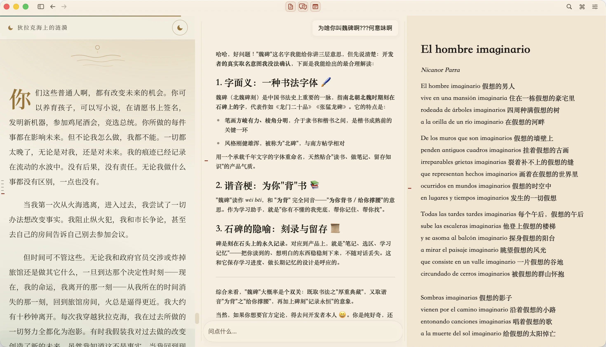
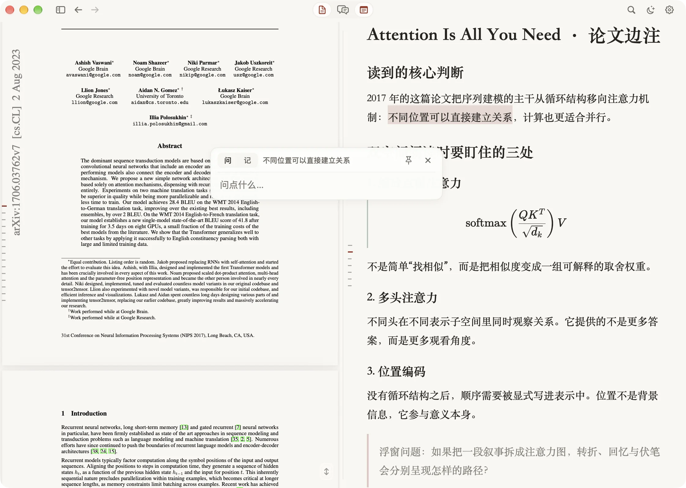
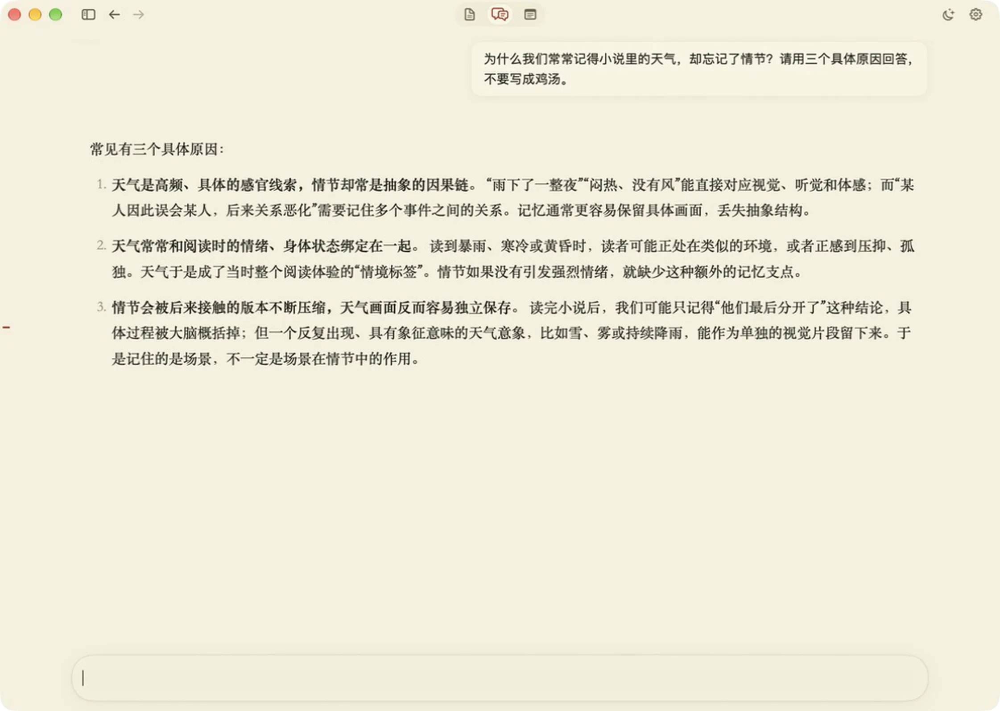
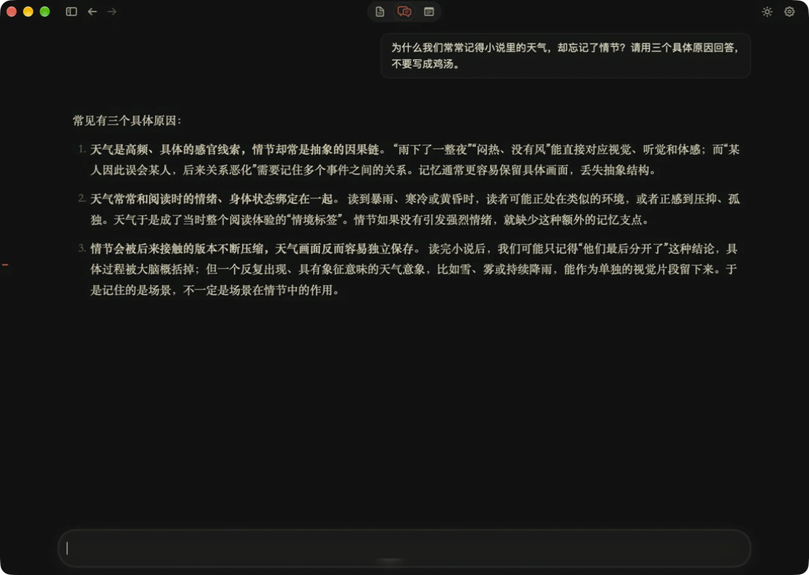
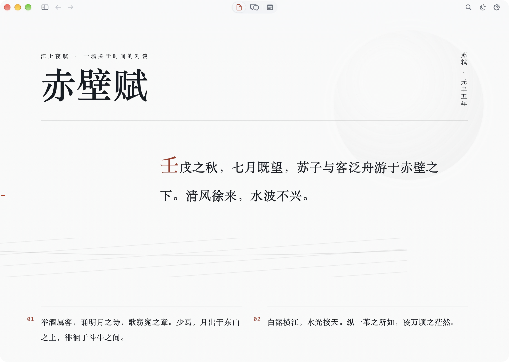
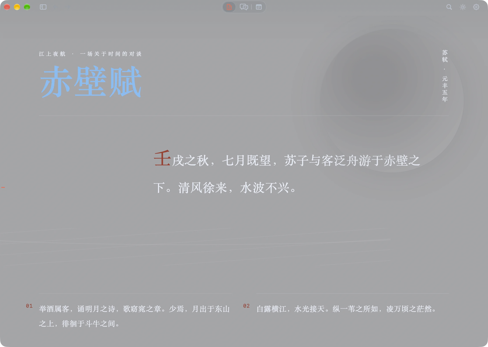

<p align="right">中文 · <a href="README.en.md">English</a></p>

<!-- WEIBEI_VISUAL:hero:START -->
<p align="center">
  
</p>
<!-- WEIBEI_VISUAL:hero:END -->

<h1 align="center">读、问、记，在同一个窗口</h1>

<p align="center">魏碑是一个原生 macOS 阅读与笔记工作台。资料在本地，AI 按需接入。</p>

<p align="center">
  <a href="https://wroughtmind.github.io/weibei/">逛逛官网</a> ·
  <a href="#开始使用">开始使用</a> ·
  <a href="#参与开发">参与开发</a> ·
  <a href="https://github.com/WroughtMind/weibei/issues">反馈问题</a>
</p>

<p align="center">
  
  
  <a href="LICENSE"></a>
  <br>
  <sub>开发中，暂无正式安装包 · 支持 Apple 芯片与 Intel · 可从源码运行</sub>
</p>

<!-- WEIBEI_VISUAL:workspace:START -->
<p align="center">
  
  <br>
  <sub>阅读、对话和笔记可并排显示，也可单独打开。</sub>
</p>
<!-- WEIBEI_VISUAL:workspace:END -->

## 主要功能

| 场景 | 在魏碑里 |
|:---|:---|
| **阅读** | 导入文件夹作为课程，阅读 PDF、HTML、Markdown 和纯文本，搜索课程资料。 |
| **提问** | 选中文字提问，点击回答里的引用查看原文；点击原文下划线可重开对应对话。 |
| **笔记** | 编辑 Markdown，插入图片、公式和代码块。AI 修改笔记前会显示提案，确认后才写入。 |
| **回看** | 查看笔记关联的资料，通过学习记忆查询之前的进度和问题。 |

<p align="center">
  
  <br>
  <sub>选中文字后，可在浮窗中提问或摘记。</sub>
</p>

## 界面主题

纸面、宣纸、墨石、石碑，另有晴璃、夜璃、雾璃、玄璃四款毛玻璃主题。阅读、对话、写作都可以独立展开；用 <kbd>⌘</kbd> + <kbd>+</kbd> / <kbd>−</kbd> 调整全局字号。

<table>
  <tr>
    <td width="50%" align="center">
      <a href="./website/assets/第三幕-真实截图-纸面-沉浸对话.webp"></a>
      <br><sub><b>纸面</b> · 沉浸对话</sub>
    </td>
    <td width="50%" align="center">
      <a href="./website/assets/第三幕-真实截图-墨石-沉浸对话.webp"></a>
      <br><sub><b>墨石</b> · 沉浸对话</sub>
    </td>
  </tr>
  <tr>
    <td width="50%" align="center">
      <a href="./website/assets/第三幕-真实截图-晴璃-沉浸阅读.webp"></a>
      <br><sub><b>晴璃</b> · 沉浸阅读</sub>
    </td>
    <td width="50%" align="center">
      <a href="./website/assets/第三幕-真实截图-夜璃-沉浸阅读.webp"></a>
      <br><sub><b>夜璃</b> · 沉浸阅读</sub>
    </td>
  </tr>
</table>

<p align="center"><sub>四款主题实景，点击图片查看大图。截图中的资料用于展示，应用不内置这些内容。</sub></p>

## 本地存储与 AI 权限

| 事项 | 具体方式 |
|:---|:---|
| 保存 | 课程、笔记、全文索引和学习记忆在本地保存。阅读本地资料和写笔记不需要模型。 |
| 联网 | 在线模型会收到完成请求所需的相关摘录；资料中的远程图片、网页内容也会联网加载。 |
| 写入 | 正式笔记和出处关系的修改先显示提案，由你确认。学习记忆自动记录，并有轻提示说明存了什么。 |
| 访问 | AI 通过魏碑提供的限定工具读取资料，没有终端或任意文件系统访问权。 |

模型由你选择：OpenAI、Anthropic、Google、DeepSeek、Kimi、OpenRouter 等内置预设，也支持订阅登录、本地 llama.cpp 和自定义 OpenAI 兼容接口。完整的数据流向见[隐私说明](PRIVACY.md)。

## 开始使用

目前请从源码运行。需要 **macOS 14 及以上**和 **Xcode Command Line Tools（Swift 5.9 及以上）**，首次构建需要联网获取依赖。

```bash
git clone https://github.com/WroughtMind/weibei.git
cd weibei
./script/build_and_run.sh
```

脚本会构建并打开魏碑。完整检查、打包或重建网页编辑器时，还需要 **Node.js 22 及以上**，并先在仓库根目录运行 `npm ci`。

1. 导入自己的资料文件夹，作为一门课程打开。
2. 选一份资料阅读，在旁边写笔记，试试全文搜索。
3. 需要 AI 时，在设置中连接模型，再选中文字提问、点击引用回看原文，或审阅一份笔记提案。

大文件和扫描件会按实际情况显示部分索引状态。目前没有正式发布计划，下一个正式版本号为 **0.0.1**，详见[发布说明](Docs/releases/README.md)。

## 参与开发

魏碑诞生于 OpenAI Build Week 2026 教育赛道，此后持续开发。[贡献指南](CONTRIBUTING.md)介绍协作方式，[安全说明](SECURITY.md)介绍安全问题的反馈方式。

<details>
<summary><strong>构建命令与检查</strong></summary>

根目录 `Makefile` 是薄入口，转发到底层构建脚本（`make help` 可看同一份列表）：

| 目标 | 实际执行 |
|---|---|
| `make build` | `swift build` |
| `make run` | `./script/build_and_run.sh` |
| `make check` | `./script/build_and_run.sh check` |
| `make package` | `./script/build_and_run.sh package` |
| `make verify` | `./script/build_and_run.sh verify`（打包并完成一次真实进程启动验收） |
| `make editor-build` | `npm run build:editor` |
| `make genui-math-check` | `npx tsx script/check-genui-math.ts` |
| `make perf-p95` | `./script/perf_p95.sh $(LOG) $(METRIC)`（用法：`make perf-p95 LOG=<perf日志> METRIC=<指标名>`） |
| `make release` | `./script/build_release_dmg.sh`（构建当前架构未公证的正式 DMG） |
| `make clean` | `swift package clean && rm -rf dist`（保留 `node_modules` 与用户数据） |

Node 工具链：在仓库根目录运行 `npm ci`，按唯一的 `package-lock.json` 安装依赖。`script/` 和 `DesignSystem/scripts/` 下的 TypeScript 工具用 `tsx` 运行，`npm run typecheck:tools` 做类型检查。

Apple 芯片与 Intel 安装包分别在对应芯片的 Mac 上原生构建。发布资产与验证要求见[双架构发布流程](Docs/releases/dual-architecture.md)。

### 检查

需要 Node.js 22 及以上：

```bash
npm ci
./script/build_and_run.sh check
```

也可以单独运行：

```bash
swift build
swift run WeiBeiSelfCheck
swift run WeiBeiWebEditorCheck
swift run WeiBeiNativeCheck --authentication-status
```

真实供应商检查需要本地有效凭据，不会悄悄换成模拟答案。

</details>

<details>
<summary><strong>技术架构</strong></summary>

SwiftUI 负责界面，AppKit 承载常驻的阅读、对话和笔记面板。PDFKit 读取 PDF，WebKit 渲染 HTML 和 Milkdown 编辑器，Vision 处理扫描页 OCR，SQLite FTS5 提供本地全文索引。公式使用 KaTeX，图表使用 Mermaid。

Swift 原生 Agent 运行时负责工具循环、供应商连接、凭据与会话账本。魏碑在展示或写入前校验引用、学习记忆更新、笔记提案和富答案；`visualize` 交互片段在无网络、无本地文件访问的沙箱中执行。长 PDF 和扫描件通过资源受限的辅助进程抽取文本，仅无原生文本的页面使用 OCR。

</details>

<details>
<summary><strong>继续阅读</strong></summary>

- [Build Week 提交记录](Docs/build-week.md)：OpenAI Build Week 2026 提交记录与评委走查
- [笔记编辑说明](Docs/note-slash-commands.md)：笔记编辑器斜杠命令、图片插入与代码块行为
- [课程库与存储架构](Docs/course-library-architecture.md)：课程库与存储架构
- [原生 Agent 落地记录](Docs/plans/2026-08-22-native-agent-runtime-实验计划.md)：Swift 原生 Agent 运行时的验证与落地记录
- [生成式界面设计](Docs/生成式界面基础与Visualize借鉴.md)：生成式界面基础与 `visualize` 决策

</details>

## 许可

- 代码与开发者文档：[MIT License](LICENSE)。
- `WeiBeiStele` 与 `WeiBeiSteleMono` 字体：[SIL Open Font License 1.1](Sources/WeiBei/Resources/Fonts/OFL.txt)。修改版必须改名，除非另行获得保留名的书面许可。
- “魏碑 / WeiBei” 名称、logo、视觉识别、截图与发布媒体：不在 MIT 与 OFL 之内。第三方软件与参考素材保留其原始条款。
- 再分发 fork 或打包应用之前，先读 [完整许可说明](LICENSING.md)。贡献流程见 [贡献指南](CONTRIBUTING.md)，安全问题见 [安全说明](SECURITY.md)。
