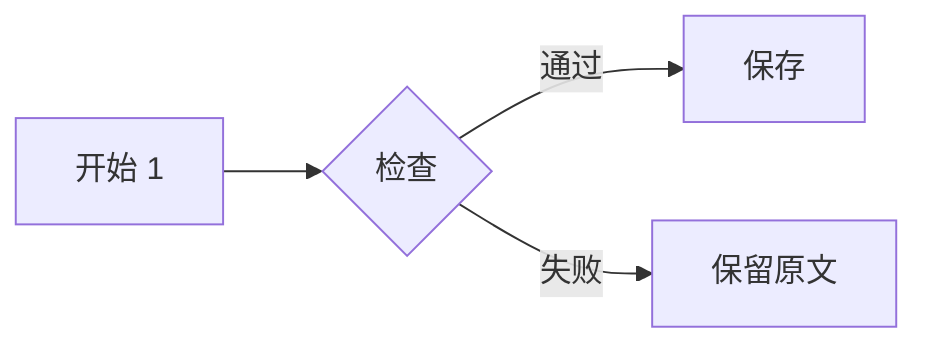
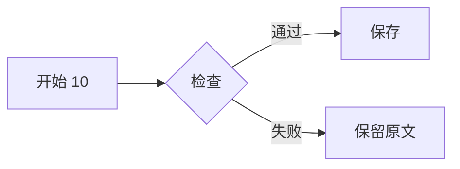
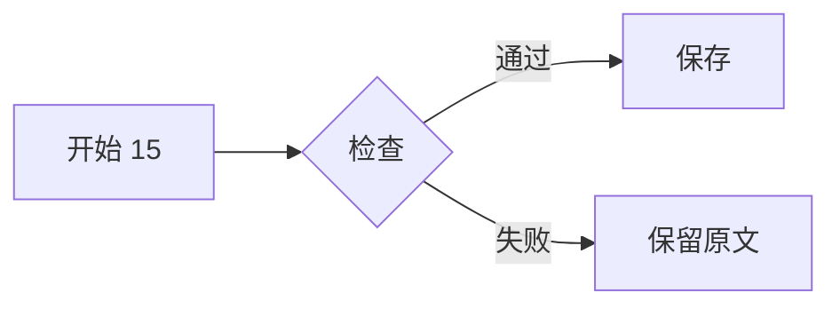
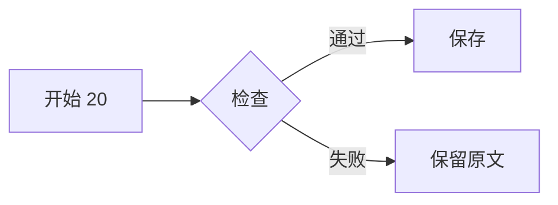

# Mermaid 密集夹具

## 流程 1



## 流程 2


## 流程 3


## 流程 4


## 流程 5


## 流程 6


## 流程 7


## 流程 8


## 流程 9


## 流程 10



## 流程 11


## 流程 12


## 流程 13


## 流程 14


## 流程 15



## 流程 16


## 流程 17


## 流程 18


## 流程 19


## 流程 20



## 流程 21

```mermaid
flowchart LR
  A21[开始 21] --> B21{检查}
  B21 -->|通过| C21[保存]
  B21 -->|失败| D21[保留原文]
```

## 流程 22

```mermaid
flowchart LR
  A22[开始 22] --> B22{检查}
  B22 -->|通过| C22[保存]
  B22 -->|失败| D22[保留原文]
```

## 流程 23

```mermaid
flowchart LR
  A23[开始 23] --> B23{检查}
  B23 -->|通过| C23[保存]
  B23 -->|失败| D23[保留原文]
```

## 流程 24

```mermaid
flowchart LR
  A24[开始 24] --> B24{检查}
  B24 -->|通过| C24[保存]
  B24 -->|失败| D24[保留原文]
```

## 流程 25

```mermaid
flowchart LR
  A25[开始 25] --> B25{检查}
  B25 -->|通过| C25[保存]
  B25 -->|失败| D25[保留原文]
```

## 流程 26

```mermaid
flowchart LR
  A26[开始 26] --> B26{检查}
  B26 -->|通过| C26[保存]
  B26 -->|失败| D26[保留原文]
```

## 流程 27

```mermaid
flowchart LR
  A27[开始 27] --> B27{检查}
  B27 -->|通过| C27[保存]
  B27 -->|失败| D27[保留原文]
```

## 流程 28

```mermaid
flowchart LR
  A28[开始 28] --> B28{检查}
  B28 -->|通过| C28[保存]
  B28 -->|失败| D28[保留原文]
```

## 流程 29

```mermaid
flowchart LR
  A29[开始 29] --> B29{检查}
  B29 -->|通过| C29[保存]
  B29 -->|失败| D29[保留原文]
```

## 流程 30

```mermaid
flowchart LR
  A30[开始 30] --> B30{检查}
  B30 -->|通过| C30[保存]
  B30 -->|失败| D30[保留原文]
```

## 流程 31

```mermaid
flowchart LR
  A31[开始 31] --> B31{检查}
  B31 -->|通过| C31[保存]
  B31 -->|失败| D31[保留原文]
```

## 流程 32

```mermaid
flowchart LR
  A32[开始 32] --> B32{检查}
  B32 -->|通过| C32[保存]
  B32 -->|失败| D32[保留原文]
```

## 流程 33

```mermaid
flowchart LR
  A33[开始 33] --> B33{检查}
  B33 -->|通过| C33[保存]
  B33 -->|失败| D33[保留原文]
```

## 流程 34

```mermaid
flowchart LR
  A34[开始 34] --> B34{检查}
  B34 -->|通过| C34[保存]
  B34 -->|失败| D34[保留原文]
```

## 流程 35

```mermaid
flowchart LR
  A35[开始 35] --> B35{检查}
  B35 -->|通过| C35[保存]
  B35 -->|失败| D35[保留原文]
```

## 流程 36

```mermaid
flowchart LR
  A36[开始 36] --> B36{检查}
  B36 -->|通过| C36[保存]
  B36 -->|失败| D36[保留原文]
```

## 流程 37

```mermaid
flowchart LR
  A37[开始 37] --> B37{检查}
  B37 -->|通过| C37[保存]
  B37 -->|失败| D37[保留原文]
```

## 流程 38

```mermaid
flowchart LR
  A38[开始 38] --> B38{检查}
  B38 -->|通过| C38[保存]
  B38 -->|失败| D38[保留原文]
```

## 流程 39

```mermaid
flowchart LR
  A39[开始 39] --> B39{检查}
  B39 -->|通过| C39[保存]
  B39 -->|失败| D39[保留原文]
```

## 流程 40

```mermaid
flowchart LR
  A40[开始 40] --> B40{检查}
  B40 -->|通过| C40[保存]
  B40 -->|失败| D40[保留原文]
```

## 流程 41

```mermaid
flowchart LR
  A41[开始 41] --> B41{检查}
  B41 -->|通过| C41[保存]
  B41 -->|失败| D41[保留原文]
```

## 流程 42

```mermaid
flowchart LR
  A42[开始 42] --> B42{检查}
  B42 -->|通过| C42[保存]
  B42 -->|失败| D42[保留原文]
```

## 流程 43

```mermaid
flowchart LR
  A43[开始 43] --> B43{检查}
  B43 -->|通过| C43[保存]
  B43 -->|失败| D43[保留原文]
```

## 流程 44

```mermaid
flowchart LR
  A44[开始 44] --> B44{检查}
  B44 -->|通过| C44[保存]
  B44 -->|失败| D44[保留原文]
```

## 流程 45

```mermaid
flowchart LR
  A45[开始 45] --> B45{检查}
  B45 -->|通过| C45[保存]
  B45 -->|失败| D45[保留原文]
```

## 流程 46

```mermaid
flowchart LR
  A46[开始 46] --> B46{检查}
  B46 -->|通过| C46[保存]
  B46 -->|失败| D46[保留原文]
```

## 流程 47

```mermaid
flowchart LR
  A47[开始 47] --> B47{检查}
  B47 -->|通过| C47[保存]
  B47 -->|失败| D47[保留原文]
```

## 流程 48

```mermaid
flowchart LR
  A48[开始 48] --> B48{检查}
  B48 -->|通过| C48[保存]
  B48 -->|失败| D48[保留原文]
```

## 流程 49

```mermaid
flowchart LR
  A49[开始 49] --> B49{检查}
  B49 -->|通过| C49[保存]
  B49 -->|失败| D49[保留原文]
```

## 流程 50

```mermaid
flowchart LR
  A50[开始 50] --> B50{检查}
  B50 -->|通过| C50[保存]
  B50 -->|失败| D50[保留原文]
```

## 流程 51

```mermaid
flowchart LR
  A51[开始 51] --> B51{检查}
  B51 -->|通过| C51[保存]
  B51 -->|失败| D51[保留原文]
```

## 流程 52

```mermaid
flowchart LR
  A52[开始 52] --> B52{检查}
  B52 -->|通过| C52[保存]
  B52 -->|失败| D52[保留原文]
```

## 流程 53

```mermaid
flowchart LR
  A53[开始 53] --> B53{检查}
  B53 -->|通过| C53[保存]
  B53 -->|失败| D53[保留原文]
```

## 流程 54

```mermaid
flowchart LR
  A54[开始 54] --> B54{检查}
  B54 -->|通过| C54[保存]
  B54 -->|失败| D54[保留原文]
```

## 流程 55

```mermaid
flowchart LR
  A55[开始 55] --> B55{检查}
  B55 -->|通过| C55[保存]
  B55 -->|失败| D55[保留原文]
```

## 流程 56

```mermaid
flowchart LR
  A56[开始 56] --> B56{检查}
  B56 -->|通过| C56[保存]
  B56 -->|失败| D56[保留原文]
```

## 流程 57

```mermaid
flowchart LR
  A57[开始 57] --> B57{检查}
  B57 -->|通过| C57[保存]
  B57 -->|失败| D57[保留原文]
```

## 流程 58

```mermaid
flowchart LR
  A58[开始 58] --> B58{检查}
  B58 -->|通过| C58[保存]
  B58 -->|失败| D58[保留原文]
```

## 流程 59

```mermaid
flowchart LR
  A59[开始 59] --> B59{检查}
  B59 -->|通过| C59[保存]
  B59 -->|失败| D59[保留原文]
```

## 流程 60

```mermaid
flowchart LR
  A60[开始 60] --> B60{检查}
  B60 -->|通过| C60[保存]
  B60 -->|失败| D60[保留原文]
```
